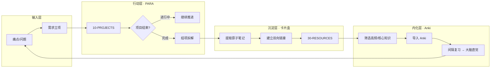

## 概念：混合型知识库架构

> 混合型知识库是"流水线工厂"——以需求为驱动，PARA 为行动工作台，卡片盒为知识沉淀池，Anki 为内化引擎，形成「需求 → 行动 → 沉淀 → 内化」的完整闭环。

**解决的核心痛点**：PARA 缺乏知识复利（项目做完就归档，知识随之封存），卡片盒缺乏行动导向（为记笔记而记笔记），单一方法论无法同时兼顾"行动效率"和"认知增长"。

---

### 核心命题

- [[痛点是知识管理的唯一动力源]]
	- **原理**：不始于"当下需要解决"的知识管理注定无法持续——痛点决定信噪比
- [[信息应按可行动性而非主题分类]]
	- **原理**：行动阶段用 PARA 按项目组织，而非学科分类
- [[知识只有被调用时才产生价值]]
	- **原理**：卡片盒的终点不是积累，而是通过 Anki 内化为决策直觉

---

### 运行机制

混合型知识库是一个四阶段流水线：

#### 阶段一：需求立项

**一切始于痛点**。不为"将来可能有用"而学习，只为"当下需要解决"而投入。

| 输入 | 转化方式 | 输出 |
|:---|:---|:---|
| 工作中的困难 | → 拆解为具体的项目定义 | P-项目 |
| 决策前的盲区 | → 设为探索性项目，附带 Q-note | P-项目 + Q-note |
| 兴趣/好奇心 | → 放入"将来/也许"清单，不急于立项 | 待孵化 |

#### 阶段二：PARA 推进

**行动阶段以 PARA 为组织原则**。项目进行时，所有素材按可行动性汇聚于项目目录，而非按主题分类。

- 产出物放在 `10-PROJECTS/<项目名>/`
- 参考资料囤在项目目录的 `_ref` 子目录
- 关键 SOP 和 term 直接建在 `30-RESOURCES/` 并双向链接到项目

#### 阶段三：结项拆解

**这是混合型架构的核心环节——去语境化**。项目结束后，必须将通用知识从项目语境中剥离，沉淀为可复用的资产。

1. 扫描项目文件夹，识别哪些知识对未来其他项目也有用
2. 创建/更新 atomic 笔记（陈述句观点）
3. 链接到对应的 concept / term / SOP
4. 将项目归档到 `40-ARCHIVE/`
5. 更新 wiki-index 和 wiki-log

#### 阶段四：Anki 内化

**知识库的终点不是硬盘，而是大脑直觉**。

- 从卡片盒中筛选高频使用的核心知识
- 制作成 Anki 卡片（问题 + 答案 + 来源链接）
- 通过间隔重复将外部知识内化为直觉

---

### 关键区别

| 维度 | PARA | 卡片盒 | Anki | 混合型架构 |
|:---|:---|:---|:---|:---|
| **角色** | 工作台 (Flow) | 沉淀池 (Stock) | 内化引擎 | 全流程流水线 |
| **组织方式** | 按项目/时间 | 按关联/话题 | 按记忆曲线 | 按生命周期 |
| **生命周期** | 短期（完成后归档） | 永久（伴随终身） | 长期（直至内化） | 四阶段衔接 |
| **单独使用的问题** | 知识无复利 | 缺乏行动导向 | 脱离语境、难坚持 | 互补短板 |

---

### 应用场景

- ✅ **适用场景**
	- **知识工作者**：信息输入量大，需要既有行动效率又有知识沉淀
	- **多项目并行者**：同时推进多个项目，结束后希望知识不流失
- ⛔ **误用**
	- **为流程而流程**：四个阶段不是每篇笔记都必须走完——短期参考类信息无需进入 Anki
	- **过早内化**：尚未验证的知识不应投入 Anki——先用起来，确认有价值再制卡

---

### SOP

> 与本概念相关的标准操作流程

- [[SOP-需求立项与PARA初始化]] — 从痛点转化为项目的标准流程
- [[SOP-项目结项后的知识拆解流程]] — 项目结束后知识提取与归档流程
- [[原子笔记拆分标准]] — 确保 atomic 颗粒度的规范
- [[SOP-Anki制卡与复习规范]] — Anki 制卡标准与复习节奏

---

### FAQ

> 与本概念相关的开放性问题

- [[Q-如何避免结项拆解成为负担而跳过？]]

---

### 知识图谱

- **父级概念**：[[知识组织]] — 知识库架构是知识组织的具体实践
- **子级概念**：
	- [[PARA笔记法]] — 混合架构的行动层
	- [[卡片盒笔记法]] — 混合架构的沉淀层
- **并列概念**：
	- [[CODE知识全生命周期工作流]] — 另一种知识管理流程（Capture → Organize → Distill → Express）
	- [[第二大脑]] — 相似但更偏数字记忆体，本架构强调"内化到大脑"
- **相关概念**：
	- [[认知负荷]] — 外部分担认知负荷的理论基础
	- [[需求决定论]] — 需求驱动的底层理念
- **参考文章**
	- Tiago Forte, "Building a Second Brain" (PARA 方法论)
	- Sönke Ahrens, "How to Take Smart Notes" (卡片盒笔记法)
