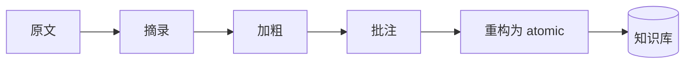

## SOP：渐进式总结法

> 将外部文章或阅读材料，通过四层提炼逐步压缩，最终产出可复用的原子笔记。

目标：任何一篇文章经过本流程后，产出 ≤ 3 条可被引用的 atomic 笔记
实现：摘录 → 加粗 → 批注 → 重构

---

### 适用场景

- 场景 1：深度阅读 — 读到一篇高质量长文，需要提取核心洞见
- 场景 2：研究综述 — 需要从多篇材料中提取观点，做横向对比
- 场景 3：AI 对话整理 — AI 对话中产生了多条启发，需要系统化提炼

---

### 核心步骤

#### 第一层：摘录（Highlight）

标记原文中你认为有价值的段落。标准：这段内容即使脱离原文语境也站得住。

#### 第二层：加粗（Bold）

在摘录段落中，用 **加粗** 标出最核心的 1-2 句话。标准：如果只能引用一句话，就是这句。

#### 第三层：批注（Marginalia）

用自己的话写批注：为什么这段重要？它和本库中哪些已有笔记有关系？标准：批注中应出现 wikilink。

#### 第四层：重构（Remix）

将批注和加粗句整合为一条或多条 atomic 笔记。标准：atomic 笔记应当是陈述句标题，可独立被引用。

---

### 实践示例

**原文**："工作记忆的容量有限，通常只能同时处理 3-5 个组块的信息，这解释了为什么 multitasking 会降低效率。"

| 层级 | 输出 |
|:---|:---|
| 摘录 | 全文 |
| 加粗 | **工作记忆容量有限，通常只能同时处理 3-5 个组块** |
| 批注 | 这与 [[外部大脑能释放前额叶的认知负荷]] 一致，解释了为什么记笔记本质上是认知卸载 |
| 重构 | 创建 atomic「多任务处理的本质是任务切换成本」，链接到 [[认知负荷]] |

---

### 常见坑点

- ⛔ **跳过层级**：直接从摘录跳到重构，跳过了"批注"这一关键的连接步骤
- 🔧 **排查**：批注层级必须完成——它是"这个新知识与旧知识有什么关系"的强制思考
- ⛔ **重构时照搬原文**：atomic 笔记的内容是原文改写而非个人转述
- 🔧 **排查**：重构时关掉原文窗口，用自己的话写

---

### 知识图谱

- **相关概念**：
	- [[知识内化]] — 渐进式总结所属的 MOC
	- [[卡片盒笔记法]] — 渐进式总结的理论基础
- **相关 SOP**：
	- [[信息收集工作流]] — 渐进式总结的上游（信息来源）
	- [[知识获取工作流]] — 渐进式总结的协同流程
- **母领域**：[[A-知识管理]]
