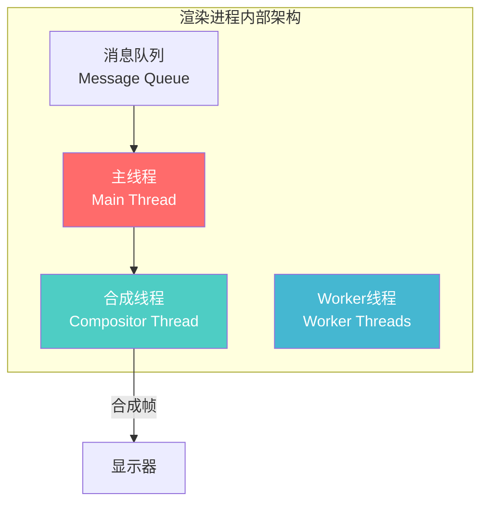
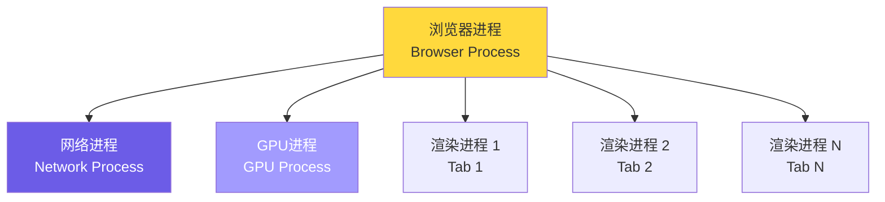
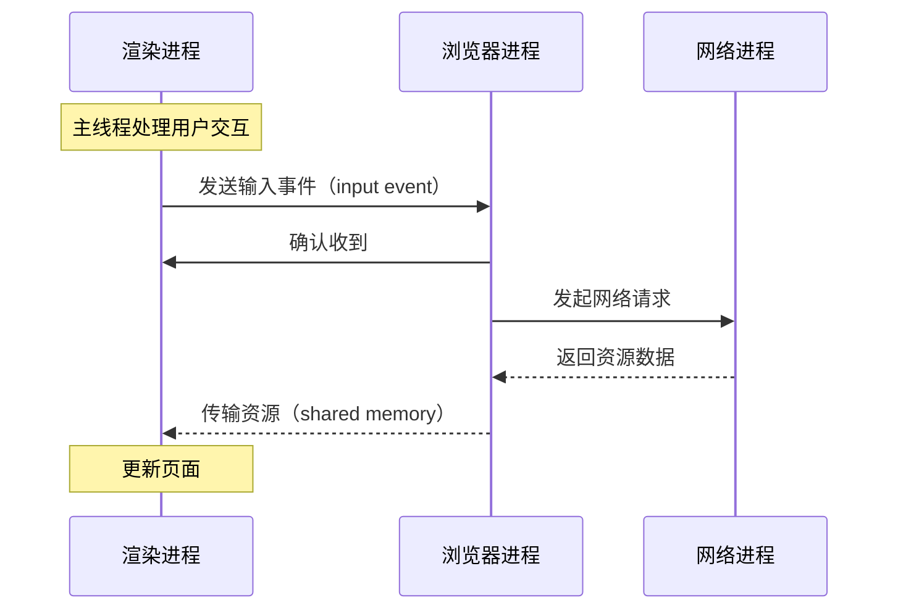
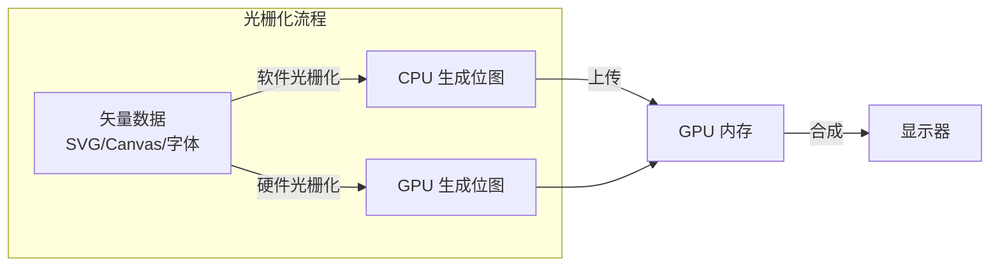

## 概念：渲染进程

> 渲染进程（Renderer Process）是浏览器中负责解析 HTML/CSS、构建 DOM/CSSOM、执行 JavaScript 和绘制页面的核心进程，每个标签页对应一个独立的渲染进程。

**解决的核心痛点**：浏览器需要安全、高效地执行来自互联网的未知代码，同时保证页面的流畅渲染和交互响应

---

### 核心命题

- [[渲染进程采用多线程协作架构]]
	- **原理**：主线程处理 DOM/JS，合成线程处理图层，Worker 线程执行后台任务，分工协作避免阻塞
- [[主线程是浏览器渲染的瓶颈]]
	- **原理**：主线程同时负责 JS 执行、样式计算、布局和绘制，当长任务占据主线程时，所有这些工作都被阻塞

---

### 运行机制



**渲染进程内部线程分工**：

| 线程 | 职责 | 是否执行 JS |
|:---|:---|:---|
| **主线程** | DOM 构建、CSSOM 计算、布局、绘制、事件处理 | 是 |
| **合成线程** | 图层合成、光栅化、GPU 加速 | 否 |
| **Worker 线程** | 后台计算、Service Worker、Web Worker | 是（独立上下文） |

---

### 关键区别

| 维度 | 主线程 | 合成线程 | Worker 线程 |
|:---|:---|:---|:---|
| **核心任务** | 渲染 Pipeline | 图层合成 | 后台计算 |
| **执行 JS** | ✓ | ✗ | ✓ |
| **阻塞影响** | 页面卡顿/INP 变差 | 只能跳帧 | 不影响渲染 |
| **与主线程通信** | — | 通过 commitFrame | via postMessage |

---

### 主线程的渲染 Pipeline

```bash
用户交互/资源加载
        ↓
    1. 事件触发（Event）
        ↓
    2. JS 执行（JS Execute）
        ↓
    3. 样式计算（Style Calculation）
        ↓
    4. 布局计算（Layout/Reflow）
        ↓
    5. 绘制指令（Paint）
        ↓
    6. 合成（Compositing）
        ↓
    显示下一帧
```

> 当上述 Pipeline 中任何一步超过 16.67ms（60fps），就会出现丢帧

---

### 与浏览器的架构关系



- **浏览器进程**：协调管理、UI 渲染
- **网络进程**：资源加载（图片、CSS、JS）
- **GPU 进程**：GPU 加速、硬件合成
- **渲染进程**：每个标签页独立运行，通过 IPC 与浏览器进程通信

---

### IPC 通信机制

渲染进程与浏览器进程之间通过 **IPC（Inter-Process Communication）** 进行通信：



**主要 IPC 消息类型**：

| 消息方向 | 内容 | 触发场景 |
|:---|:---|:---|
| 渲染进程 → 浏览器进程 | 输入事件、网络请求、Tab 状态 | 用户点击、滚动、fetch |
| 浏览器进程 → 渲染进程 | 资源数据、权限确认、导航指令 | 资源加载完成、安全策略 |
| 渲染进程 → GPU 进程 | 图层数据、绘制指令 | 合成帧提交 |

**共享内存传输**：大数据（如图片、字体）通过共享内存传递，避免进程间复制的开销

---

### 光栅化与 GPU 加速

**光栅化（Rasterization）**：将矢量图形（SVG、Canvas 2D、字体）转换为位图（Bitmap）的过程



**合成线程的光栅化职责**：

1. **Draw Quad 构建**：主线程完成 Paint 后，合成线程将绘制指令转换为 Draw Quad
2. **纹理上传**：将位图上传到 GPU 内存（可能触发 CPU→GPU 传输）
3. **GPU 合成**：使用 GPU 并行合成多个图层，生成最终帧

**GPU 加速的条件**：

| 条件 | 说明 |
|:---|:---|
| `will-change: transform` | 提示浏览器为元素创建独立图层 |
| `transform: translateZ(0)` | 强制创建合成层 |
| 视频、Canvas 元素 | 天然 GPU 加速 |
| CSS 动画 | `transform`/`opacity` 动画可在合成线程执行 |

> 过度创建合成层会消耗大量 GPU 内存，建议按需使用 `will-change`

---

### 应用场景

- ✅ **适用场景**
	- **理解 INP 指标**：主线程阻塞直接影响 INP，主线程是优化的关键战场
	- **前端性能优化**：了解渲染 Pipeline 才能定位回流/重绘的性能问题
	- **浏览器安全模型**：渲染进程是沙箱环境，理解其边界有助于理解 XSS 防护
- ⛔ **误用**
	- **将 Worker 当作主线程替代**：Worker 无法直接操作 DOM，只能做计算
	- **过度优化合成线程**：合成线程本身不阻塞渲染，过度优化收益有限

---

### FAQ

- [[Q-浏览器的事件循环是如何工作的]]
- [[Q-什么是浏览器的回流和重绘]]

---

### 知识图谱

> 知识图谱链接 term（术语定义）和相关 concept，建立概念关系网络

- **父级概念**：[[浏览器]] — 渲染进程是浏览器的核心子进程
- **并列概念**：
	- [[浏览器核心架构]] — 多进程架构的整体设计
- **子级概念/术语**：
	- [[DOM]] — 文档对象模型，由主线程构建
	- [[CSSOM]] — CSS 对象模型，由主线程构建
	- [[回流和重绘]] — 主线程的布局和绘制阶段
	- [[事件循环]] — 驱动主线程运转的机制
- **相关概念**：
	- [[长任务]] — 主线程阻塞的常见原因
	- [[INP]] — 主线程响应性直接影响 INP 指标
	- [[V8引擎]] — JS 引擎，在主线程执行 JS 代码

---

### 参考延伸

- [Chromium 多进程架构](https://www.chromium.org/developers/design-documents/multi-process-architecture/) — Chromium 官方架构文档
- [JS 线程模型](https://developer.mozilla.org/zh-CN/docs/Web/JavaScript/EventLoop) — MDN 事件循环解释
