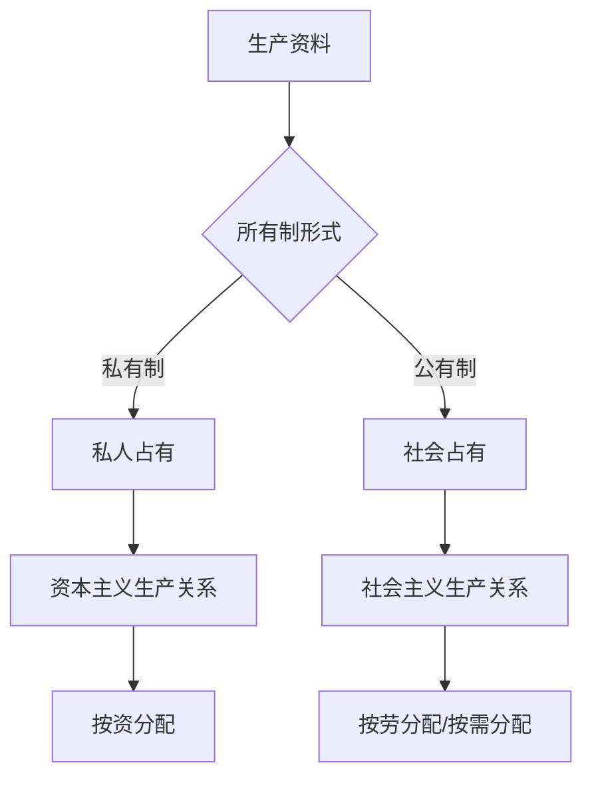

## 概念：生产资料

> 生产资料是指用于生产商品和服务的社会资源，包括土地、工厂、机器、工具、原材料等。

**解决的核心痛点**：区分社会经济系统中不同要素在生产过程中的作用，理解财富创造的根本来源和社会分配关系的本质。

---

### 核心命题

- [[生产资料的占有方式决定了社会财富的分配格局]]
	- **原理**：谁拥有生产资料，谁就控制了商品的生产和分配权力，进而决定社会财富的流向
- [[生产资料的所有制形式是划分社会形态的核心标准]]
	- **原理**：奴隶社会、封建社会、资本主义社会、社会主义社会的根本区别在于生产资料归谁所有

---

### 运行机制

---

### 关键区别

| 维度 | 生产资料 | 劳动力 |
|:--- |:--- |:--- |
| **核心逻辑** | 生产的物质条件 | 人的劳动能力 |
| **在生产中的作用** | 被动因素（劳动对象/工具） | 主动因素（创造价值） |
| **可替代性** | 可积累、可转移 | 与人不可分离 |

| 维度 | 生产资料 | 资本 |
|:--- |:--- |:--- |
| **定义范畴** | 物质生产要素 | 可带来增值的价值 |
| **历史性** | 伴随人类生产活动 | 资本主义特有的产物 |
| **形态** | 土地、工厂、机器 | 货币、商品、证券 |

---

### 应用场景

- ✅ **适用场景**
	- **分析社会形态**：通过生产资料所有制判断社会性质
	- **理解阶级关系**：生产资料的占有决定阶级地位
	- **经济制度比较**：区分资本主义与社会主义的核心维度
- ⛔ **误用**
	- **将生产资料等同于资本**：在社会主义语境下，公有制企业使用的是生产资料而非资本
	- **忽视劳动力价值**：过度强调生产资料而忽略劳动创造价值的事实

---

### 知识图谱

> 知识图谱分类基于奥苏贝尔同化理论：上位（父级）、子集（子级）、并列、相关

- **父级概念**：[[生产关系]] — 生产资料所有制是生产关系的基础
- **子级概念**：
	- [[土地]] — 最基础的生产资料
	- [[劳动工具]] — 机器、设备等
	- [[原材料]] — 生产过程的物质基础
- **并列概念**：
	- [[劳动力]] — 与生产资料相对的生产要素
	- [[资本]] — 能够增值的生产资料
- **相关概念**：
	- [[所有制]] — 生产资料的占有形式
	- [[阶级]] — 因生产资料占有而形成的社会群体

---

### 参考延伸

- 马克思《资本论》第一卷
- 马克思主义政治经济学基本原理
- [维基百科：生产资料](https://zh.wikipedia.org/wiki/%E7%94%9F%E4%BA%A7%E8%B5%84%E6%96%99)
