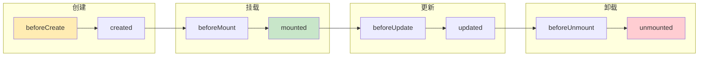

## 概念：生命周期

> 生命周期（Lifecycle）是指 Vue 组件从创建、挂载、更新到销毁的各个阶段，框架在每个阶段提供钩子函数供开发者介入。

**解决的问题**：在合适的时机执行合适的逻辑，如请求数据、绑定事件、清理资源

---

### 核心命题

- **生命周期阶段**
  - 创建 → 挂载 → 更新 → 卸载
- **Composition API 钩子**
  - onMounted、onUpdated、onUnmounted 等
- **Options API 钩子**
  - created、mounted、updated、destroyed 等

---

### 运行机制

---

### 钩子函数详解

#### 创建阶段

| 钩子 | 说明 | 常用场景 |
|:---|:---|:---|
| `beforeCreate` | 实例初始化后，数据观测之前 | 初始化第三方库 |
| `created` | 实例创建完成后 | **请求数据**、初始化状态 |

#### 挂载阶段

| 钩子 | 说明 | 常用场景 |
|:---|:---|:---|
| `beforeMount` | 模板编译后、首次渲染之前 | 最后的配置 |
| `mounted` | 组件挂载后 | **DOM 操作**、获取 refs |

#### 更新阶段

| 钩子 | 说明 | 常用场景 |
|:---|:---|:---|
| `beforeUpdate` | 数据更新后、虚拟 DOM 重渲染之前 | 访问更新前的 DOM |
| `updated` | 虚拟 DOM 重渲染后 | **依赖更新后的 DOM 操作** |

#### 卸载阶段

| 钩子 | 说明 | 常用场景 |
|:---|:---|:---|
| `beforeUnmount` | 组件卸载前 | **清理定时器**、解绑事件 |
| `unmounted` | 组件卸载后 | 完全清理 |

---

### Vue3 新增钩子

| 钩子 | 说明 |
|:---|:---|
| `onActivated` | 被 keep-alive 缓存的组件激活时 |
| `onDeactivated` | 被 keep-alive 缓存的组件停用时 |
| `onRenderTracked` | 响应式依赖被追踪时（调试用） |
| `onRenderTriggered` | 响应式依赖触发更新时（调试用） |

---

### Composition API vs Options API

| Options API | Composition API |
|:---|:---|
| `created` | `onMounted`（setup 在 created 前执行） |
| `mounted` | `onMounted` |
| `beforeUpdate` | `onBeforeUpdate` |
| `updated` | `onUpdated` |
| `beforeDestroy` | `onBeforeUnmount` |
| `destroyed` | `onUnmounted` |

---

### 知识图谱

- **父级概念**：[[Vue]]
- **关联概念**：
  - [[响应式原理(Vue3)]] — 数据变化触发更新
  - [[虚拟DOM(Vue)]] — 渲染机制
- **相关问题**：
  - Vue2 和 Vue3 生命周期有什么区别？

---

### 参考延伸

- Vue3 官方文档：Lifecycle Hooks
- 源码：`packages/runtime-core/src/apiLifecycle.ts`
