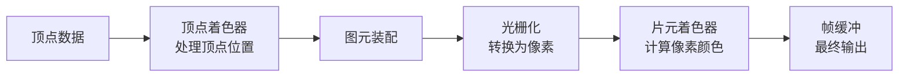

## 概念：着色器

> 在 GPU 上执行的程序，用于控制像素的着色、纹理和渲染效果。

**解决的核心痛点**：CPU 逐像素处理效率低下，着色器让 GPU 并行处理海量像素，实现实时高性能图形渲染。

---

### 核心命题

- 着色器是 GPU 并行计算的核心，一个着色器程序可同时处理数百万像素
- 顶点着色器处理 " 在哪里画 "，片元着色器处理 " 画成什么样 "
- GLSL 是 WebGL 着色器的标准语言，语法类似 C

---

### 运行机制

#### 渲染管线



#### 两种着色器

| 类型 | 职责 | 处理内容 |
|:---|:---|:---|
| **顶点着色器** | 计算顶点位置 | 变换矩阵、法线计算 |
| **片元着色器** | 计算像素颜色 | 纹理采样、光照计算、颜色混合 |

#### GLSL 示例

```glsl
// 顶点着色器
attribute vec4 a_position;
void main() {
  gl_Position = u_projection * u_modelView * a_position;
}

// 片元着色器
precision mediump float;
void main() {
  gl_FragColor = vec4(1.0, 0.5, 0.2, 1.0); // 橙红色
}
```

---

### 关键区别

| 维度 | 顶点着色器 | 片元着色器 |
|:---|:---|:---|
| **处理对象** | 顶点（vertices） | 像素（fragments） |
| **执行次数** | 每个顶点执行一次 | 每个像素执行一次 |
| **核心任务** | 几何变换、坐标转换 | 颜色计算、纹理采样 |
| **输出** | 裁剪空间坐标 | 最终像素颜色 |

---

### 应用场景

- ✅ **WebGL 图形渲染**：3D 游戏、数据可视化（Three.js、D3.js）
- ✅ **图像处理**：滤镜、模糊、锐化
- ✅ **特效**：光晕、粒子效果、阴影
- ✅ **Canvas 2D 高级效果**：通过 WebGL 加速 2D 渲染
- ⛔ **简单静态页面**：无需使用，直接用 CSS/图片

---

### 与前端交互的关系

着色器是**高性能前端交互**的技术基础：

| 交互场景 | 着色器作用 |
|:---|:---|
| **3D 图表交互** | 鼠标悬停时实时改变颜色 |
| **拖拽旋转 3D 模型** | 顶点着色器处理旋转变换 |
| **粒子跟随效果** | 片元着色器计算粒子颜色 |
| **手势缩放** | 顶点着色器处理缩放矩阵 |

---

### 知识图谱

- **父级概念**：[[WebGL]] — 着色器的宿主技术
- **并列概念**：
	- [[Canvas]] — 2D 渲染（对比 WebGL）
	- [[SVG]] — 矢量图形（适合 UI，不适合实时渲染）
- **子级概念**：
	- 顶点着色器 — 处理位置
	- 片元着色器 — 处理颜色
	- GLSL — 着色器语言
- **相关领域**：
	- [[前端交互]] — 着色器的应用领域
	- [[ThreeJS]] — 封装了着色器的高级 3D 库

---

### FAQ

- [[Q-GLSL 如何入门]] — 待创建
- [[Q-WebGL vs Canvas 2D 如何选择]] — 待创建

---

### 参考延伸

- [WebGL 着色器教程](https://webglfundamentals.org/)
- [GLSL 参考文档](https://registry.khronos.org/OpenGL/specs/gl/GLSLangSpec.4.20.pdf)
- Three.js 着色器材质：[MeshStandardMaterial](https://threejs.org/docs/#api/en/materials/MeshStandardMaterial)
