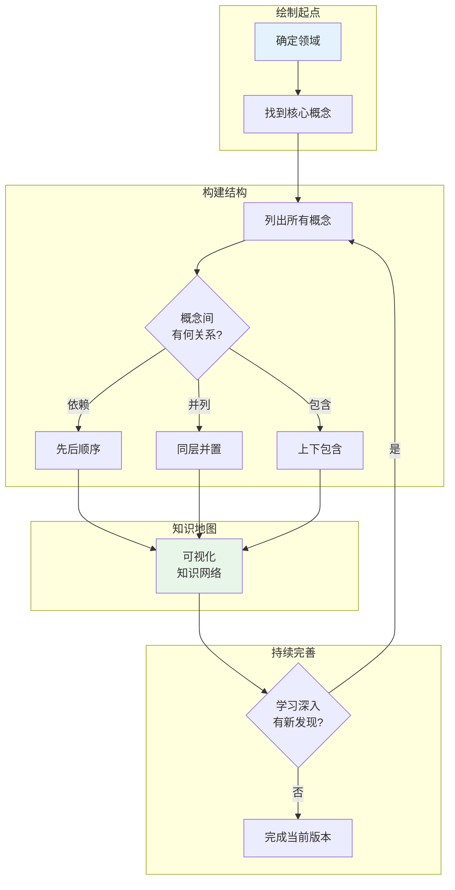

## 概念：知识地图

> 知识地图是领域知识的结构化视图，通过可视化概念间的联系，帮助找到学习路径和识别知识缺口。

**解决的核心痛点**：面对陌生领域时不知道从哪学起——知识地图帮助建立全局视野，避免盲目学习

---

### 核心命题

- [[知识地图的本质是建立领域知识的结构化视图]]
	- 不是线性目录，而是网状结构
	- 展示概念间的依赖关系和优先级
- [[知识地图帮助找到学习路径和知识缺口]]
	- 通过「已知 → 未知」发现学习路线
	- 识别「不会但需要会」的技能
- [[知识地图需要持续迭代和更新]]
	- 初期的粗糙地图随学习深入不断完善

---

### 运行机制

**绘制步骤**：
1. 确定要学习的领域
2. 找到该领域的核心概念（通过 Overview 文章、Wiki）
3. 列出所有相关概念
4. 梳理概念间的依赖关系
5. 确定学习顺序（先学什么、后学什么）
6. 可视化呈现（手绘、思维导图、工具）

---

### 关键区别

| 维度 | 知识地图 | 目录/大纲 | 思维导图 |
|:--- |:--- |:--- |:--- |
| **结构** | 网状，显示依赖 | 线性，层级 | 辐射状，发散 |
| **重点** | 概念关系 | 分类 | 发散联想 |
| **用途** | 学习路径规划 | 内容导航 | 头脑风暴 |
| **动态** | 持续迭代 | 相对固定 | 一次性 |

---

### 应用场景

- ✅ **适用场景**
	- **进入新领域**：快速建立全局视野
	- **学习规划**：确定学习优先级和路径
	- **技能盘点**：识别知识和技能缺口
	- **知识回顾**：梳理已学知识的结构
- ⛔ **误用**
	- **追求完美**：花太多时间画图而迟迟不动
	- **一次完成**：初版地图就定稿，不迭代

---

### 知识图谱

- **父级概念**：[[A-知识管理]]
- **相关概念**：[[有意义学习]], [[第二大脑]], [[PARA笔记法]]

---

### 参考延伸

- **工具**：Obsidian、 Miro、 XMind
- **相关方法**：知识图谱、学习路线图（Roadmap）
