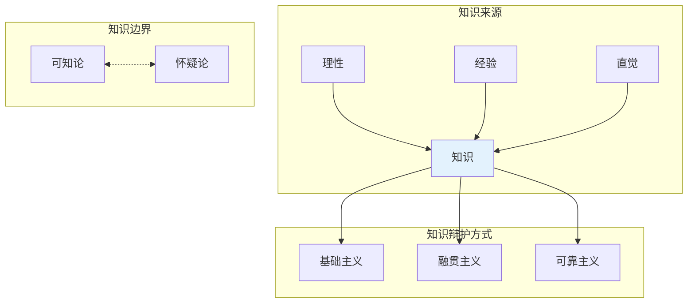

## 概念：知识论

> 知识论（Epistemology），又称认识论，是哲学的一个分支，研究知识的本质、来源、范围和有效性，探讨我们如何认识世界以及知识是否可靠。

**解决的核心痛点**：解决「什么是知识」「我们如何确定自己知道」的问题，为判断信念是否为真知识提供标准

---

### 核心命题

- [[知识的定义是「得到辩护的真信念」]]
	- 盖梯尔问题揭示了传统定义的不足
- [[理性主义和经验主义是知识来源的两大阵营]]
	- 理性主义：知识来源于理性/逻辑
	- 经验主义：知识来源于感官经验
- [[怀疑主义挑战知识的可能性]]
	- 极端怀疑论认为我们无法获得任何知识

---

### 运行机制

---

### 关键区别

| 维度 | 知识论 | 形而上学 |
|:--- |:--- |:--- |
| **研究对象** | 知识的本质与可能性 | 存在的本质 |
| **核心问题** | 我们能知道什么？ | 什么是真实存在的？ |
| **方法** | 分析、论证、反思 | 思辨、概念分析 |

---

### 应用场景

- ✅ **适用场景**
	- **判断信息可靠性**：用知识论标准评估新闻/观点
	- **理解科学方法**：理性 + 经验的认识论基础
	- **AI 认知研究**：机器能否有「知识」
- ⛔ **误用**
	- **过度怀疑**：陷入不可知论而拒绝一切
	- **轻信权威**：未经理性审视就接受观点

---

### 批判

- **外部批判**
	- **自然主义（蒯因）**：知识论应当自然化，成为经验心理学的一章，而非先验规范学科。传统的"辩护"概念无法脱离自然因果链条
	- **女性主义知识论**：传统知识论忽略知识生产中的权力结构、性别偏见和社会位置，所谓"客观性"常常掩盖了特定群体的视角缺失
	- **实用主义（罗蒂）**：知识论作为"自然之镜"的企图已失败，我们应放弃知识是心智对实在准确再现的追求，转而关注对话与效用
- **内在张力**
	- **基础主义的无穷后退问题**：为信念提供辩护需要基础信念，但基础信念本身的辩护何在？阿格里帕三难（无限倒退/循环/独断）至今没有公认解
	- **内在主义 vs 外在主义**：知识辩护需要主体能内省其理由吗？还是只要信念由可靠过程产生即可？两种立场各有反例，难以调和
	- **盖梯尔问题的持续挑战**：1963 年盖梯尔提出反例以来，JTB 定义经历数十次修正，仍未出现公认的完善定义

### 知识图谱

- **父级概念**：[[哲学]]
- **子集概念**：
	- [[理性主义]]
	- [[经验主义]]
	- [[怀疑主义]]
- **并列概念**：
	- [[逻辑学]]
	- [[形而上学]]
- **相关概念**：
	- [[真理]]
	- [[信念]]
	- [[批判性思维]]

---

### 参考延伸

- **代表人物**：柏拉图、笛卡尔、洛克、休谟、康德
- **经典问题**：盖梯尔问题、缸中之脑、洞穴隐喻
