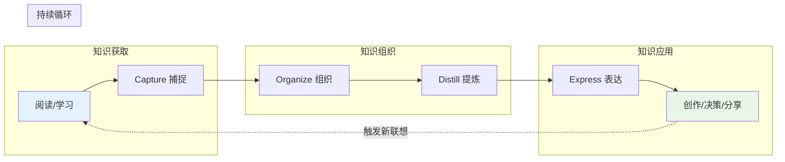

## 概念：第二大脑

> 第二大脑是用数字工具构建的个人知识管理系统，通过外部存储补充人脑记忆，辅助思考和决策。

**解决的核心痛点**：人脑工作记忆容量有限（约 4 个组块），长时记忆不可靠且易遗忘——需要一个外部系统来存储、组织和检索知识，释放认知资源用于创造性思考。

---

### 核心命题

- [[外部大脑能释放前额叶的认知负荷]]
	- **原理**：将知识外包给数字系统，释放工作记忆空间
- [[知识只有被调用时才产生价值]]
	- **原理**：反对收藏癖，检索和应用的优先级高于存储
- [[自下而上的涌现优于自上而下的分类]]
	- **原理**：原子笔记通过双向链接自然涌现知识结构，而非预设分类

---

### 运行机制

Tiago Forte 的 "Building a Second Brain" 方法论包含两个互补的框架：

#### CODE 工作流（知识处理流水线）

- **Capture**：快速捕捉想法和信息，使用收件箱暂存
- **Organize**：按 PARA 分类（项目/领域/资源/归档）
- **Distill**：渐进式总结——从摘录到加粗到批注到重构，逐层提炼
- **Express**：输出和应用知识，完成从输入到价值的转化

#### 渐进式总结（Progressive Summarization）

第二大脑的关键提炼技术，分为四层：

| 层级 | 操作 | 目的 |
|:---:|:---|:---|
| L1 | 原始笔记 | 完整保留原文 |
| L2 | **加粗段落** | 标记最值得关注的部分 |
| L3 | ==高亮关键句== | 提炼核心观点 |
| L4 | 用自己的话总结 | 重新编码，加深理解 |
| L5 | 重构/创作 | 将知识融入自己的作品 |

**原则**：只在必要时深化——大多数笔记止步于 L1/L2，只有高价值笔记才进入 L4/L5。

---

### 关键区别

| 维度 | 第二大脑 | [[数字花园]] | 博客 |
|:--- |:--- |:--- |:--- |
| **核心目的** | 辅助思考和记忆 | 公开分享和生长 | 内容发布 |
| **访问范围** | 完全私有 | 半公开（允许不完美） | 完全公开（要求完整） |
| **强调** | 存储与检索 | 生长与迭代 | 输出与传播 |
| **知识单元** | 原子化，散射状 | 笔记→主题簇→领域 | 完整文章 |
| **与卡片盒的关系** | 行动导向，强调输出 | — | — |

与 [[卡片盒笔记法]] 的定位差异：

| 维度 | 第二大脑 | 卡片盒笔记法 |
|:---|:---|:---|
| **导向** | 行动导向——知识服务于项目产出 | 连接导向——知识服务于洞察涌现 |
| **组织方式** | PARA（按可行动性） | 双向链接（按关联性） |
| **成功标准** | 是否完成了项目、做出了决策 | 是否产生了新洞察、建立了新连接 |
| **生命周期** | 项目结束即归档，知识随项目流动 | 笔记永久留存，随知识网络生长 |
| **两者关系** | 互补——项目驱动知识沉淀，沉淀的知识反哺未来项目 | |

---

### 应用场景

- ✅ **适用场景**
	- **知识积累**：长期构建个人知识库，积累领域认知
	- **辅助决策**：快速检索相关信息，做出更优判断
	- **写作创作**：从笔记网络中激发新想法和连接
- ⛔ **误用**
	- **收藏癖**：只存不用，获取信息的快感替代了真正的学习
	- **过度整理**：花太多时间在分类/打标签/调整结构，而非思考和产出
	- **工具迷恋**：不断更换笔记工具，把选择工具当成生产力本身

---

### 局限性

- **维护成本高**：第二大脑需要持续投入时间整理和回顾，否则会变成"数字垃圾场"
- **工具绑定风险**：深度依赖特定工具（Obsidian/Notion），迁移成本高
- **过度外化**：过度依赖外部存储可能导致"数字健忘症"——不再努力记忆，反而削弱了内部认知能力
- **不适合所有人**：对信息输入量小或工作流程简单的人，建立第二大脑的投入产出比不高

---

### FAQ

> 与本概念相关的开放性问题

- [[Q-如何避免第二大脑沦为收藏夹？]]
- [[Q-外部存储是否削弱了内部记忆能力？]]

---

### 知识图谱

- **父级概念**：[[A-知识管理]] — 第二大脑是知识管理的具体实践方法论
- **并列概念**：
	- [[数字花园]] — 侧重公开分享，第二大脑侧重私有积累
	- [[卡片盒笔记法]] — 侧重连接和涌现，第二大脑侧重行动和产出
- **相关概念**：
	- [[PARA笔记法]] — 第二大脑的组织框架
	- [[CODE知识全生命周期工作流]] — 第二大脑的处理流程
	- [[有意义学习]] — 深层学习的理论基础
	- [[认知负荷]] — 外部分担认知负荷的理论依据

### 参考延伸

- **来源**：Tiago Forte, *Building a Second Brain* (2022)
- **核心方法**：CODE 工作流 + PARA 组织法 + 渐进式总结
- **核心工具**：Obsidian、Notion、Roam Research
- **理论基础**：认知心理学（工作记忆、认知负荷理论）
