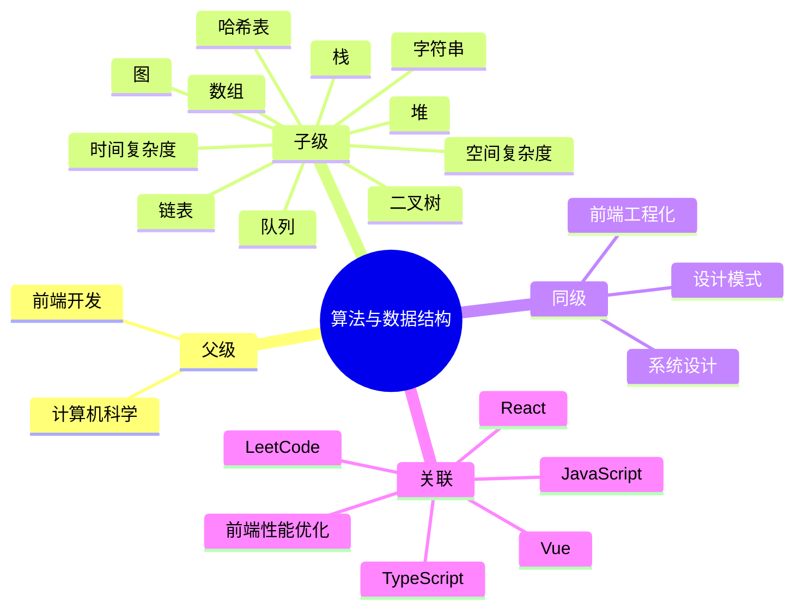

## 🗺️ MOC： 算法与数据结构

> 算法与数据结构是计算机科学的核心，聚焦算法在前端开发中的实际应用，通过系统学习提升问题分析与解决能力

---

### 知识图谱

---

### 定义

- **核心范畴**：
	- 算法思想（分治、贪心、动态规划、回溯、排序、搜索）
	- 数据结构（线性结构、树形结构、图结构、散列表）
	- 复杂度分析（时间复杂度、空间复杂度、大 O 表示法）
	- 前端场景应用（Diff 算法、Virtual DOM、缓存策略、事件委托）
- **不包括**：
	- 底层系统算法（操作系统、编译器、驱动程序）
	- 密码学协议、区块链共识算法
	- 分布式系统算法（Paxos、Raft）
- **与相关领域的区别**：
	- vs [[设计模式]]：算法关注 " 怎么做 "（步骤/流程），设计模式关注 " 怎么组织 "（结构/关系）
	- vs [[前端性能优化]]：算法是底层能力支撑，性能优化是上层目标
	- vs [[系统设计]]：算法是单机思维，系统设计是多机/分布式思维

---

### 关键领域

> 该领域的核心知识主题（链接 Concept 或子领域 Area）

- **复杂度分析**
	- [[时间复杂度]] — 算法执行时间随输入规模增长的趋势
	- [[空间复杂度]] — 算法占用内存空间随输入规模增长的趋势
	- [[大O表示法]] — 描述算法复杂度的标准 notation
- **基础数据结构**
	- [[数组]] — 连续内存的线性结构，高频随机访问
	- [[字符串]] — 字符序列，处理文本数据
	- [[链表]] — 通过指针链接的线性结构，擅长插入删除
	- [[栈]] — LIFO，后进先出的数据结构
	- [[队列]] — FIFO，先进先出的数据结构
- **树形结构**
	- [[二叉树]] — 每个节点最多两个子节点
	- [[平衡树]] — AVL、红黑树等自平衡二叉搜索树
	- [[Trie树]] — 前缀树，用于字符串检索
- **图结构**
	- [[图]] — 节点 + 边的非线性结构
	- [[广度优先搜索|BFS]] — 广度优先搜索
	- [[深度优先搜索|DFS]] — 深度优先搜索
- **哈希结构**
	- [[哈希表]] — key-value 映射，O(1) 平均查找
	- [[哈希碰撞]] — 冲突解决策略（链地址、开放寻址）
- **算法思想**
	- [[分治算法]] — 分解问题、递归求解、合并结果
	- [[贪心算法]] — 局部最优推导全局最优
	- [[动态规划]] — 状态存储避免重复计算
	- [[回溯算法]] — 试探与回退的搜索策略
- **排序与搜索**
	- [[排序算法]] — 快排、归并、堆排等 O(nlogn) 排序
	- [[二分搜索]] — 有序数组的 O(logn) 查找
- **前端专项算法**
	- [[Diff算法]] — 虚拟 DOM 比对（Vue/React 核心）
	- [[Virtual DOM]] — 虚拟 DOM 原理与实现
	- [[事件委托]] — 高性能事件处理模式
	- [[LRU缓存]] — 缓存淘汰策略

---

### SOP

> 该领域的标准化操作流程（SOP）

- [[SOP-LeetCode刷题方法]] — 按类型专题突破，高效刷题策略
- [[SOP-算法复杂度分析]] — 如何快速分析算法复杂度
- [[SOP-前端面试算法准备]] — 面试高频题型与应对策略
- [[SO算法提升专项]] — 系统性算法能力提升路径

---

### FAQ

> 该领域的常见问题（链接 Question 或 MOC）

- [[Q-LeetCode如何高效刷题]]
- [[Q-何时用排序何时用哈希表]]
- [[Q-动态规划如何入门]]
- [[Q-前端需要掌握哪些算法]]
- [[算法真题库]] — 面试真题集合，按类型分类

---

### 算法真题与专题

> 面试真题、算法专题与练习笔记

**真题练习**

- [[三数之和]]
- [[买卖股票的最佳时机 II]]
- [[二叉树的最近公共祖先]]
- [[对角线遍历]]
- [[旋转矩阵]]
- [[最长公共前缀]]
- [[最长回文子串]]
- [[有序三元组中的最大值]]
- [[分割等合子集]]
- [[删除排序数组中的重复项]]
- [[翻转字符串里的单词]]
- [[背包问题]]
- [[零矩阵]]
- [[颜色分类]]
- [[用最精炼的代码实现数组非零非负最小值]]

**算法专题**

- [[数学应用]]
- [[算法选择与调优]]
- [[线性插值]]

---
