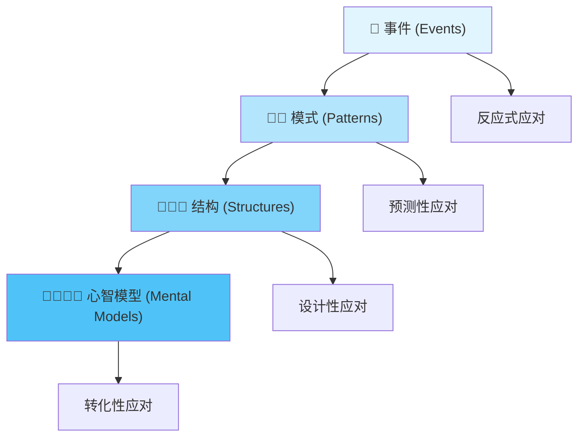
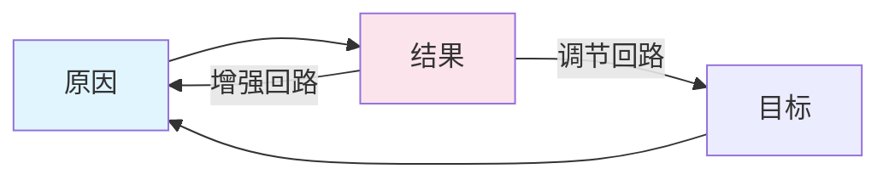

## 概念：系统思维

> 系统思维是一种从事物**互动关系**（而非孤立要素）和**动态演化**（而非静态快照）的角度来理解世界的认知框架，关注整体如何通过各部分的相互作用产生出单一部分所不具备的**涌现**属性。

**解决的核心痛点**：在复杂、动态、模糊的环境中（如生态系统、软件架构、团队管理），避免 " 头痛医头 " 的线性解决方案导致问题恶化。

---

### 核心命题

- 整体大于部分之和
	- **原理**：系统的功能存在于连接之中，把大象切成两半得到的不是两只小象
- 反馈回路驱动系统行为
	- **原理**：结果会反过来影响原因（增强或调节），形成因果循环而非简单因果链
- 系统结构决定行为
	- **原理**：只有改变系统的结构（规则、连接方式），才能根本性地改变系统的表现
- 时间延迟是系统振荡的根源
	- **原理**：行为与结果之间的时间差会导致调节过头或不及，引发系统波动

---

### 运行机制

#### 冰山模型

| 层次 | 说明 | 应对方式 |
|:---|:---|:---|
| **事件** | 发生了什么？（Bug 出现了） | 反应式应对 |
| **模式** | 一直在发生什么？（每次上线前都会出现这类 Bug） | 预测性应对 |
| **结构** | 是什么导致了这些模式？（缺乏自动化测试流程） | 设计性应对 |
| **心智模型** | 什么样的信念导致了这些结构？（" 功能上线比代码质量更重要 "） | 转化性应对 |

#### 反馈回路

| 类型 | 说明 | 示例 |
|:---|:---|:---|
| **增强回路** | 滚雪球效应，A 增加导致 B 增加，B 增加又导致 A 增加 | 复利、病毒传播、技术债 |
| **调节回路** | 恒温器效应，系统试图维持某种平衡 | 人体体温、库存管理 |

---

### 关键区别

| 维度 | [[线性思维]] | [[系统思维]] |
|:---|:---|:---|
| **隐喻** | 机器（零件组装） | 有机体（细胞生长） |
| **分析方法** | 拆解（分析单独部件） | 连接（分析交互关系） |
| **对错误的看法** | 寻找罪魁祸首（Blame） | 寻找系统漏洞（Structure） |
| **时间观** | 快照式 | 动态演化式 |
| **核心关注** | 局部、单因果 | 整体、动态、反馈循环 |

---

### 应用场景

- ✅ **适用场景**
	- **软件架构设计**：理解微服务之间的依赖关系，一个服务的延迟可能导致整个系统的雪崩
	- **解决顽疾**：反复出现的问题（如减肥反弹、项目延期），通常意味着背后有未被发现的增强回路
	- **团队管理**：理解激励机制如何导致意想不到的员工行为
- ⛔ **误用**
	- **症状解**：只是贴创可贴，如服务器慢了就加内存，而不是去查 SQL 查询为什么慢
	- **局部优化**：每个部门都达到最高效率，但公司整体效率反而下降

---

### 知识图谱

- **父级概念**：[[批判性思维]] — 系统思维是批判性思维处理复杂问题的重要工具
- **子级概念**：
	- 反馈回路 — 增强回路和调节回路
	- 存量与流量 — 系统的基础结构
	- 杠杆点 — 系统中最有效的干预点
- **并列概念**：
	- [[线性思维]] — 关注直线因果而非循环反馈
	- 还原论 — 与整体论相对
- **相关概念**：
	- 控制论 — 系统控制的理论研究
	- 复杂性科学 — 研究复杂系统行为的学科

---

### FAQ

- [[Q-如何识别系统中的增强回路和调节回路]]
- [[Q-系统思维如何帮助解决软件架构问题]]

---

### 参考延伸

- 《系统之美》— Donella Meadows，系统思维的经典入门书
- 《第五项修炼》— 彼得·圣吉，将系统思维应用于组织管理
