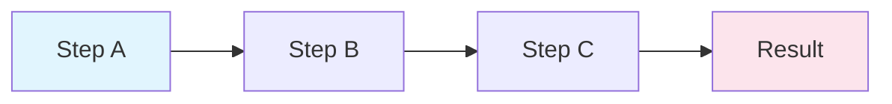

## 概念：线性思维

> 线性思维是一种基于 **「原因 → 结果」** 单向路径的认知模式，假设事物的发展是连续的、顺序的、且可预测的。

**解决的核心痛点**：在简单、封闭的系统中（如流水线生产），提供最高的执行效率和可控性。

---

### 核心命题

- 线性思维假定结果是原因的必然产物
	- **原理**：相信只要控制了输入，就能精确控制输出，对应因果决定论
- 线性思维通过还原论简化复杂系统
	- **原理**：把大问题拆解成小问题，分别解决后，大问题自然解决
- 路径依赖是线性思维的固有惯性
	- **原理**：思维单向向前，难以回头审视最初假设是否错误（缺乏反馈回路）

---

### 运行机制

#### 链式反应模型

#### 核心流程

| 阶段 | 说明 |
|:---|:---|
| **输入** | 确定原因/起点 |
| **处理** | 顺序执行每个步骤 |
| **输出** | 获得结果 |

---

### 关键区别

| 维度 | [[线性思维]] | [[系统思维]] |
|:---|:---|:---|
| **结构** | 直线（Straight Line） | 回路（Loop/Cycle） |
| **核心关注** | 局部、快照、单因果 | 整体、动态、反馈循环 |
| **哲学基础** | 还原论 | 整体论 |
| **应对复杂性** | 试图控制和预测 | 试图适应和引导 |

---

### 应用场景

- ✅ **适用场景**
	- **SOP 执行**：CI/CD 部署流程，必须先构建、再测试、最后部署，顺序不可乱
	- **简单故障排查**：问题源头单一时（如插头没插导致电脑不开机），线性排查最高效
	- **项目排期**：需求明确、变动极少的情况下，制定线性时间表
- ⛔ **误用**
	- **瀑布式开发**：在需求模糊多变的软件开发中强行使用线性流程，导致产出与需求脱节
	- **解决软问题**：试图用线性逻辑解决人际冲突或企业文化问题（复杂系统）

---

### 知识图谱

- **父级概念**：[[逻辑思维]] — 线性思维是逻辑思维的一种形式
- **子级概念**：
	- [[因果链]] — 线性思维的典型结构
	- [[第一性原理]] — 深度线性的极致
- **并列概念**：
	- [[系统思维]] — 关注循环而非直线
	- [[发散思维]] — 关注可能性而非因果
	- [[非线性思维]] — 不遵循线性路径的思维方式
- **相关概念**：
	- [[批判性思维]] — 评估思维质量的方法论
	- [[收敛思维]] — 聚焦于单一解决方案的思维方式

---

### FAQ

- [[Q-什么时候应该用线性思维而不是系统思维]]
- [[Q-如何避免线性思维的路径依赖陷阱]]

---

### 参考延伸

- 《第五项修炼》— 彼得·圣吉，详细阐述线性思维在现代管理中的局限性
- [系统思维入门](https://thesystemsthinker.com/)
