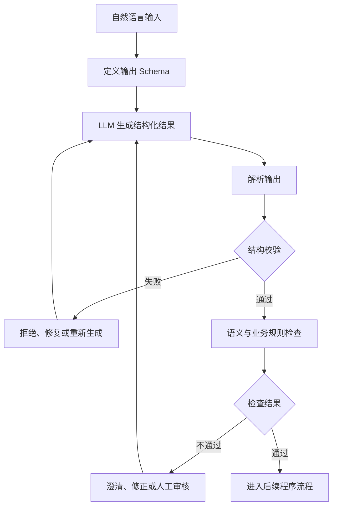

## 概念：结构化输出（Structured Output）

> 结构化输出是通过预定义的数据结构与约束，使大语言模型生成能够被程序解析、校验和使用的数据。

**解决的核心痛点**：LLM 默认生成的自然语言具有不确定性，输出格式、字段内容和组织方式可能随上下文变化，导致程序难以稳定解析和自动化处理。结构化输出通过建立明确的数据契约，降低模型输出与程序接口之间的不确定性。

---

### 核心命题

- 结构正确不代表语义正确
- **原理**：Schema 可以约束字段、类型和格式，但无法单独证明数据符合用户意图或客观事实。一个完全合法的 JSON 对象仍然可能包含错误信息。
- 数据契约使模型输出具备可检查性
- **原理**：预先定义字段、类型、必填项和允许值，可以让程序根据明确规则检查模型输出，而不必完全依赖自然语言理解。
- 结构化输出不能替代独立验证
- **原理**：格式校验只能证明输出满足特定结构约束，不能证明任务已正确执行，也不能证明模型声明的结果真实可靠。
- 模型输出必须经过程序边界检查才能进入可信工作流
- **原理**：将模型输出视为外部输入，通过解析、Schema 校验、业务规则检查和权限控制，避免不可信数据直接触发关键操作。
- 结构化输出是连接自然语言与确定性程序的接口
- **原理**：LLM 负责理解和生成，程序负责解析、校验和执行。结构化数据为两者之间建立了明确的交互边界。

---

### 运行机制

结构化输出通常由数据契约定义、模型生成和程序验证三个部分组成。

1. **定义结构**：开发者使用 JSON Schema、类型定义或其他约束描述期望的数据。
2. **模型生成**：模型根据用户输入和结构约束生成结果。具体约束能力取决于模型及 API。
3. **格式解析**：程序将模型返回的内容解析为目标数据结构。
4. **结构校验**：检查字段、类型、必填项、枚举值及其他 Schema 约束。
5. **语义校验**：检查结果是否符合任务意图和业务规则。 #mark

> [[如何检查结果是否符合任务意图和业务规则？]]

6. **后续处理**：只有通过必要检查的数据才能进入工具调用、任务执行或其他业务流程。

**注意**：图中的重新生成、修复和人工审核是可选的应用层策略，并非所有结构化输出机制都内置这些能力。对于高风险操作，还需要独立的权限检查。

---

### 关键区别

#### 结构化输出与普通 JSON 提示

|维度|结构化输出|普通 JSON 提示|
|---|---|---|
|**核心逻辑**|通过格式约束、Schema 或受约束生成机制控制输出|通过自然语言指令要求模型返回 JSON|
|**格式保障**|取决于 API 是否提供受约束生成及其支持范围|主要依赖模型遵循提示词|
|**程序校验**|仍然需要|仍然需要|
|**语义正确性**|不保证|不保证|
|**适用场景**|对输出格式稳定性有明确要求的程序接口|快速原型、简单任务或约束较弱的场景|

#### 结构化输出与 Function Calling

|维度|结构化输出|Function Calling|
|---|---|---|
|**核心逻辑**|生成符合指定数据结构的结果|生成工具调用请求及其参数|
|**核心产物**|结构化数据|工具名称、参数及调用请求|
|**是否涉及工具执行**|不必涉及|通常需要宿主程序处理并执行|
|**执行权限**|由后续应用逻辑决定|需要宿主检查工具权限和调用条件|
|**适用场景**|信息提取、分类、任务契约生成|搜索、文件操作、数据库查询等工具交互|

#### 结构校验与语义验证

|维度|结构校验|语义验证|
|---|---|---|
|**核心逻辑**|检查数据是否满足格式和 Schema 约束|检查内容是否符合任务意图、业务规则或事实要求|
|**判断依据**|类型、字段、枚举、数值范围等明确规则|业务规则、上下文、外部数据或人工判断|
|**自动化程度**|通常较高，适合确定性程序检查|取决于验证问题，部分情况需要模型或人工参与|
|**适用场景**|JSON 解析、字段校验、类型检查|任务正确性、业务合理性、事实一致性检查|

---

### 适用范围

- ✅ **适用场景**
- **信息提取**：从非结构化文本中提取姓名、日期、实体及其他字段，便于后续程序处理。
- **分类与路由**：将用户输入转换为预定义类别或路由参数，使程序能够根据结果选择处理流程。
- **任务契约生成**：将自然语言需求转换为结构化任务描述，为后续规划、执行和验证提供输入。
- **工具调用参数生成**：约束模型生成符合工具接口的数据，减少参数格式错误。
- **Agent 状态管理**：使用结构化数据表达任务步骤、执行状态、检查结果和错误信息。
- **数据交换**：在 LLM 与应用程序之间建立明确、可维护的数据接口。
- ⛔ **误用**
- **把合法 JSON 当成正确答案**：格式合法并不代表字段内容真实、合理或符合用户意图。
- **把 Schema 当成完整业务规则**：Schema 能描述部分约束，但复杂的跨字段关系、权限要求和业务语义通常需要额外逻辑。
- **直接执行未经授权的结构化指令**：即使模型输出符合工具参数 Schema，也不能因此跳过权限检查。
- **把模型生成的验证报告当成独立证据**：结构化报告只是数据格式，不能证明其中的测试结果或执行声明真实发生。
- **对所有输出强制使用复杂 Schema**：过度复杂的结构会增加维护成本，并可能降低任务灵活性。
- **失效边界**
- 无法仅凭数据格式证明模型输出的事实真实性。
- 无法仅凭 Schema 判断复杂任务是否真正满足用户的隐含意图。
- 无法保证模型在所有输入条件下都能生成正确、完整的数据。
- 无法替代工具执行、权限治理、任务验证和审计机制。
- 对于高度开放、创造性或难以形式化描述的任务，强制结构化可能损失有价值的信息。
- 不同模型和 API 对受约束生成的支持程度不同，不能假设所有 Schema 约束都能被执行。

---

### 批判

- **外部批判**
- **符号主义与形式化方法视角**：结构化输出虽然建立了明确的数据表示，但数据结构的形式正确性并不意味着其语义解释正确。形式系统能够检查已定义的规则，却不能自动补足未定义的业务语义。
- **概率语言模型视角**：LLM 的输出具有概率性。即使采用结构约束，也不能因此认为模型已经消除幻觉、理解错误或上下文误读。
- **软件工程视角**：Schema 只能覆盖显式定义的约束。如果接口契约设计不完整，程序仍可能接收到结构合法但业务上不可用的数据。
- **人机协作视角**：过度依赖自动化结构转换可能掩盖用户意图中的歧义。对于影响较大的决策，系统仍应允许用户澄清和确认。
- **内在张力**
- **约束与表达能力的冲突**：结构越严格，程序越容易处理，但模型表达复杂信息的空间可能越小。
- **确定性接口与概率性生成的冲突**：程序期待稳定的数据契约，而模型生成仍可能受到上下文、模型版本和提示词变化的影响。
- **形式正确与实质正确的分离**：结构校验能够建立有限的确定性，却不能自动解决语义正确性问题。
- **自动化与人工判断的冲突**：自动验证能够提高效率，但无法覆盖所有歧义和价值判断；完全依赖人工又会削弱自动化的收益。
- **Schema 演化与兼容性的冲突**：修改字段、类型或约束可能影响下游消费者，需要版本管理和兼容性策略。

---

### FAQ

> 以下问题用于进一步探索结构化输出的设计边界。它们是待研究的问题，不代表已经形成经过实践验证的标准流程。

- [[如何设计适合 Agent 的 JSON Schema？]]
- [[如何验证 LLM 生成的 Task Contract 是否符合用户意图？]]
- [[结构化输出失败后应该重试、修复还是请求用户澄清？]]
- [[如何处理不同 LLM 对 JSON Schema 支持程度的差异？]]
- [[如何验证结构化输出中的事实声明？]]
- [[何时应该使用 Function Calling 而不是普通结构化输出？]]

---

### SOP

> 以下是可以进一步沉淀为独立 SOP 的操作流程。具体执行策略应根据模型能力、任务风险和项目需求验证后确定。

- [[定义 LLM 输出 Schema 的 SOP]] — 明确输出字段、类型、必填项、允许值及必要约束。
- [[校验 LLM 结构化输出的 SOP]] — 对模型输出执行解析、Schema 校验和业务规则检查。
- [[处理结构化输出失败的 SOP]] — 根据错误类型决定拒绝、修复、重试或请求用户澄清。
- [[设计 Agent 工具调用参数的 SOP]] — 定义工具参数结构，并建立权限检查与执行边界。
- [[验证 Task Contract 的 SOP]] — 检查任务契约的结构、语义、约束和用户确认状态。

---

### 知识图谱

> 通过上下位关系和相关关系，将结构化输出连接到 LLM、Agent、程序验证及工程治理知识网络。

- **父级概念**：
- [[大语言模型]] — 结构化输出是约束和处理大语言模型生成结果的一种技术。
- **子级概念**：
- [[JSON Schema]] — 描述 JSON 数据结构及其约束的标准。
- [[Structured Outputs API]] — 通过模型 API 实现受约束结构化生成的能力。
- [[结构校验]] — 检查输出是否符合指定数据结构。
- [[结构化任务契约]] — 使用结构化数据表达任务目标、约束和验收条件。
- **并列概念**：
- [[Prompt Engineering]] — 通过提示词设计引导模型行为。
- [[Function Calling]] — 让模型生成工具调用请求及参数。
- [[RAG]] — 通过检索外部信息增强模型回答或生成过程。
- **相关概念**：
- [[Agent]] — 使用结构化输出连接模型推理与程序执行。
- [[Task Contract]] — 为任务目标、约束和验收条件建立明确的数据契约。
- [[Independent Verification]] — 独立检查任务结果是否满足要求。
- [[Evidence]] — 为判断和结论提供可检查的依据。
- [[Human-in-the-Loop]] — 在歧义、权限请求和关键决策中引入人工参与。
- [[类型系统]] — 使用类型描述和约束程序数据。
- [[数据契约]] — 定义系统模块之间的数据结构和交互约定。
- **参考文章**：
- [OpenAI Structured Outputs 指南](https://platform.openai.com/docs/guides/structured-outputs)
- [JSON Schema 官方文档](https://json-schema.org/learn)
- [Zod 官方文档](https://zod.dev/)
- [Anthropic Tool Use 文档](https://docs.anthropic.com/en/docs/agents-and-tools/tool-use/overview)

---

### 个人理解

结构化输出的本质，是在概率性语言生成与确定性程序处理之间建立一个明确的接口。

它解决的是**输出如何被程序可靠地读取和检查**，而不是直接解决**输出是否真实、任务是否正确完成**。

在 Agent 工程中，应将结构化输出视为数据边界的一部分：

- LLM 负责理解输入并生成候选结果。
- Schema 负责描述允许的数据结构。
- 程序负责解析和检查结构。
- 业务验证负责检查语义与任务约束。
- 独立验证负责检查执行结果。
- Evidence 为结论提供可检查的依据。
- 人类负责处理系统无法可靠消解的歧义和关键决策。

因此，结构化输出并不是让模型变得绝对可靠，而是让模型的不确定性能够被明确地隔离、检查和管理。
