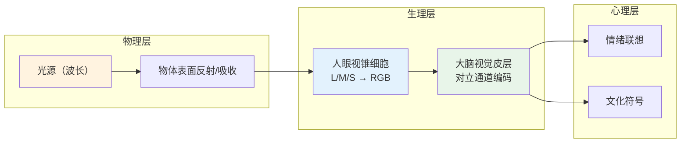

## 概念：色彩理论

> 研究色彩如何被感知、混合、搭配的系统化知识体系，涵盖物理学（光的波长）、生理学（视觉感知）、心理学（情绪影响）三个层面。

---

### 核心命题

- **色彩是光而非物体的属性**
	- **原理**：物体本身没有颜色，不同波长的光被反射后被人眼感知为不同颜色。黑暗中没有颜色。
- **色彩和谐是文化习得而非先天直觉**
	- **原理**：不同文化对配色和谐的判断有差异，尽管某些对比（如红-绿）有生理基础。
- **色彩感知是相对的而非绝对的**
	- **原理**：同一颜色在不同背景、光照、相邻色下看起来完全不同（色彩恒常性、同时对比）。

---

### 运行机制

**色彩三要素**（HSL 模型）：

| 要素 | 定义 | 示例 |
|:---|:---|:---|
| **色相 (Hue)** | 颜色的种类，即"是什么颜色" | 红色、蓝色、绿色 |
| **饱和度 (Saturation)** | 颜色的纯度/鲜艳程度 | 鲜红 → 灰红 |
| **明度 (Lightness)** | 颜色的明亮程度 | 浅蓝 → 深蓝 |

---

### 关键区别

| 维度 | 加色混合（RGB） | 减色混合（CMYK） |
|:---|:---|:---|
| **原理** | 光叠加，越混越亮 | 颜料吸收，越混越暗 |
| **三原色** | 红、绿、蓝 | 青、品、黄 |
| **叠满结果** | 白色 | 黑色 |
| **应用** | 屏幕、显示器 | 印刷、油漆 |

---

### 经典配色模式

| 模式       |    色差    | 效果       |  使用难度  |
| :------- | :------: | :------- | :----: |
| **互补**   |   180°   | 强烈对比、冲击力 | 低（易过激） |
| **类似色**  |   30°    | 和谐统一、柔和  |   低    |
| **三等分**  |   120°   | 丰富平衡、有活力 |   中    |
| **分裂互补** | 150°+30° | 对比柔和版    |   中    |
| **四边形**  |  90°×2   | 复杂调色板    |   高    |

---

### 实用法则

- **60-30-10 法则**：主色 60%（背景）、次要色 30%（组件）、强调色 10%（交互元素）
- **无障碍对比**：正文需要至少 4.5:1 对比度（WCAG AA），大文字需要 3:1
- **大面积不鲜艳**：大面积色块应降低饱和度，鲜艳色只用于小面积强调
- **蓝黄盲友好**：约 8% 男性和 0.5% 女性有红绿色盲，避免纯红/绿作为唯一区分手段

---

### 应用场景

- ✅ **适用场景**
  - **UI 设计**：选择品牌色 → 生成调色板 → 应用 60-30-10 法则
  - **数据可视化**：用色相区分类别、用饱和度/明度编码数值
  - **品牌设计**：理解色彩联想在不同文化的差异
- ⛔ **误用**
  - **纯理论推导**：色彩理论是指导原则而非数学公式——人眼判断比理论更重要
  - **忽略内容**：配色最终服务于内容，不能让配色喧宾夺主

---

### 知识图谱

- **父级概念**：[[视觉设计]] — 视觉设计是色彩理论的上层应用领域
- **相关概念**：
  - [[色彩心理学]] — 色彩对情绪和行为的影响（子集）
  - [[视觉设计原则]] — 色彩与其他设计原则的组合使用
  - [[认知负荷]] — 不当配色会增加用户的认知成本
- **相关领域**：[[设计|A-设计]] — 设计领域的核心理论基础

### 参考延伸

- Johannes Itten — 《色彩艺术》（经典色轮和配色理论奠基人）
- Josef Albers — 《色彩的互动》（色彩相对性经典实验）
- WCAG 2.1 — 无障碍色彩对比度标准
- [Adobe Color](https://color.adobe.com) — 在线配色工具
