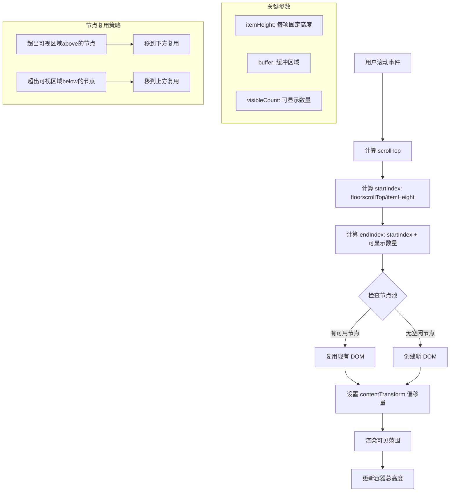

## 概念：虚拟列表

> 虚拟列表是一种**只渲染可见区域数据**的列表优化技术，通过计算滚动位置动态切换渲染内容，解决海量数据渲染的性能问题。

**解决的核心痛点**：传统列表渲染所有数据会导致 DOM 节点过多，内存占用高，滚动卡顿。虚拟列表通过只渲染可见区域 + 动态回收节点，实现「海量数据 + 流畅滚动」的兼得。

---

### 核心命题

> 核心命题引用 atomic 笔记（陈述句观点），每个命题是一句话洞见

- [[虚拟列表的核心思想是只渲染可见区域]] — 滚动时计算可见范围，只渲染当前应显示的 N 条数据
	- **原理**：固定容器高度 + 计算 startIndex/endIndex + 动态挂载/卸载 DOM
- [[虚拟列表通过滚动位置计算可见项]] — 根据 scrollTop 和 itemHeight 计算当前应该显示哪些数据
	- **原理**：startIndex = Math.floor(scrollTop / itemHeight)，endIndex 基于容器可视高度计算
- [[虚拟列表采用DOM回收而非销毁重建]] — 可见范围外的数据从 DOM 移除但节点对象保留，滚动回来时复用
	- **原理**：对象池思想，避免 GC 压力

---

### 运行机制

**核心流程**：
1. 监听 scroll 事件（节流）
2. 计算可见范围 startIndex ~ endIndex
3. 动态创建/复用 DOM 节点
4. 设置 transform 或 padding 模拟总高度

---

### 关键区别

| 维度 | 虚拟列表 | 分页加载 | 懒加载 |
|:---|:---|:---|:---|
| **核心逻辑** | 单次渲染可见区域，滚动时动态切换 | 一次加载一页，触发加载更多 | 图片进入视口才加载 |
| **数据加载** | 一次性加载全部数据，只渲染部分 | 按页加载，分批获取 | 滚动到底部触发加载 |
| **适用场景** | 数据量大但需要流畅滚动 | 数据量极大，无法一次加载 | 图片/内容逐个加载 |
| **内存占用** | O(可见数量)，固定 | O(当前页) | O(可视区域) |
| **滚动体验** | 连续，流畅 | 间歇性加载，有加载等待 | 图片逐个出现 |

---

### 应用场景

- ✅ **适用场景**
	- **长列表渲染**：数据量 > 1000 条，如聊天记录、商品列表、日志流
	- **固定高度列表项**：每项高度可计算（已知或通过测量缓存）
	- **实时数据流**：需要持续展示新数据同时保持滚动位置
- ⛔ **误用**
	- **动态高度列表项**：高度不一致时计算复杂，需要更复杂实现（absolute positioning 或 虚拟树）
	- **一次性加载成本高**：数据获取本身就很慢，分页可能更合适
	- **列表项组件复杂**：每个 item 渲染很重，虚拟列表只能减少 DOM 数量，无法减少渲染计算量
- ⭐常用的 npm 包
	- [react-virtuoso](https://virtuoso.dev/react-virtuoso/) — 最流行，功能强大，支持动态高度
	- [react-window](https://www.npmjs.com/package/react-window) — 轻量级，固定行高场景首选
	- [vue-virtual-scroller](https://www.npmjs.com/package/vue-virtual-scroller) — vue 场景下的虚拟列表库

---

### SOP

> 与本概念相关的标准操作流程，通过实践辅助理解

- [[实现简易虚拟列表]] — 从零实现虚拟列表的完整流程

---

### FAQ

> 与本概念相关的开放性问题，待进一步探索

- 虚拟列表如何处理动态高度?
- 虚拟列表与 windowing 算法的区别？

---

### 知识图谱

> 知识图谱链接 term（术语定义）和相关 concept，建立概念关系网络

- **父级概念**：
	- [[前端性能优化]] — 虚拟列表是性能优化的具体实现
	- [[渲染性能]] — 虚拟列表解决的是渲染性能问题
- **子级概念**：
	- [[虚拟头节点]] — 虚拟列表中维护占位元素的辅助技术
	- [[无限滚动]] — 依赖虚拟列表思想的数据加载模式
- **并列概念**：
	- [[分页加载]] — 另一种解决大数据渲染的方案
	- [[懒加载]] — 图片/内容的延迟加载策略
	- [[IntersectionObserver]] — 可用于实现懒加载的浏览器 API
- **相关概念**：
	- [[DOM API]] — 虚拟列表依赖 DOM 操作实现节点管理
	- [[requestIdleCallback]] — 可用于虚拟列表的滚动节流优化

---

### 参考延伸

- MDN: [Virtual Scrolling](https://developer.mozilla.org/en-US/docs/Web/API/VirtualScrolling)
- 经典实现: [react-window](https://github.com/bvaughn/react-window)、[react-virtualized](https://github.com/bvaughn/react-virtualized)
- 文章: [用 Vue3 徒手实现虚拟列表](https://example.com/vue3-virtual-list)
