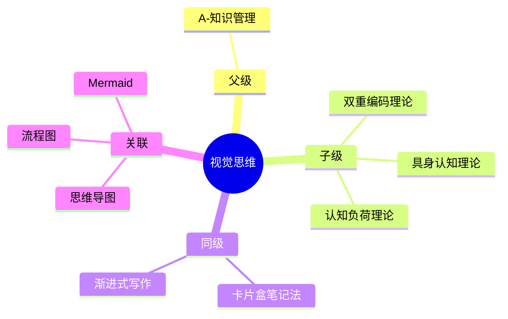

## 概念： 视觉思维

> 通过图形、图表、图谱等视觉化方式辅助思考、知识整理和信息表达的思维方式。

---

### 知识图谱

---

### 定义

- **核心范畴**：视觉化思考、图形表达、知识可视化
- **不包括**：专业图形设计、UI/UX 设计
- **与相关领域的区别**：关注思维辅助而非美学呈现

---

### 长期目标

- **愿景**：掌握视觉化工具，提升复杂概念的传达能力和知识整理效率
- **里程碑**：
	- [x] 阶段 1：掌握主流视觉化工具（思维导图、流程图、Mermaid）
	- [x] 阶段 2：建立视觉化知识整理工作流 ✅ 2026-04-09
	- [ ] 阶段 3：提升图表传达能力，建立个人视觉笔记规范

---

### 关键领域

> 该领域的核心知识主题

- **理论基础**
	- [[双重编码理论]] — 文字 + 图像双重编码记忆更牢固
	- [[认知负荷]] — 视觉分组降低信息处理压力
	- 具身认知理论 — 手绘动作强化思维具身性
- **视觉工具**
	- [[Mermaid]] — 代码绘图（流程图、时序图、类图）
	- Excalidraw — 手绘风格图表
	- 思维导图 — 发散思维的视觉化工具
	- [[视觉工具选取原则]] — 根据场景选择视觉工具的准则

---

### 原子洞见

> 该概念下的核心观点（atomic 笔记）

- [[视觉思维能降低认知负荷]] — 把信息外化到空间/图形结构，减轻工作记忆负担

---

### SOP

> 该领域的标准化操作流程

- [[SOP-视觉思维工作流]] — 从信息到视觉化笔记的标准流程
- [[SOP-视觉工具选择矩阵]] — 根据场景选择合适的视觉工具

---

### FAQ

> 该领域的常见问题

- [[Q-如何选择合适的图表类型]]
- [[Q-视觉笔记和文字笔记哪个更好]]

---
