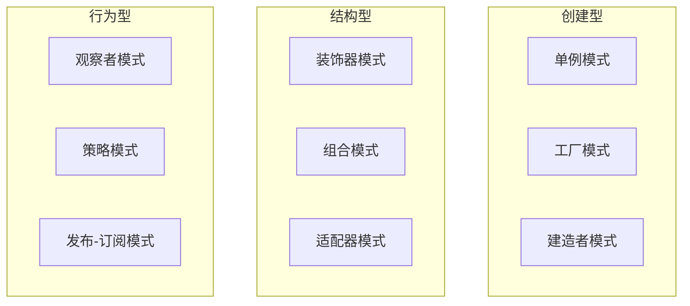

## MOC：设计模式

> 设计模式是在软件设计中解决常见问题的可重用解决方案，分为创建型、结构型和行为型三大类。

---

### 创建型

关注对象创建机制，提升灵活性和复用性。

- [[单例模式]] — 确保一个类只有一个实例
- [[工厂模式]] — 创建对象的接口
- [[建造者模式]] — 分步构建复杂对象
- [[模块模式]] — IIFE 封装私有作用域
- [[依赖注入]] — 将对象需要的依赖改为外部注入

### 结构型

关注对象组合方式，定义实体间的关系。

- [[装饰器模式]] — 动态添加额外职责
- [[组合模式]] — 树形结构表示整体-部分
- [[适配器模式]] — 使不兼容接口协同工作

### 行为型

关注对象间通信与职责分配。

- [[观察者模式]] — 定义对象间的一对多依赖关系
- [[发布订阅模式]] — 发布者和订阅者解耦
- [[策略模式]] — 定义一组可互换的算法

---

### 知识网络

- **父级**：[[软件工程]] — 设计模式是软件工程中代码设计方法论的核心组成部分
- **相关**：[[SOLID 原则]]、[[重构]]、[[面向对象编程]]

---

### 待探索

- [ ] 设计模式在函数式编程中的对应方案
- [ ] 现代框架（React/Vue）中设计模式的自然替代
- [ ] 设计模式在 TypeScript 类型系统中的应用

## 参考延伸

- 《设计模式：可复用面向对象软件的基础》（Gang of Four）
- [Refactoring Guru](https://refactoring.guru/design-patterns)
