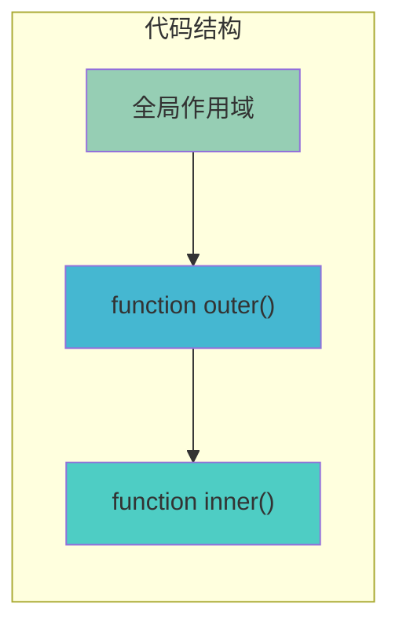
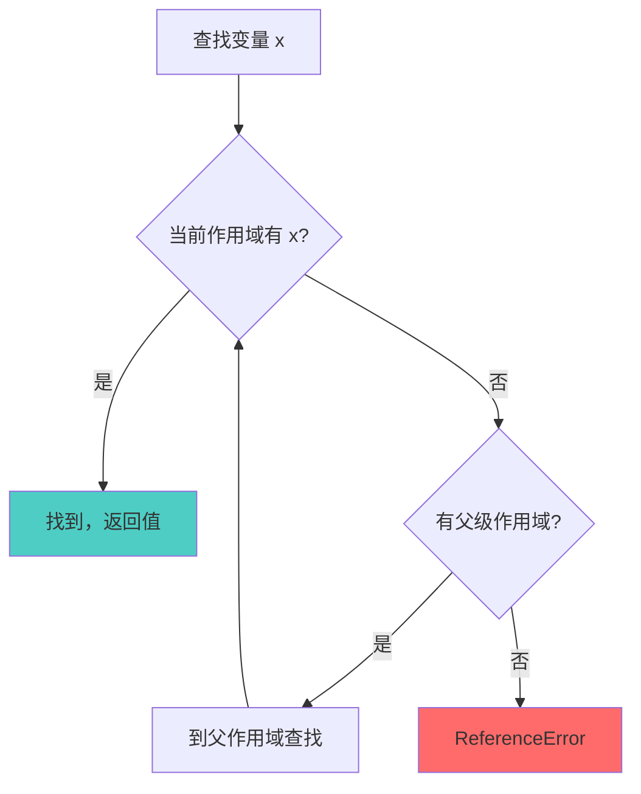

## 概念：词法作用域

> 词法作用域（Lexical Scoping）是 JavaScript 采用的作用域机制，变量的可见性由其在源代码中的声明位置决定，在代码执行前就已经确定。

**解决的核心痛点**：在代码执行前，程序员需要能够静态分析确定变量的作用域，从而写出可预测的代码；同时引擎需要高效地根据声明位置建立作用域关系。

---

### 核心命题

- [[作用域在函数定义时就决定了]]（待创建）
	- **原理**：词法作用域下，函数的作用域链在函数创建时就已确定（通过 [[Scope]] 属性），而非运行时
- [[闭包源于词法作用域的跨越边界访问]]（待创建）
	- **原理**：函数可以访问其定义时所在作用域的变量，即使该函数在别的作用域执行

---

### 运行机制

词法作用域（静态作用域）遵循 " 定义位置决定作用域 " 的原则：



**作用域确定时机**：

1. **编译阶段**：编译器扫描代码，记录每个变量和函数声明的位置
2. **函数创建时**：函数对象被创建，同时记录其 [[Scope]] 属性，指向当前作用域链
3. **函数执行时**：基于 [[Scope]] 构建新的作用域链，供变量查找使用

**变量查找过程**：



**与动态作用域的对比**：

```javascript
// 词法作用域（JavaScript）
var value = 1;
function foo() {
    console.log(value);
}
function bar() {
    var value = 2;
    foo();  // 输出 1，而非 2
}
bar();
```

```javascript
// 动态作用域（伪代码，JavaScript 不支持）
var value = 1;
function foo() {
    console.log(value);  // 运行时决定，输出 2
}
function bar() {
    var value = 2;
    foo();  // 调用时才决定 value
}
```

---

### 关键区别

| 维度 | 词法作用域（静态作用域） | 动态作用域 |
|:--- |:--- |:--- |
| **作用域确定时机** | 编译时，基于代码结构 | 运行时，基于调用栈 |
| **变量查找路径** | 由定义位置决定 | 由调用位置决定 |
| **可静态分析** | ✅ 可以 | ❌ 不可以 |
| **代表语言** | JavaScript、Python、Java、C | Perl（部分）、Bash（部分） |

---

### 应用场景

- ✅ **适用场景**
	- **代码分析工具**：ESLint、babel 转换时可以准确推断变量作用域
	- **闭包实现**：词法作用域是闭包的基础，函数记住其定义时的环境
	- **模块化**：代码结构在写代码时就已确定，模块边界清晰
- ⛔ **误用**
	- **用 eval 或 with 动态修改作用域**：这会破坏词法作用域的可预测性，导致性能问题和调试困难
	- **假设作用域在运行时变化**：这是对 JavaScript 的常见误解

---

### FAQ

- 暂无相关 Question

---

### 知识图谱

- **父级概念**：[[作用域]] — 变量的可见性范围
- **子级概念**：
	- [[块级作用域]]（待创建）— let/const 引入的块级作用域
	- [[函数作用域]]（待创建）— function 创建的作用域
- **并列概念**：
	- [[动态作用域]]（待创建）— 与词法作用域对立的作用域机制
- **相关概念**：
	- [[作用域链]] — 词法作用域下的变量查找机制
	- [[闭包]] — 词法作用域的产物
	- [[执行栈]] — 管理函数执行时的作用域链
- **参考文章**
	- [MDN - 词法作用域](https://developer.mozilla.org/zh-CN/docs/Web/JavaScript/Closures/Lexical_scoping_and_variables)
