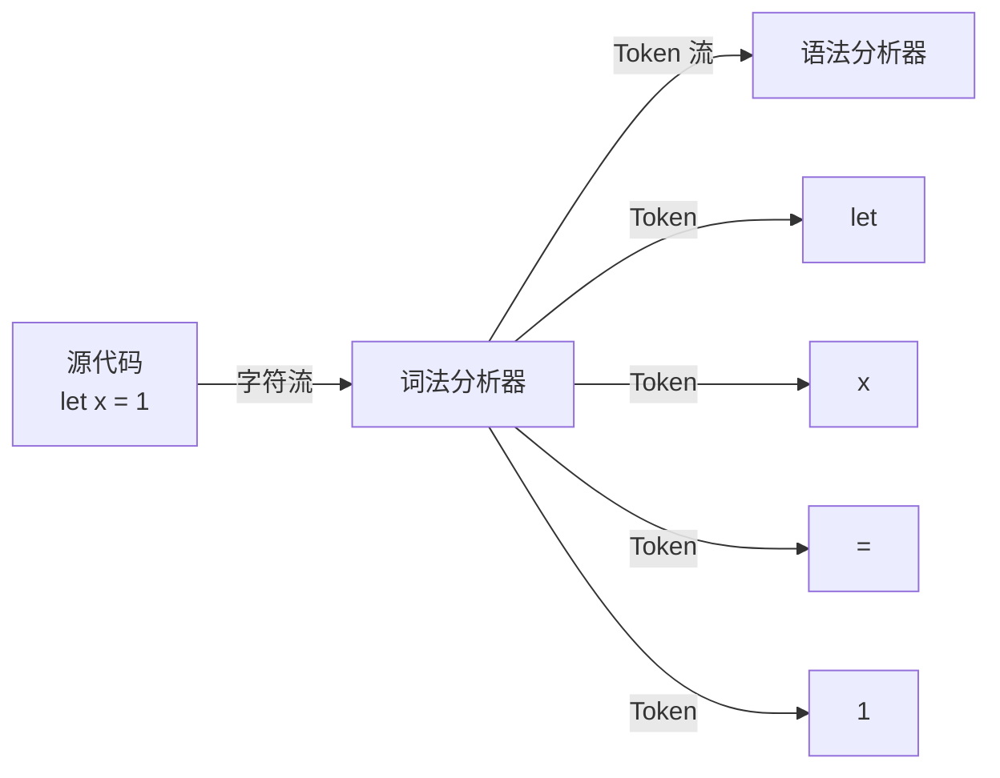

## 术语：词法分析

> **别名**: Lexical Analysis, Tokenization
> **领域**: #前端开发/编译器

### 定义

词法分析 (Lexical Analysis) 是编译器的第一个阶段，将源代码字符串分解为一个个的词法单元 (Token)。这些 Token 是编程语言中有意义的最小语法单元。

### 过程

### 常见 Token 类型

| 类型 | 示例 | 说明 |
|------|------|------|
| 关键字 | `let`, `if`, `function` | 语言保留词 |
| 标识符 | `x`, `myFunc` | 变量名、函数名 |
| 运算符 | `+`, `-`, `=` | 运算和赋值 |
| 字面量 | `1`, `"hello"` | 常量值 |
| 分隔符 | `(`, `)`, `;` | 语法结构 |

### 锚点连接

- **属于**：[[JavaScript 引擎]]
- **前置阶段**：无
- **后续阶段**：[[语法分析]]
- **相关概念**：[[AST]] [[编译器]]
