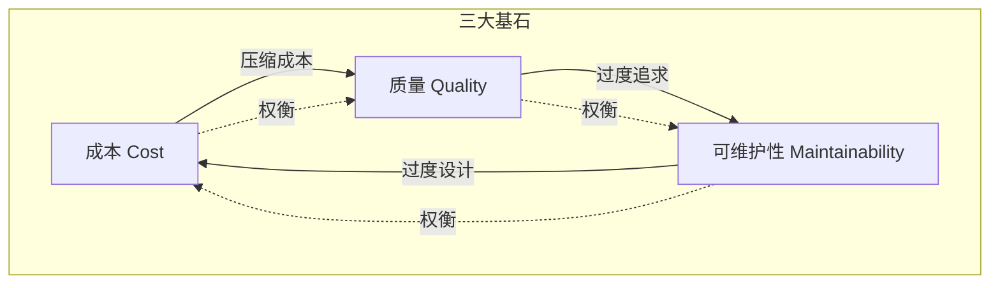

## 概念：软件工程三大基石

> 软件工程的本质是在成本（Cost）、质量（Quality）、可维护性（Maintainability）三个维度之间做权衡。

**解决的核心痛点**：软件项目如何在有限的资源下，平衡开发速度、代码质量和长期可维护性？三大基石提供了决策分析框架。

---

### 核心命题

- **成本是短期约束**：开发时间和人力投入直接影响交付速度，但压缩成本往往以牺牲质量或可维护性为代价
- **质量是生存底线**：低质量软件导致线上故障、用户流失，修复成本随延迟指数增长
- **可维护性是长期价值**：可维护性差的代码积累技术债务，最终拖垮开发效率
- **三者不可兼得**：任何软件决策都是三者的权衡——快速交付可能降低质量，过度设计增加成本

---

### 关键区别

| 维度 | 软件工程三大基石 | 项目管理铁三角 |
|:---|:---|:---|
| **核心关注** | 软件产品的内在属性 | 项目交付的外部约束 |
| **维度** | 成本、质量、可维护性 | 时间、范围、成本 |
| **时间跨度** | 全生命周期 | 单项目周期 |
| **衡量方式** | 主观+客观（指标） | 客观（时间/预算/功能数） |

---

### 知识图谱

- **父级概念**：[[软件工程|MOC-软件工程]] — 三大基石是软件工程的核心决策框架
- **相关概念**：
	- [[重构]] — 应对可维护性下降的核心手段
	- [[SOLID 原则]] — 提升可维护性的设计准则
	- 测试 — 保障质量的实践方法
	- 代码审查 — 兼顾质量与可维护性的协作机制
