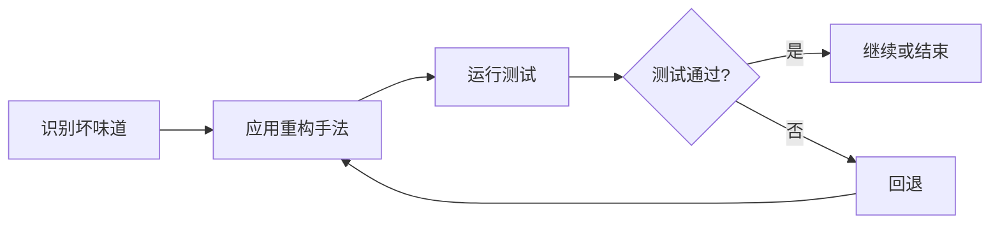

## 概念：重构

> 在不改变代码外部行为的前提下，改善内部结构、提高代码质量的系统性实践。

**解决的核心痛点**：软件代码在持续迭代中会逐渐腐化（技术债务），重构提供了系统性地改善代码结构而不破坏功能的实践方法。

---

### 核心命题

- 重构的核心是"小步快跑"——每次修改后运行测试，确保行为不变
- 重构需要在安全的测试覆盖下进行——没有测试的重构是盲目修改
- 重构与设计模式相辅相成——重构可以引入设计模式，设计模式指导重构方向

---

### 运行机制

---

### 关键区别

| 维度 | 重构 | 重写 |
|:---|:---|:---|
| **行为变化** | 不改变 | 重新设计 |
| **风险** | 低（小步迭代） | 高（一次性替换） |
| **时间成本** | 持续投入 | 集中投入 |
| **适用场景** | 代码尚可 | 代码不可救药 |

---

### 知识图谱

- **父级概念**：[[软件工程]] — 重构是软件工程中的持续改进实践
- **相关概念**：
	- [[设计模式|MOC-设计模式]] — 设计模式为重构提供目标方向
	- [[SOLID 原则]] — SOLID 原则是衡量重构质量的标尺
