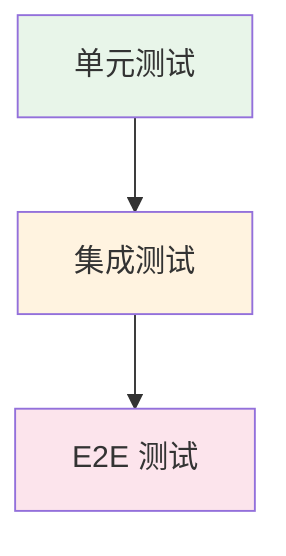

## 概念：集成测试

> 验证多个模块或组件协同工作时的交互正确性的测试方法，介于单元测试和 E2E 测试之间。

**解决的核心痛点**：单元测试只验证孤立模块，E2E 测试难以定位问题，集成测试专注于模块间接口的正确性。

---

### 核心命题

- 集成测试的核心价值是「接口验证」——确保模块间契约不被破坏
- 集成测试比单元测试更接近真实使用，比 E2E 测试更容易定位问题
- 集成测试的范围选择很重要，过大则失去优势，过小则验证不足

---

### 测试金字塔

| 层级 | 范围 | 速度 | 维护成本 |
|:---|:---|:---:|:---:|
| **单元测试** | 单一函数 | 快 | 低 |
| **集成测试** | 模块间接口 | 中 | 中 |
| **E2E 测试** | 完整路径 | 慢 | 高 |

---

### 集成测试 vs 其他测试

| 维度 | 集成测试 | 单元测试 | E2E 测试 |
|:---|:---|:---|:---|
| **范围** | 模块间接口 | 单一模块 | 整个应用 |
| **速度** | 中 | 快 | 慢 |
| **隔离性** | 部分隔离 | 完全隔离 | 不隔离 |
| **失败定位** | 较精确 | 精确 | 模糊 |

---

### 集成策略

| 策略 | 说明 | 适用场景 |
|:---|:---|:---|
| **Big Bang** | 所有模块一次性集成 | 小型项目 |
| **自顶向下** | 从上层开始逐步集成 | 有明确层级结构 |
| **自底向上** | 从底层开始逐步集成 | 底层模块稳定 |
| **三明治** | 上下两层同时向中间集成 | 大型项目 |
| **持续集成** | 每次提交自动集成 | 所有项目 |

---

### 前端集成测试场景

| 场景 | 说明 |
|:---|:---|
| **组件测试** | 验证 React/Vue 组件的 props 和事件 |
| **模块间通信** | 验证模块间的函数调用和数据传递 |
| **API 集成** | 验证 API 调用和数据处理逻辑 |
| **路由集成** | 验证路由配置和页面跳转 |

---

### 常见问题

- ⛔ **过度依赖 mock**：失去集成测试的意义
- ⛔ **测试范围不清**：集成 vs E2E 边界模糊
- ⛔ **环境差异**：测试环境与生产环境不一致

---

### 知识图谱

- **父级概念**：[[前端工程]] — 属于质量保障领域
- **并列概念**：
	- [[单元测试]] — 单一模块验证
	- [[E2E]] — 完整用户路径验证
- **相关工具**：
	- [[Vitest]] — 支持组件测试
	- Testing Library — DOM 测试工具

---

### 参考延伸

- [Testing Integration](https://martinfowler.com/articles/testing-strategies.html)
- [Vitest - Testing Foundations](https://vitest.dev/guide/testing-types.html)
