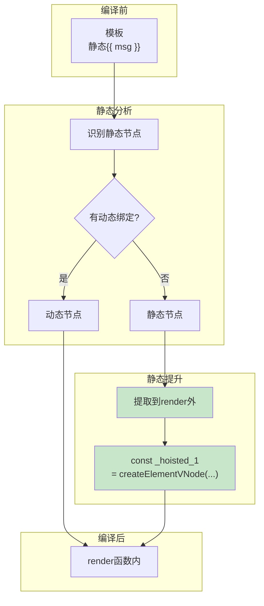

## 概念：静态提升

> 静态提升（Static Hoisting）是 Vue3 编译器的一项优化技术，将模板中不变的部分（静态节点）提取到 render 函数外部，避免每次渲染时重复创建。

**解决的核心痛点**：静态节点每次 render 都重新创建浪费性能，静态提升将其提取到外部只创建一次

---

### 核心命题

- **静态节点的定义**
	- 不包含任何动态绑定（无插值、无指令、无动态属性）
	- 纯静态内容的 DOM 节点
- **提升的效果**
	- 减少 VNode 创建次数
	- 减少内存占用
	- 提升渲染性能

---

### 运行机制



#### 代码示例

```javascript
// 模板
<div>
  <p class="static">静态内容</p>
  <p>{{ dynamic }}</p>
</div>

// 编译后（无静态提升）
function render() {
  return h('div', [
    h('p', { class: 'static' }, '静态内容'),  // 每次都创建
    h('p', dynamic)                            // 动态部分
  ])
}

// 编译后（有静态提升）
const _hoisted_1 = /*#__PURE__*/_createElementVNode("p", { class: "static" }, "静态内容", -1 /* HOISTED */)

function render() {
  return _createElementVNode("div", null, [
    _hoisted_1,  // 复用已创建的静态节点
    _createElementVNode("p", null, dynamic, 1 /* TEXT */)
  ])
}
```

---

### 静态提升的类型

| 类型 | 示例 | 是否提升 |
|:---|:---|:---|
| 静态文本 | `<span>文字</span>` | ✓ |
| 静态属性 | `<div class="foo">` | ✓ |
| 静态绑定 | `:class="cls"` | ✗ |
| 插值 | `{{ msg }}` | ✗ |
| 动态指令 | `v-if="show"` | ✗ |

---

### 应用场景

- **适用场景**
	- 大面积静态内容的组件
	- 列表中的静态结构
	- 布局类组件
- **误用**
	- 过度细粒度提升反而增加复杂度

---

### 知识图谱

- **父级概念**：[[模板编译(Vue3)]]
- **关联概念**：
	- [[Block管理]] — 另一种优化机制
	- [[预标记]] — 标记动态节点

---

### 参考延伸

- Vue3 源码：`packages/compiler-core/src/transforms/hoistStatic.ts`
