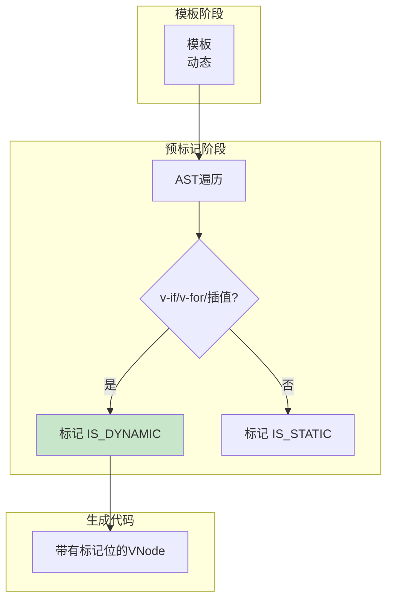

## 概念：预标记

> 预标记（Pre-marking）是 Vue3 编译器在模板编译阶段对动态节点进行标记的优化技术，帮助运行时更高效地进行 diff 对比。

**解决的核心痛点**：运行时需要遍历整个 VNode 树才能确定哪些是动态节点，预标记提前标记减少遍历开销

---

### 核心命题

- **动态节点类型**
	- 插值节点：`{{ msg }}`
	- 动态绑定：`:class`, `:style`
	- 动态指令：`v-if`, `v-for`, `v-bind`
- **标记的作用**
	- 快速定位动态节点
	- 减少 diff 时的遍历范围
	- 与 Block 配合实现精准更新

---

### 运行机制

> 当数据变化触发重新渲染时，Vue 3 不会去对比整个虚拟 DOM 树，而是利用 `patchFlag` 进行优化：
>
> - **收集动态节点**：每个**Block**（如根节点、带有 `v-if`/`v-for` 的节点）会收集其下所有带 `patchFlag` 的后代动态节点，存储到 `dynamicChildren` 数组中。
> 
> - **跳过静态树**：更新时，直接遍历 `dynamicChildren` 数组，只对这些动态节点进行对比。
> 
> - **精准更新属性**：对于动态节点，根据其 `patchFlag` 的具体值，只对比相应的属性。例如，如果一个节点只有 `TEXT` 标记，那就只对比文本内容，不再检查 `class`、`style` 或其他属性。



#### 代码示例

```javascript
// 模板
<div>
  <span>静态</span>
  <span>{{ msg }}</span>
</div>

// 编译后的 VNode（带标记）
// 静态节点：标记为 -1 (HOISTED)
// 动态文本节点：标记为 1 (TEXT)
// 动态元素节点：标记为 2 (CLASS/STYLE 等）

function render(_ctx, _cache) {
  return (_openBlock(), _createElementBlock("div", null, [
    // 静态节点，不参与 diff
    _createElementVNode("span", null, "静态", -1),
    // 动态节点，带 TEXT 标记
    _createElementVNode("span", null, _ctx.msg, 1 /* TEXT */)
  ]))
}
```

---

### 标记类型

| 标记 | 值 | 说明 |
|:---|:---:|:---|
| `HOISTED` | -1 | 已静态提升的节点 |
| `TEXT` | 1 | 文本内容是动态的 |
| `CLASS` | 2 | class 是动态的 |
| `STYLE` | 4 | style 是动态的 |
| `PROPS` | 8 | 属性是动态的 |
| `FULL_PROPS` | 16 | 全部属性是动态的 |

---

### 与静态提升的区别

| 维度 | 静态提升 | 预标记 |
|:---|:---|:---|
| **目的** | 减少创建 | 减少 diff 遍历 |
| **处理对象** | 完全静态的节点 | 动态节点 |
| **阶段** | 编译时 | 编译时 + 运行时 |

---

### 知识图谱

- **父级概念**：[[模板编译(Vue3)]]
- **关联概念**：
	- [[静态提升]] — 配合优化
	- [[Block管理]] — 利用标记进行更新

---

### 参考延伸

- Vue3 源码：`packages/compiler-core/src/ast.ts`
