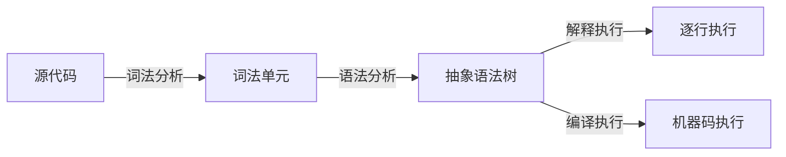

<!--
	原子笔记 (Atomic Note) 设计原则：

	1. 原子笔记是最小的知识单元——一个笔记记录一个洞见
	2. 核心是"一句话观点"——用陈述句表达你的理解
	3. 必须有"论据/示例"——代码、案例、数据支撑观点
	4. 包含"关联"——建立与父级和相关笔记的链接
	5. 与 term 的区别：atomic 是主观洞见，term 是客观定义

	写作节奏：
	- 先写核心观点（What I learned）
	- 再写论据支撑（Why/How I know）
	- 最后写关联（Where it fits）
-->

> JavaScript 引擎读取源代码，通过词法分析、语法分析生成抽象语法树 (AST)，然后解释执行或编译执行。

### 论据/示例

1. **解析 (Parsing)**：词法分析 + 语法分析 → 生成 AST
2. **解释/编译**：AST → 字节码或机器码
3. **执行**：在虚拟机或直接执行机器码

### 关联

- **父级**：[[JavaScript 引擎]]
- **相关**：[[V8 引擎]] [[字节码]]
