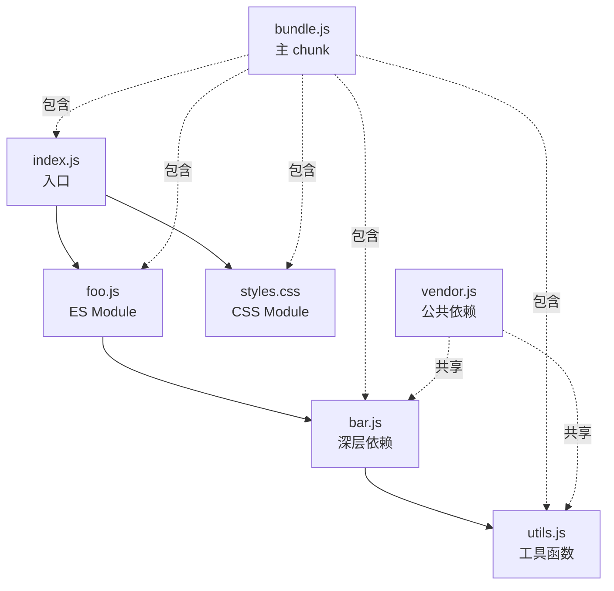

> Webpack 模块打包的本质是建立依赖图并生成优化后的资源集合。

## 论据/示例

**依赖图构建过程**：

```javascript
// 入口文件 src/index.js
import { foo } from './foo.js';
import styles from './styles.css';

console.log(foo);
```

```javascript
// foo.js
export const foo = 'hello';
```

Webpack 解析流程：
1. 从 `entry`（`src/index.js`）开始
2. 检测到 `import './foo.js'` → 将 foo.js 加入依赖图
3. 检测到 `import './styles.css'` → 调用 css-loader 处理
4. 递归解析所有模块，构建完整依赖图
5. 根据图关系，将相关模块打包到同一个 chunk

**构建后的依赖图**：



**优化后的资源集合**：

| 优化手段 | 效果 |
|:---|:---|
| Tree Shaking | 移除未使用的 export |
| Code Splitting | 按需加载，减小首屏体积 |
| Minification | 压缩代码，移除空格注释 |
| Module Concatenation | 合并模块减少函数调用开销 |

## 关联

- [[Webpack]] — 本观点的上位概念
- [[Webpack配置流程]] — 配置 Webpack 的标准流程
