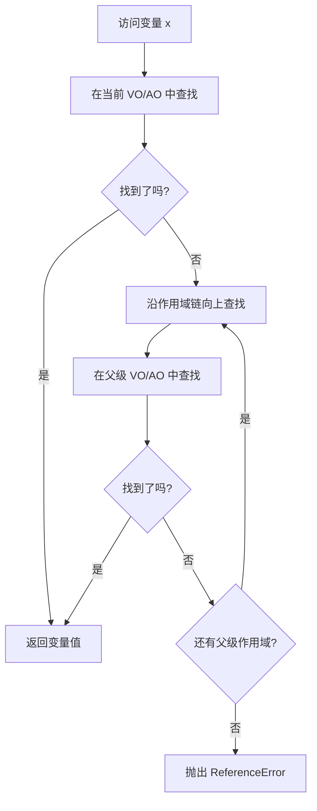

## 🧩 概念：作用域链

### 1. 核心定义 (The Essence)

> [!abstract]
> 作用域链 (Scope Chain) 是 JavaScript 中用于变量查找的机制，它是一个由当前执行上下文的变量对象和所有父级执行上下文的变量对象组成的链表结构。

**解决的核心痛点**：在 JavaScript 中，当代码需要访问一个变量时，需要有一套明确的规则来确定这个变量在哪里定义。作用域链正是为了解决 " 变量查找路径 " 问题而存在的，它定义了变量访问的优先级和范围。

### 2. 核心命题与原则 (Atomic Propositions)

- [[作用域链的构建基于函数的词法作用域]]
	- **原理**：作用域链在函数**定义时**就已经确定，而不是在函数调用时。函数内部的 `[[Scope]]` 属性保存了其父级作用域链。
- [[闭包的本质是函数保存了其定义时的作用域链]]
	- **原理**：==当一个函数返回另一个函数时，内部函数会保存外部函数的作用域链，即使外部函数已经执行完毕，这就是闭包能够访问外部变量的原因。==
- [[变量查找遵循作用域链的逐级向上搜索规则]]
	- **原理**：当访问一个变量时，JavaScript 引擎会先在当前执行上下文的变量对象中查找，如果找不到，就沿着作用域链向上查找，直到全局上下文。

### 3. 运行机制/模型 (Mechanism)

#### ⚙️ 运作流程

#### 🆚 关键区别 (Compare & Contrast)

| 维度 | **[[作用域链]]** | **[[原型链]]** |
|:--- |:--- |:--- |
| **核心逻辑** | 变量查找的路径和顺序 | 属性/方法查找的路径和顺序 |
| **创建时机** | 函数定义时确定（词法作用域） | 对象创建时确定（基于 `__proto__`） |
| **主要内容** | 变量对象/活动对象的链表 | 原型对象的链表 |
| **适用场景** | 查找变量、函数标识符 | 查找对象属性、方法 |

### 4. 应用场景与反模式 (Use Cases)

- ✅ **适用场景**
	- **理解变量访问规则**：通过作用域链可以清晰理解为什么内部函数可以访问外部函数的变量。
	- **调试作用域问题**：当变量访问出现意外结果时，检查作用域链可以帮助定位问题。
	- **实现模块化**：利用闭包和作用域链可以创建私有变量和模块模式。
- ⛔ **误用与反模式 (Anti-Patterns)**
	- **过度依赖全局变量**：过多使用全局变量会污染全局作用域，增加命名冲突的风险。
	- **循环引用导致内存泄漏**：不当使用闭包可能导致作用域链中的对象无法被垃圾回收。

### 5. 知识图谱 (Knowledge Graph)

- **父级概念**：[[执行上下文]]、[[JS执行机制]]
- **子概念/组成部分**：[[词法作用域]]、[[闭包]]、[[变量对象]]
- **关联概念**：[[This绑定]]、[[原型链]]
- **相关工具/库**：浏览器开发者工具的 Scope 面板可用于查看当前作用域链。

### 6. 参考与延伸

- **经典文献**：《JavaScript 高级程序设计》、《你不知道的 JavaScript》
- **推荐阅读**：[[彻底明白作用域、执行上下文]] 这篇文章详细解释了执行上下文、变量对象和作用域链的关系。
