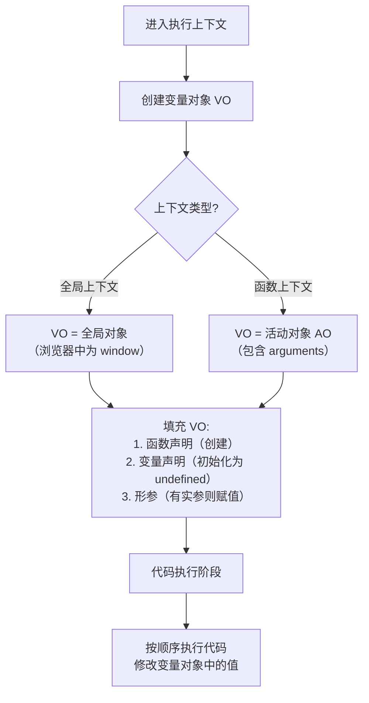

## 🧩 概念：变量对象

### 1. 核心定义 (The Essence)

> [!abstract]
> 变量对象 (Variable Object, VO) 是 JavaScript 执行上下文中的一个内部数据结构，用于存储该上下文中定义的所有变量、函数声明和形参。

**解决的核心痛点**：在 JavaScript 代码执行前，需要有一个地方来存储和管理当前作用域内的所有标识符（变量、函数等），以便在执行阶段能够快速查找和访问它们。变量对象正是为了解决这个 " 标识符存储与管理 " 问题而存在的。

### 2. 核心命题与原则 (Atomic Propositions)

- [[执行上下文在创建阶段会生成变量对象]]
	- **原理**：当进入一个执行上下文时（函数调用或全局代码执行），JavaScript 引擎会先创建变量对象，然后根据规则填充变量、函数声明和形参。
- [[变量提升的本质是变量对象在创建阶段的初始化]]
	- **原理**：变量提升现象实际上是因为在代码执行前，变量对象已经创建并初始化了变量（值为 `undefined`）和函数（值为函数对象）。
- [[活动对象是函数上下文中被激活的变量对象]]
	- **原理**：在函数上下文中，变量对象被称为活动对象 (Activation Object, AO)，它除了包含变量对象的所有属性外，还包含 `arguments` 对象。

### 3. 运行机制/模型 (Mechanism)

#### ⚙️ 运作流程

## 🆚 关键区别 (Compare & Contrast)

| 维度 | **[[变量对象]]** | **[[作用域链]]** |
|:--- |:--- |:--- |
| **核心逻辑** | 存储当前上下文的所有标识符 | 定义变量查找的路径和顺序 |
| **创建时机** | 执行上下文创建阶段 | 基于函数创建时的 `[[Scope]]` 属性构建 |
| **主要内容** | 变量、函数声明、形参、arguments | 当前 VO/AO + 所有父级 VO/AO 的链表 |
| **适用场景** | 标识符的存储和访问 | 变量查找的规则和路径 |

## 4. 应用场景与反模式 (Use Cases)

- ✅ **适用场景**
	- **理解变量提升**：通过变量对象的创建过程，可以清晰理解为什么变量和函数会 " 提升 "。
	- **调试作用域问题**：当变量访问出现意外结果时，检查变量对象的内容可以帮助定位问题。
	- **理解闭包机制**：闭包能够访问外部函数的变量，本质上是因为它保存了外部函数执行上下文的活动对象。
- ⛔ **误用与反模式 (Anti-Patterns)**
	- **过度依赖变量提升**：虽然理解变量提升很重要，但在编写代码时应避免依赖这一特性，而是使用 `let`/`const` 和合理的代码组织。

## 5. 知识图谱 (Knowledge Graph)

- **父级概念**：[[执行上下文]]、[[JS执行机制]]
- **子概念/组成部分**：[[活动对象]]、[[arguments对象]]、[[变量提升]]
- **关联概念**：[[作用域链]]、[[闭包]]、[[This绑定]]
- **相关工具/库**：浏览器开发者工具的 Scope 面板可用于查看当前作用域链和变量对象。

## 6. 参考与延伸

- **经典文献**：《JavaScript 高级程序设计》、《你不知道的 JavaScript》
- **推荐阅读**：[[彻底明白作用域、执行上下文]] 这篇文章详细解释了执行上下文、变量对象和作用域的关系。
