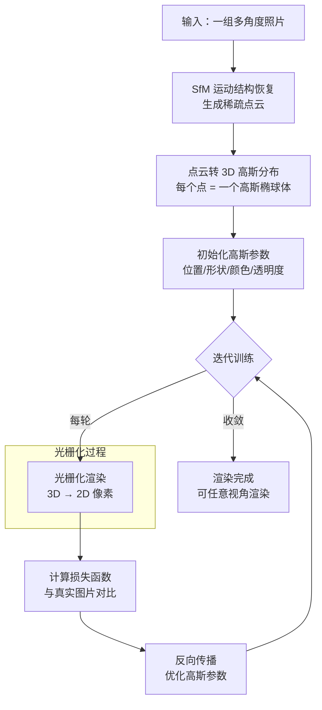

## 概念：3D 高斯泼溅（3D Gaussian Splatting）

> 用一组 3D 高斯分布（椭球体）表示 3D 场景，通过光栅化将高斯 " 泼溅 " 到 2D 屏幕进行渲染的新一代 3D 重建技术。

**解决的核心痛点**：NeRF（神经辐射场）训练慢、渲染慢、依赖神经网络隐式表达；3DGS 用显式高斯分布实现百倍提速，且无需神经网络即可达到照片级真实感渲染。

---

### 核心命题

- **显式表达**：用 3D 高斯函数直接表示场景，而非神经网络隐式编码
- **高效渲染**：基于光栅化的渲染方式，比 NeRF 的射线步进快 100 倍以上
- **可微优化**：通过反向传播调整高斯参数（位置、形状、颜色、透明度）学习场景
- **椭球基元**：各向异性高斯可精确覆盖复杂表面结构

---

### 运行机制

#### 3D 高斯的数学表达

3D 高斯函数定义：

$$G(\mathbf{x}) = e^{-\frac{1}{2}(\mathbf{x}-\boldsymbol{\mu})^T \boldsymbol{\Sigma}^{-1}(\mathbf{x}-\boldsymbol{\mu})}$$

其中：
- **μ**：椭球中心（3D 位置）
- **Σ**：协方差矩阵（3×3，正定矩阵），决定椭球形状和旋转

协方差矩阵可分解为：

$$\boldsymbol{\Sigma} = \mathbf{R} \mathbf{S} \mathbf{S}^T \mathbf{R}^T$$

- **R**：旋转矩阵（四元数表示，4 参数）
- **S**：缩放对角矩阵（3 参数）

因此每个高斯由 **7 个参数**定义：位置 (3) + 旋转 (4) + 缩放 (3) = 10 参数（再加透明度、颜色）

#### 3D → 2D 投影

---

### 关键区别

| 维度 | NeRF（神经辐射场） | 3DGS（高斯泼溅） |
|:---|:---|:---|
| **表达方式** | 隐式（MLP 神经网络） | 显式（高斯分布） |
| **渲染速度** | 慢（射线步进采样） | 快 100 倍 +（光栅化） |
| **训练时间** | 数小时 | 数分钟 |
| **内存占用** | 高（需要 MLP） | 低（稀疏点云） |
| **视角自由度** | 任意新视角 | 有限基线内 |
| **实现复杂度** | 中等 | 相对简单 |

---

### 应用场景

- ✅ **适用场景**
	- **3D 重建**：从照片重建真实场景（文物、建筑、人物）
	- **自动驾驶仿真**：生成逼真的训练数据
	- **AR/VR**：实时场景捕获和渲染
	- **机器人导航**：环境建模
	- **游戏/影视**：快速资产创建
- ⛔ **局限性**
	- **远基线视角**：超出训练视角范围会退化
	- **光泽表面**：镜面反射场景建模困难
	- **动态场景**：主要针对静态场景

---

### 知识图谱

- **父级领域**：[[计算机图形学]] — 所属技术领域
- **演进关系**：
	- [[NeRF]] — 前代技术（神经辐射场）
- **相关概念**：
	- [[高斯分布]] — 数学基础
	- [[Mesh]] — 传统 3D 模型表示
	- [[光栅化]] — 渲染方式
	- [[SfM]] — 运动结构恢复（前期点云重建）
	- [[ThreeJS]] — WebGL 实现基础
- **参考文章**
	- https://github.com/apple/ml-sharp
