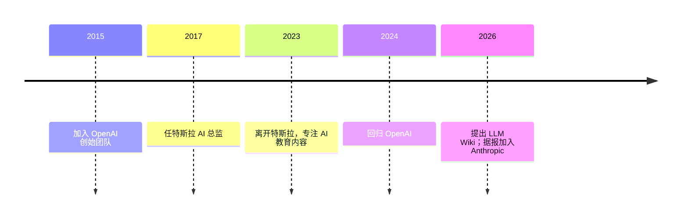

> LLM Wiki 个人知识库方法论的提出者，曾任特斯拉 AI 总监、OpenAI 创始成员。

## 人物卡片

| 项目       | 信息                        |
| -------- | ------------------------- |
| **姓名**   | Andrej Karpathy           |
| **生卒**   | 待核实（斯洛伐克布拉迪斯拉发出生，幼年移居多伦多） |
| **国籍**   | 斯洛伐克裔（现居美国）               |
| **职业**   | AI 研究者/工程师，前特斯拉 AI 总监     |
| **代表领域** | 人工智能、深度学习、知识管理            |

---

### 生平简介

Andrej Karpathy，斯洛伐克裔 AI 研究者。多伦多大学本科，斯坦福大学博士（师从李飞飞，主讲 CS231n）。2015 年成为 OpenAI 创始成员；2017 年加入特斯拉任 AI 总监，主导 Autopilot 视觉系统；2024 年回归 OpenAI；据网络报道 2026 年 5 月加入 Anthropic 参与 Claude 模型大规模训练。

> ⚠️ 部分履历（尤其近况）来自网络转述，引用时需核实。

---

### 人生时间线

| 时间 | 事件 | 影响 |
|------|------|------|
| 2015 | 加入 OpenAI 创始团队 | AI 前沿从业起点 |
| 2017 | 任特斯拉 AI 总监，主导 Autopilot | 工业界 AI 领导者 |
| 2023 | 离开特斯拉，制作"Neural Networks: Zero to Hero"系列 | 普及深度学习 |
| 2024 | 回归 OpenAI | — |
| 2026-04 | 提出 LLM Wiki 方法论 | 确立个人知识库新范式 |
| 2026-05 | 据报加入 Anthropic | — |

---

### 主要成就

- **LLM Wiki 方法论**（2026）：提出让 LLM 担任"知识编译器"维护个人 Markdown 知识库，本库即基于此方法论
- **Software 2.0**（2017）：提出数据驱动编程范式概念，影响深远
- **开源教学项目**：nanoGPT、micrograd、llama2.c 等，及 "Neural Networks: Zero to Hero" 系列教程
- **自动驾驶**：特斯拉 Autopilot 视觉系统主导者

---

### 思想与观点

> 提炼人物的核心思想，链接到相关 atomic/concept 笔记

- **LLM Wiki**：LLM 从"操作代码"转向"操作知识"，把知识库当作有状态的代码库持续编译维护——本库 [[llm-wiki-schema]] 的三层架构（Raw/Wiki/Schema）与 ingest/query/lint 操作即源于此
- **Software 2.0**：用数据与优化取代手写规则，让"程序"自己学习
- **vibe coding**（2025）：强调 LLM 时代的直觉式编程协作

---

### 代表作品

- **《LLM Wiki》（idea file，2026-04）**：个人知识库构建方法论的原始文本
- **"Neural Networks: Zero to Hero"**（2023）：深度学习入门视频课程
- **《Intro to Large Language Models》**（2023）：LLM 科普视频/文章
- **nanoGPT / micrograd / llama2.c**：开源教学项目

---

### 关系网络

- **导师**：李飞飞（Fei-Fei Li）—— 斯坦福博士导师，CS231n 课程创始
- **东家**：OpenAI / 特斯拉 / Anthropic —— 历任任职机构
- **理论渊源**：Vannevar Bush 的 Memex（1945）—— LLM Wiki 引用的人类知识管理构想源头

---

### 名言

> Obsidian 是 IDE，LLM 是程序员，Wiki 是代码库。—— 对 LLM Wiki 工具栈的比喻

---

### 评价与争议

- **影响力**：被广泛视为深度学习普及者与"人机协作"理念先锋
- **争议**：部分观点（如 vibe coding、LLM Wiki 取代 RAG）引发讨论；近况变动频繁，需以官方信息为准

---

### 知识图谱

- **父级领域**：[[知识内化]]（MOC-知识内化）
- **相关概念**：
	- [[人工智能]] — 核心领域
	- [[llm-wiki-schema]] — 本库对其 LLM Wiki 方法论的落地
- **相关人物**：
	- 李飞飞（Fei-Fei Li）— 斯坦福博士导师
- **参考来源**
	- 百度百科、腾讯云开发者社区、The Blockbeats 等网络资料（2026-07 检索）
