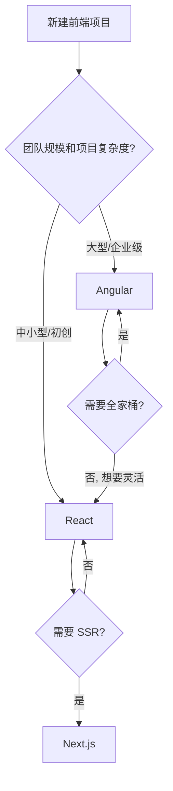

## Angular vs React

### 一句话对比

Angular 是**完整的应用框架**（约定大于配置、全家桶），React 是**UI 库**（灵活组合、选型自由），两者代表了前端开发的两种核心哲学。

---

### 核心对比

| 维度 | **[[Angular]]** | **[[React]]** |
|:---|:---|:---|
| **定位** | 全栈框架（路由/HTTP/表单/DI 内置） | UI 库（只负责视图层） |
| **版本** | Angular 2+（2016），重写自 AngularJS | React 16+（Hooks 2019） |
| **语言** | TypeScript 强制 | TypeScript 可选（推荐） |
| **模板** | 独立的 HTML 模板 + 指令（ngIf/ngFor） | JSX（HTML in JS） |
| **响应式** | Signal / RxJS Observable | Hooks（useState/useEffect） |
| **变更检测** | Zone.js 自动触发 | setState 显式触发 |
| **DI 系统** | 内置依赖注入（构造函数注入） | 无（用 props / Context 替代） |
| **CSS 隔离** | `encapsulation: ViewEncapsulation`（默认仿真） | CSS-in-JS / CSS Modules / Tailwind |
| **学习曲线** | 🟥 陡峭（DI/装饰器/RxJS/模块系统） | 🟩 平缓（JS 基础即可入手） |
| **启动方式** | `ng new` → 全项目脚手架 | `create-react-app` / Vite → 轻量模板 |

---

### 差异点

- **架构哲学**：
	- Angular 提供"标准公路"——约定目录结构、标准工具链、统一编码风格。团队不需要争论"用哪个路由库"。
	- React 提供"越野车"——一切由你组装。灵活性高，但团队需要额外约定和规范。
- **响应式模型**：
	- Angular Signal：`count = signal(0)` ⇒ `count()` 读取 ⇒ `count.set(1)` 写入。自动依赖追踪，类似 Vue3 的 ref。
	- React Hooks：`[count, setCount] = useState(0)` ⇒ `count` 读取 ⇒ `setCount(1)` 写入。每次渲染重新执行，需要 deps array 声明依赖。
- **变更检测**：
	- Angular 用 Zone.js 拦截所有异步操作（setTimeout/XHR/事件），自动触发检测。性能问题时可切换 `OnPush` 策略。
	- React 通过 `setState` 显式触发重新渲染，通过 Virtual DOM diff 找出变更。
- **表单处理**：
	- Angular：ReactiveForms（`FormGroup`/`FormControl`）内置验证器和状态追踪
	- React：受控组件（`value` + `onChange`）或非受控组件（`ref`），验证需额外库（Formik / React Hook Form）
- **HTTP 请求**：
	- Angular：`HttpClient` 内置，返回 Observable，可 `pipe` 链式处理
	- React：`fetch` / `axios` 手动封装，或在 SWR / TanStack Query 中处理
- **状态管理**：
	- Angular Signals + RxJS BehaviorSubject（服务单例天然共享状态）
	- React 需要额外库（Zustand / Redux / Jotai）或 Context + useReducer

---

### 场景选择

- **选 Angular 当**：企业级应用、大型团队（10+人）、需要长期维护的项目、团队成员偏好强类型和约定
- **选 React 当**：初创项目、快速原型、灵活性需求高、团队偏好轻量和自由选型

---

### 决策树

---

### 知识图谱

- **父级概念**：[[MOC-前端面试真题库]]
- **相关概念**：
	- [[Vue vs React]] — Vue 与 React 的对比，Angular 是第三种路线
	- [[Signal(Angular)]] — Signal 在 Angular 中的具体实现
	- [[Hooks(React)]] — React 的响应式基础
- **相关对比**：
	- [[VS-Vue2 vs Vue3]]
	- [[Vue vs React]]
