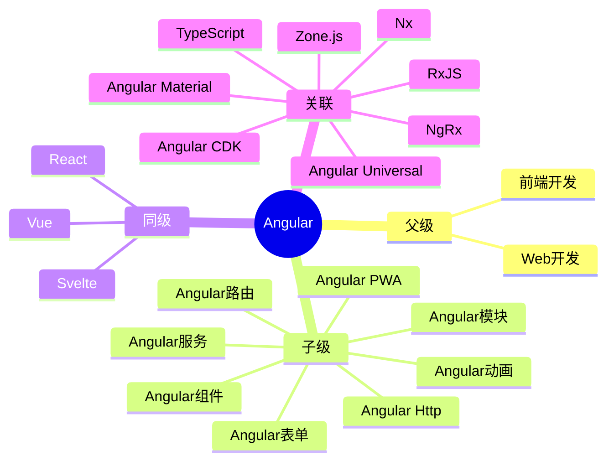

## 概念： Angular

> Angular 是 Google 维护的 TypeScript 优先企业级前端框架，提供完整的前端解决方案

---

### 知识图谱

---

### 定义

- **核心范畴**：
	- TypeScript 优先的企业级前端应用开发
	- 完整的应用架构（模块化、依赖注入、路由、表单、HTTP）
	- 响应式编程（RxJS + Angular）
	- 跨平台支持（Web、移动端、桌面端）
- **不包括**：
	- 原生 JavaScript/TypeScript 基础（属于 [[JavaScript]] / [[TypeScript]] 领域）
	- UI 组件库本身（属于 [[Angular Material]] 领域）
	- 后端开发（属于后端领域）
- **与相关领域的区别**：
	- vs [[React]]：Angular 是完整框架（内置路由、表单、HTTP），React 是库需搭配使用
		- 👉[[Angular vs React]]
	- vs [[Vue]]：Angular 强制 TypeScript 和装饰器语法，Vue 更灵活
	- vs [[Svelte]]：Angular 编译时复杂，运行时框架；Svelte 编译时复杂，零运行时

---

### 长期目标

- **愿景**：深入掌握 Angular 企业级应用开发，能够构建高性能、可维护的大型 Angular 应用
- **里程碑**：
	- [x] 阶段 1：掌握 Angular 核心概念（组件、服务、模块、依赖注入） ✅ 2026-06-16
	- [ ] 阶段 2：熟练使用 RxJS 与 Angular 响应式编程
	- [ ] 阶段 3：掌握 Angular 路由、守卫、懒加载
	- [ ] 阶段 4：掌握 Angular 表单（响应式表单、模板驱动表单）
	- [ ] 阶段 5：掌握 Angular Http 与 REST API 交互
	- [ ] 阶段 6：掌握 Angular 性能优化（变更检测、OnPush、虚拟滚动）
	- [ ] 阶段 7：掌握 Angular PWA 与 SSR（Angular Universal）
	- [ ] 阶段 8：掌握 Angular 单元测试（Karma、Jasmine）和 E2E 测试（Protractor、Cypress）

---

### 关键领域

> 该领域的核心知识主题（链接 Concept 或子领域 Area）

- **核心概念**
	- [[Signal(Angular)|Angular Signal]] — Angular 应用的状态跟踪方式
	- [[Angular Component]] — Angular 应用的基本构建块
	- [[Angular Module]] — Angular 应用的组织单元（NgModule）
	- [[Angular Service]] — 依赖注入与服务层
	- [[Angular依赖注入]] — Angular 的核心特性
	- [[Angular变更检测]] — 理解 Angular 如何追踪状态变化
- **路由与导航**
	- [[Angular路由]] — 路由配置、懒加载、路由守卫
	- [[Angular路由动画]] — 路由切换动画
- **表单与验证**
	- [[Angular表单]] — 响应式表单与模板驱动表单
	- [[表单验证]] — Angular 内置验证器与自定义验证器
- **HTTP 与状态**
	- [[Angular Http]] — HTTP 客户端与 REST API 交互
	- [[Angular状态管理]] — 服务 + RxJS vs NgRx
- **RxJS 集成**
	- [[RxJS]] — Angular 内置响应式编程基础
	- [[Angular RxJS模式]] — Angular 中 RxJS 的最佳实践
- **性能与工程化**
	- [[Angular性能优化]] — OnPush、变更检测、虚拟滚动
	- [[Angular测试]] — 单元测试与 E2E 测试
	- [[Angular CLI]] — Angular 项目脚手架与构建工具
- **生态系统**
	- [[Angular Material]] — Google 官方的 UI 组件库
	- [[Angular CDK]] — 组件开发工具包（拖拽、无障碍、 overlays）
	- [[NgRx]] — Angular 专用状态管理（Redux 模式）
	- [[NgRx ComponentStore]] — 组件级轻量状态管理
	- [[PrimeNG]] — 第三方全功能 UI 组件库
	- [[NG-ZORRO]] — 阿里 Ant Design Angular 实现
	- [[Angular Fire]] — Firebase 与 Angular 的集成
	- [[Nx]] — Angular Monorepo 开发工具
	- [[Augury]] — Angular 官方调试与性能分析工具
- **进阶主题**
	- [[Angular Universal]] — 服务端渲染（SSR）
	- [[Angular PWA]] — Progressive Web App 支持
	- [[Angular动画]] — Angular 动画系统

---

### SOP

> 该领域的标准化操作流程（SOP）

- [[SOP-Angular项目创建]] — 使用 Angular CLI 创建新项目
- [[SOP-Angular组件开发]] — 创建组件、传递数据、处理事件
- [[SOP-Angular服务开发]] — 创建服务、依赖注入、HTTP 调用
- [[SOP-Angular路由配置]] — 路由配置、懒加载、路由守卫
- [[SOP-Angular表单开发]] — 响应式表单或模板驱动表单
- [[SOP-Angular测试]] — 编写 Angular 单元测试和服务测试
- [[SOP-Angular部署]] — 构建优化与部署配置

---

### FAQ

> 该领域的常见问题（链接 Question 或 MOC）

- [[Angular面试题]]

---
