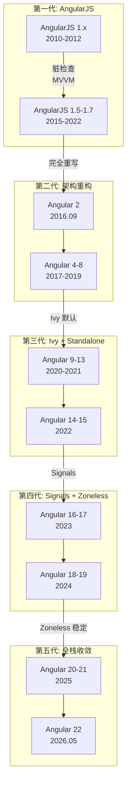

## Angular 版本演进路线图

> Angular 从 2012 年 AngularJS 1.0 到 2026 年的 v22，经历了从 MVVM 框架到现代化响应式平台的架构重构。本条笔记以 roadmap 视角梳理关键里程碑、当前状态与未来方向。

**核心定位**：帮助开发者在技术选型和版本升级时清晰了解 Angular 的演进路径，判断当前版本所处的生命周期。

---

### 演进路线图

---

### 里程碑

| 时代 | 开始版本 | 结束版本 | 核心主题 | 架构标志 |
|:--- |:--- |:--- |:--- |:--- |
| AngularJS | 1.0 (2012) | 1.7 (2022 LTS end) | MVVM 双向绑定 | `$scope` + `$digest` |
| 重写重构 | 2 (2016) | 8 (2019) | TypeScript + 组件化 | Zone.js + View Engine |
| Ivy 时代 | 9 (2020) | 13 (2021) | 增量 DOM + 编译优化 | Ivy 渲染引擎 |
| Standalone | 14 (2022) | 15 (2022) | 去 NgModule | Standalone API |
| Signals | 16 (2023) | 17 (2023) | 细粒度响应式 | `signal()` / `effect()` |
| Zoneless | 18 (2024) | 19 (2024) | 脱离 Zone.js | Zoneless Change Detection |
| 全栈收敛 | 20 (2025) | 22 (2026) | SSR + 开发者体验 | Vite 构建全面切换 |

---

### 逐版关键特性

| 版本 | 发布日期 | 关键特性 |
|:--- |:--- |:--- |
| **AngularJS 1.x** | 2010-2012 | 双向数据绑定、MVC 模式、指令系统 |
| **Angular 2** | 2016.09 | TypeScript、Zone.js、组件化、DI 新架构 |
| **Angular 4** | 2017.03 | 统一语义化版本（跳过 v3）、ngIfelse、TS 2.2 |
| **Angular 5** | 2017.11 | HttpClient（替代 Http）、Build Optimizer |
| **Angular 6** | 2018.05 | Angular CLI Workspaces、`ng update`、Angular Elements |
| **Angular 7** | 2018.10 | CLI Prompts、CDK Drag & Drop、Virtual Scrolling |
| **Angular 8** | 2019.05 | Ivy 预览（opt-in）、Differential Loading、Lazy Loading 重构 |
| **Angular 9** | 2020.02 | Ivy 默认启用、Component Test Bed 重构 |
| **Angular 10** | 2020.06 | Strict Mode 增强、Date Range Picker |
| **Angular 11** | 2020.11 | HMR 支持、Webpack 5 实验、国际化更新 |
| **Angular 12** | 2021.05 | 废弃 IE11、Webpack 5 稳定、Strict Mode 默认启用 |
| **Angular 13** | 2021.11 | 移除 View Engine、RxJS 7、动态组件改进 |
| **Angular 14** | 2022.06 | Standalone Components (dev preview)、Typed Forms |
| **Angular 15** | 2022.11 | Standalone API 稳定、Directive Composition API |
| **Angular 16** | 2023.05 | Signals (dev preview)、esbuild Dev Server、SSR Hydration |
| **Angular 17** | 2023.11 | `@if`/`@for`/`@defer` 模板语法、Signals 稳定、Vite + esbuild 默认 |
| **Angular 18** | 2024.05 | Zoneless (experimental)、`output()` API、Signal Forms (dev preview) |
| **Angular 19** | 2024.11 | Zoneless 稳定、Incremental Hydration、`linkedSignal()`、`resource()` |
| **Angular 20** | 2025.05 | Signal Forms 稳定、图片指令、应用级 DI 范围增强 |
| **Angular 21** | 2025.11 | esbuild 全面覆盖 AOT、SSR 流式渲染优化、开发者工具重做 |
| **Angular 22** | 2026.05 | 全站 SSR 框架融合、Signal 生态巩固、编译管线统一 |

---

### 当前状态（2026.07）

| 状态 | 版本 |
|:--- |:--- |
| **最新稳定版** | Angular 22 (2026.05) |
| **LTS 活跃支持** | v21, v22 |
| **LTS 长期维护** | v18, v19, v20 |
| **已停止支持** | v17 及更早 |

---

### 核心命题

- AngularJS 的脏检查机制在复杂应用中导致性能瓶颈，这是 Angular 2 完全重写的根本动因
	- **原理**：AngularJS 的 `$digest` 循环在每次事件后遍历所有 watch，页面复杂度上升时帧率急剧下降；Angular 2 改用单向数据流 + Zone.js 触发变更检测，将检测从 O(n²) 降至接近 O(n)
- Ivy 渲染引擎是 Angular 历史上最重要的架构变革，其增量 DOM 策略同时优化了 bundle 体积和编译速度
	- **原理**：Ivy 将模板编译为模板指令（template instructions），而非 View Engine 的解释器模式；同一棵树中静态节点不参与变更检测，tree-shaking 可直接移除未使用的指令
- Signals 的引入标志着 Angular 从 Zone.js 全局变更检测向细粒度响应式编程的范式转移
	- **原理**：Zone.js 无法感知数据流的具体路径，必须在整个组件树上执行 `markForCheck`；Signals 通过生产者-消费者图精确追踪依赖，只有订阅了变更 signal 的视图节点才会重新求值
- v20-v22 的全栈收敛方向使 Angular 从纯前端框架演进为端到端应用平台（SSR → 流式渲染 → 全站融合）
	- **原理**：ESR 和增量水合技术模糊了 CSR/SSR 的边界，编译时统一管线让构建产出在服务端和客户端共用同一份 AST 分析

---

### 适用范围

- ✅ **适用场景**
	- **企业级后台管理**：强类型 + DI + 模块化的开箱即用体系适配大型团队协作
	- **长期维护项目**：语义化版本 + 自动化迁移脚本降低跨版本升级成本
	- **SSR 全栈应用（v20+）**：统一的构建和渲染管线简化了传统的前后端分离架构
- ⛔ **误用**
	- **快速原型**：Angular 的 CLI 脚手架和类型系统在快速验证阶段是额外负担
- **失效边界**
	- 微前端场景下 DI 容器的隔离仍需额外适配（Module Federation + Angular 有已知运行时冲突）
	- Signal 的响应式链路在当前版本（v22）在跨微前端边界传递时仍缺乏标准协议

---

### 批判

- **外部批判**
	- React 社区：Angular 的全家桶架构在灵活性和 bundle 体积上不及渐进式方案
	- Svelte 社区：编译时优化的理念本可以让 Angular 做得更彻底，Ivy 和 Signals 虽然追赶但历史包袱仍在
- **内在张力**
	- rxjs 与 signals 并存：两套响应式体系的转换（`toSignal` / `toObservable`）增加认知负担
	- 向后兼容压力：长时间 LTS 周期导致老旧 API（如 `*ngIf`、NgModule）的清理速度慢

---

### FAQ

- [[Q-Angular跳过v3的原因]]
- [[Q-Signals能否完全替代RxJS]]
- [[Q-Angular的LTS策略]]

---

### 知识图谱

- **父级概念**：[[前端框架]] — Angular 所属的上位领域
- **子级概念**：
	- [[Angular Signals]] — v16 引入的细粒度响应式原语
	- [[Ivy渲染引擎]] — v8-v9 引入的第三代编译与渲染引擎
	- [[Zoneless变更检测]] — v18-v19 稳定化的无 Zone.js 新范式
- **并列概念**：
	- [[React版本演进]] — React 从类组件到 Server Components 的演进路径
- **相关概念**：
	- [[前端工程化]] — CLI、monorepo、module federation 等工程实践
	- [[SSR演进]] — 从 CSR 到 SSR 再到全站渲染的演化
- **参考文章**
	- [Angular 官方更新日志](https://angular.dev/update-guide)
	- [Angular Blog - Releases](https://blog.angular.dev/tag/releases)
