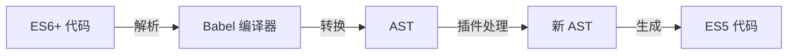

## 术语：Babel

> **别名**: Babel, Babel.js
> **领域**: #前端开发/工程化

### 定义

Babel 是一个 JavaScript 编译器，主要用于将 ES6+ 新语法转换为向后兼容的 ES5 代码，使代码可以在旧版浏览器或环境中运行。

### 工作流程

### 核心配置

| 配置项 | 说明 |
|--------|------|
| `presets` | 预设集合，如 `@babel/preset-env`、`@babel/preset-react` |
| `plugins` | 语法转换插件 |
| `targets` | 目标浏览器版本 |

### 锚点连接

- **属于**：[[前端工程化]]
- **相关概念**：[[抽象语法树]] [[Webpack]] [[Vite]]
- **相关工具**：ESLint、TypeScript
