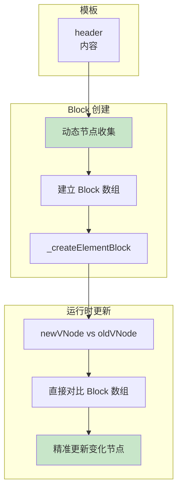

## 概念：Block 管理

> Block（块）是 Vue3 引入的核心优化机制，通过将动态节点平铺收集到 Block 中，实现精准的依赖追踪和高效的更新。

**解决的核心痛点**：Vue2 虚拟 DOM 树形结构导致更新时需要递归遍历整个树，Block 将动态节点扁平化存储，大幅减少遍历开销

---

### 核心命题

- **Block 的本质**
	- 是一个数组，存储所有动态子节点
	- 用空间换时间，避免递归遍历
- **Block vs 传统 VNode 树**
	- 传统：嵌套树结构，需要递归遍历
	- Block：扁平数组 + 动态节点集合

---

### 运行机制



#### 代码示例

```javascript
// 模板
<div>
  <header v-if="show">header</header>
  <main>静态内容</main>
</div>

// 编译后 - 使用 Block
function render(_ctx, _cache) {
  // _openBlock() 创建并进入当前 Block
  return (_openBlock(), _createElementBlock("div", null, [
    // v-if 动态节点，使用 _createElementVNode
    _ctx.show ? _createElementVNode("header", null, "header") : _createCommentVNode("v-if", true),
    // 静态内容，已提升
    _hoisted_1
  ]))
}

// Block 结构示意
block = {
  type: "div",
  children: [
    dynamicNode1,  // header (v-if)
    staticNode     // 已提升的静态节点
  ],
  dynamicChildren: [
    dynamicNode1   // 只有动态节点参与 diff
  ]
}
```

---

### Block 类型

| 类型 | 说明 | 使用场景 |
|:---|:---|:---|
| `ElementBlock` | 元素块 | 普通 DOM 元素 |
| `ComponentBlock` | 组件块 | 组件 |
| `CommentBlock` | 注释块 | v-if 条件渲染 |
| `ForBlock` | 循环块 | v-for 列表 |

---

### Block 与 diff

```javascript
// 传统 diff vs Block diff

// 传统：需要递归遍历整棵树
function patch(oldVNode, newVNode) {
  if (oldVNode.type !== newVNode.type) {
    replace(oldVNode, newVNode)  // 整棵树替换
  }
  // 递归比较子节点...
}

// Block：直接对比动态节点数组
function blockPatch(block, newBlock) {
  // 1. 对比动态节点（数量少很多）
  block.dynamicChildren.forEach((child, i) => {
    patch(child, newBlock.dynamicChildren[i])
  })
}
```

---

### 与 Vue2 的对比

| 维度 | Vue2 | Vue3 Block |
|:---|:---|:---|
| **结构** | 树形 | 扁平 + 动态集合 |
| **diff** | 递归整棵树 | 只 diff 动态节点 |
| **性能** | O(n) | O(d)，d=动态节点数 |
| **静态优化** | 不支持 | 支持 |

---

### 知识图谱

- **父级概念**：[[模板编译(Vue3)]]
- **关联概念**：
	- [[静态提升]] — 配合减少动态节点
	- [[预标记]] — 标记动态节点辅助 Block

---

### 参考延伸

- Vue3 源码：
	- `packages/runtime-core/src/renderer.ts`（Block 实现）
	- `packages/compiler-core/src/codegen.ts`（Block 生成）
