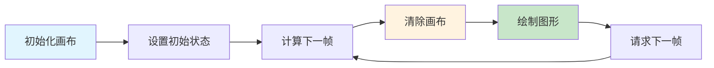

## 概念：Canvas 动画

> Canvas 动画是使用 HTML5 Canvas API，通过在画布上**逐帧绘制图形**来实现动画效果的技术。

**解决的核心痛点**：DOM 动画受限于 CSS 属性，而 Canvas 可以实现任意图形的动画、游戏粒子效果、实时数据可视化等高性能需求。

---

### 核心命题

- Canvas 动画的本质是「帧重绘」——每一帧清除画布并重新绘制所有图形
- Canvas 的优势是「像素级控制」——可以在任意位置绘制任意形状
- Canvas 的局限是「手动管理」——没有 DOM 结构，需要自己实现事件系统和状态管理

---

### 运行机制

#### 动画循环

#### 核心技术

| 技术 | 说明 |
|:---|:---|
| **requestAnimationFrame** | 浏览器提供的帧同步 API，与屏幕刷新率同步 |
| **Canvas 2D Context** | 绑制矩形、弧线、文字、图片等 |
| **离屏 Canvas** | 预渲染到离屏画布，减少重复绘制 |

---

### 关键区别

| 维度 | Canvas 动画 | CSS 动画 | DOM 动画 |
|:---|:---|:---|:---|
| **控制粒度** | 像素级 | 属性级 | 属性级 |
| **性能** | 高（位图操作） | 中（GPU 加速） | 低（重排/重绘） |
| **适用场景** | 游戏、粒子、数据可视化 | UI 过渡 | 简单交互 |
| **状态管理** | 手动 | 自动 | 自动 |

---

### 应用场景

- ✅ **适用场景**
	- **游戏开发**：2D 游戏、精灵动画、碰撞检测
	- **粒子系统**：火焰、烟雾、爆炸等特效
	- **数据可视化**：实时图表、动态图形
	- **图像处理**：滤镜、变换、图像合成
	- **物理模拟**：重力、碰撞、弹簧效果
- ⛔ **误用**
	- **简单 UI 动画**：按钮点击、页面过渡用 CSS 即可
	- **需要 DOM 特性的场景**：无障碍、SEO、内容选择

#### SOP

![[动画效果示例#Canvas]]

#### FAQ

- [[Q-Canvas 和 SVG 应该如何选择]]
- [[Q-如何优化 Canvas 动画性能]]
---

### 知识图谱

- **父级概念**：[[前端开发]] — Canvas 动画是前端图形开发的重要组成
- **子级概念**：
	- requestAnimationFrame — 帧同步核心 API
	- Canvas 2D Context — 绑制 API
	- 离屏渲染 — 性能优化技术
- **并列概念**：
	- [[CSS Animation]] — CSS 实现的动画
	- SVG 动画 — 矢量图形动画
	- WebGL — 3D 图形 API
- **相关概念**：
	- [[动画原理]] — 动画的理论基础
	- [[Canvas]] — Canvas API 的基础

---

### 参考延伸

- [MDN - Canvas API](https://developer.mozilla.org/en-US/docs/Web/API/Canvas_API)
- [HTML5 Canvas Tutorial](https://www.html5canvastutorials.com/)
