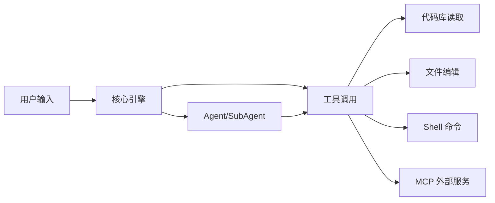

## 概念：Claude Code

> Claude Code 是一个由 AI 驱动的代理编码工具，可以读取代码库、编辑文件、运行命令，并与开发工具集成。

**解决的核心痛点**：传统 AI 编程助手停留在"对话补全"层面，无法自主理解项目上下文、执行多步操作、调用开发工具链。Claude Code 将 AI 从建议者升级为执行者，实现端到端的开发任务自动化。

---

### 核心命题

- Claude Code 的本质是 Agent 而非 Copilot
	- **原理**：Copilot 等待用户提问，Agent 主动理解项目、规划步骤、执行操作
- Claude Code 的价值在于上下文持久化
	- **原理**：通过 CLAUDE.md 和 Memory 系统保持跨会话的项目规范记忆
- 复杂任务应拆解为 SubAgent 并行处理
	- **原理**：单个上下文窗口存在容量上限，SubAgent 架构实现逻辑隔离和并行加速

---

### 运行机制

Claude Code 的工作流程：

1. **感知**：接收用户输入，读取项目 CLAUDE.md 和上下文
2. **推理**：规划执行步骤，决定调用哪些工具
3. **执行**：通过工具调用（读文件、编辑、运行命令）完成操作
4. **反馈**：将结果返回用户，或继续下一轮推理

---

### 关键区别

| 维度 | Claude Code | [[GitHub Copilot]] | [[ChatGPT]] |
|:--- |:--- |:--- |:--- |
| **交互模式** | 代理自主执行 | 行内代码补全 | 对话式问答 |
| **项目感知** | 完整代码库理解 | 当前打开文件 | 无项目上下文 |
| **工具调用** | 原生 CLI + MCP | 仅 IDE 内操作 | 依赖插件 |
| **自动化** | CI/CD Headless | 无 | 无 |

---

### 核心要素

> Claude Code 的八项核心能力组件

- **CLAUDE.md**：记忆系统，根治"失忆"顽疾，将项目规范一次性写入配置文件，即可在每次对话中自动加载，不需要反复重申
- **Skills**：终结风格飘忽，将代码审查标准配置化、制度化，彻底取代"口头叮嘱"的不确定性
- **SubAgent**：化解上下文溢出，将复杂任务拆解为多个独立的上下文单元，实现并行处理与逻辑隔离
- **Hooks**：在工具调用时自动触发安全检查或日志记录，构建防御性编程机制
- **MCP**：打破数据孤岛，连接外部数据库和API
- **Headless模式**：支持在CI/CD流水线中实现自动化交付
- **Agent SDK**：通过代码编排复杂的多步Agent工作流，提升任务执行的灵活性
- **Plugins**：将上述能力打包封装，便于分发和复用

---

### 适用范围

- ✅ **适用场景**
	- **代码库探索与理解**：阅读、搜索、分析大型项目结构
	- **功能开发与重构**：编辑文件、实现新功能、优化代码质量
	- **自动化流水线**：CI/CD 集成、批量任务处理、代码审查
	- **学习与调试**：解释代码逻辑、定位 Bug、提供修复方案
- ⛔ **误用**
	- **非编程任务**：图形设计、文案撰写、数据分析（非代码输出）
	- **纯对话咨询**：需要深度领域知识而非编码的问题
- **失效边界**
	- 对极大规模代码库（百万行级）的完整理解受限
	- 依赖准确的项目配置（CLAUDE.md）指导，无配置时质量下降

---

### FAQ

> 与 Claude Code 相关的开放性问题——先理解问题（发散），再看标准流程（收敛）

- [[Q-如何高效使用 Claude Code？]]
	- **状态**：待探索 — 从基础命令到高级工作流的最佳实践路径
- [[Q-Claude Code 与 Claude API 的区别？]]
	- **状态**：待探索 — 代理编码工具 vs 底层 API 的选型决策
- [[Q-如何设计 Claude Code 的 CLAUDE.md 配置？]]
	- **状态**：待探索 — 项目级记忆系统的配置方法论
- [[Q-如何编排 Claude Code 的多 Agent 协作？]]
	- **状态**：待探索 — SubAgent 与 Agent SDK 的任务分工策略

---

### SOP

> 标准操作流程——是 FAQ 中问题经过实践验证后的收敛成果

- [[SOP-使用Claude-Code自动化CI-CD流水线]] — CI/CD 集成、Headless 自动化审查与修复
- [[SOP-使用Claude-Code开发React组件]] — 利用 Claude Code 的 Agent 能力高效开发组件
- [[SOP-提示词工程最佳实践]] — Claude Code 提示词设计与优化通用流程

---

### 知识图谱

- **父级概念**：[[人工智能|A-人工智能]] — AI 代理编码工具
- **子级概念**：
	- [[CLAUDE.md]] — 项目级持久记忆配置
	- [[Skills]] — 可复用的行为配置
	- [[MCP]] — 外部服务集成协议
- **并列概念**：
	- [[GitHub Copilot]] — IDE 内联代码补全
	- [[Claude API]] — 底层 API 接入方式
- **参考文章**
	- [Claude Code 概述](https://code.claude.com/docs/zh-CN/overview)
	- [Claude Code 基本命令](https://code.claude.com/docs/zh-CN/quickstart#基本命令)
	- [Claude Code 最佳实践](https://code.claude.com/docs/zh-CN/best-practices)⭐
	- [everything-claude-code](https://github.com/pedyc/everything-claude-code/blob/main/README.zh-CN.md)⭐
	- [[Claude Code 使用指南]] — 基础命令和交互方式
	- [[Claude Code 进阶使用]] — SubAgent、Skills 等高阶技巧
