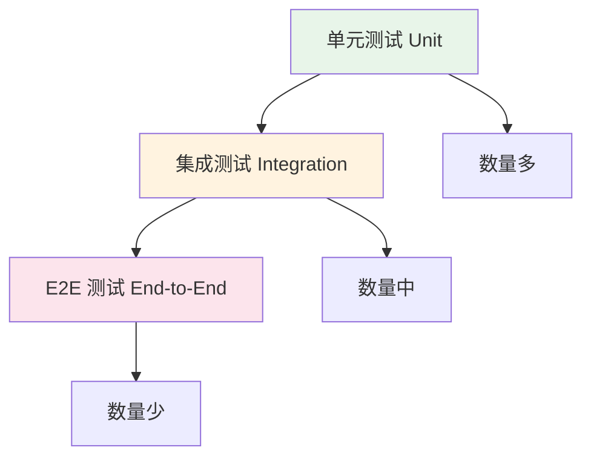

## 概念：E2E

> End-to-End Testing（端到端测试）是一种从用户视角模拟真实行为，验证整个应用从前端到后端完整流程的测试方法。

**解决的核心痛点**：单元测试和集成测试只能验证局部功能，无法确保用户真实使用场景下的完整链路是否正常工作。

---

### 核心命题

- E2E 测试的核心价值是「信心」——验证关键用户路径在真实环境中正常工作
- E2E 测试的维护成本高，必须聚焦于关键路径，而非追求覆盖率
- 好的 E2E 策略是「少而精」，而非「多而全」

---

### 测试金字塔

| 层级 | 范围 | 数量 | 维护成本 |
|:---|:---|:---:|:---:|
| **单元测试** | 单一函数/模块 | 大量 | 低 |
| **集成测试** | 模块间交互 | 中量 | 中 |
| **E2E 测试** | 完整用户路径 | 少量 | 高 |

---

### E2E vs 其他测试

| 维度 | E2E 测试 | 单元测试 | 集成测试 |
|:---|:---|:---|:---|
| **范围** | 整个应用 | 单一函数 | 模块间接口 |
| **执行速度** | 慢（秒级） | 快（毫秒级） | 中 |
| **维护成本** | 高 | 低 | 中 |
| **失败定位** | 困难 | 容易 | 较容易 |
| **信心程度** | 高 | 低 | 中 |

---

### 应用场景

- ✅ **关键用户路径**：登录、支付、核心功能流程
- ✅ **回归测试**：防止功能破坏
- ✅ **CI/CD 流水线**：自动验证发布质量
- ✅ **跨浏览器测试**：确保多浏览器兼容
- ⛔ **简单功能**：单元测试更高效
- ⛔ **追求高覆盖率**：维护成本过高

---

### 常用工具

| 工具 | 特点 | 适用场景 |
|:---|:---|:---|
| [[T-Playwright]] | 微软出品，支持多浏览器，API 现代 | 现代 Web 应用 |
| [[T-Cypress]] | 实时 reload，调试友好 | 快速开发迭代 |
| Selenium | 老牌工具，生态丰富 | 传统 Web 应用 |

---

### 知识图谱

- **父级概念**：[[前端工程化]] — 属于质量保障领域
- **并列概念**：
	- 单元测试 — 测试粒度更细
	- 集成测试 — 模块间接口验证
- **工具链**：
	- [[T-Playwright]]
	- [[T-Cypress]]

---

### 常见问题

- ⛔ **测试脆弱**：过度依赖 CSS 选择器，UI 变化导致大量失败
- ⛔ **执行时间长**：CI 流水线瓶颈
- ⛔ **数据依赖**：测试间数据污染

---

### E2E 测试最佳实践

1. **聚焦关键路径**：选择用户最常用的核心流程
2. **使用语义选择器**：data-testid > CSS 选择器 > XPath
3. **独立测试数据**：每个测试使用独立数据，避免相互依赖
4. **合理的等待策略**：避免硬编码 sleep，使用智能等待
5. **截图/视频记录**：失败时保留证据便于调试

---

### 参考延伸

- [Playwright 官方文档](https://playwright.dev/)
- [Cypress 官方文档](https://docs.cypress.io/)
- [Testing Trophy](https://kentcdodds.com/blog/the-testing-trophy)
