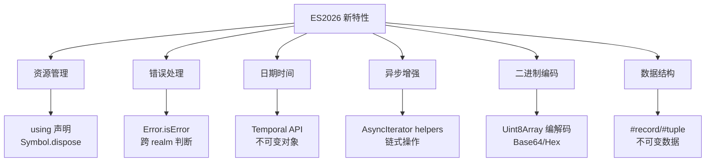
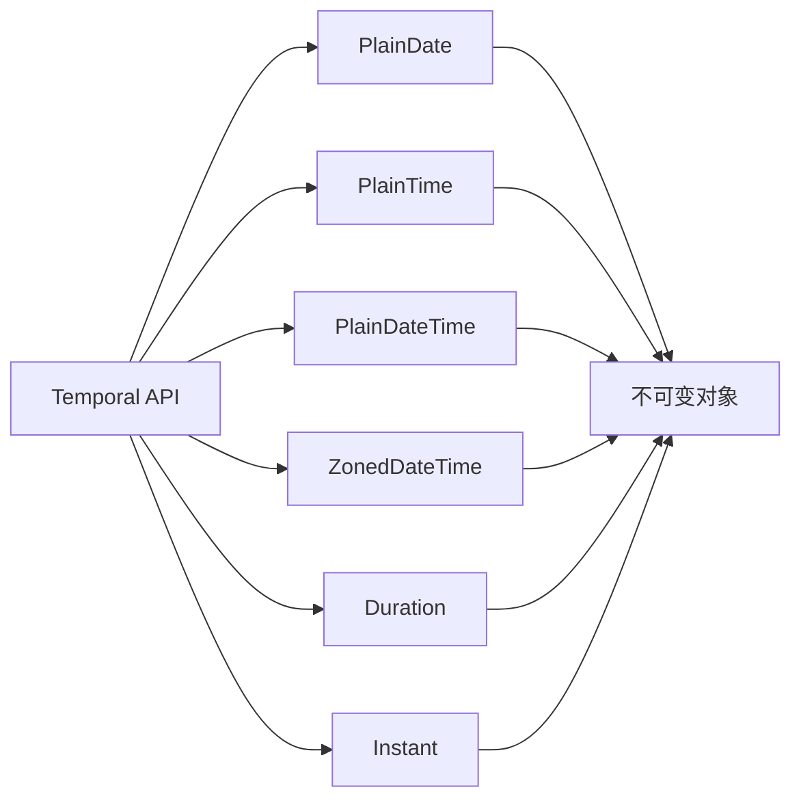

## 概念：ES2026

> ECMAScript 2026 (ES17) 是 JavaScript 自 ES2015 以来最重要的更新，引入 20+ 新特性，聚焦资源管理、日期时间和异步增强

**解决的核心痛点**：JavaScript 长期存在资源管理繁琐、Date API 设计缺陷、错误类型判断不精确等痛点，ES2026 一次性填补了这些缺陷

---

### 核心命题

- ES2026 是 JavaScript 走向成熟的重要里程碑 — 资源管理、日期时间、不可变数据结构等企业级特性首次原生支持
	- **原理**：`using` 声明让资源释放自动化，`Temporal API` 填补了 20 年来的日期时间 API 缺陷
- `using` / `await using` 将改变 JavaScript 资源管理模式 — 从手动 `try-finally` 走向声明式自动管理
	- **原理**：通过 `Symbol.dispose()` 实现作用域结束时自动调用，类似于 C# `using`、Python `with`
- `Temporal API` 是 JavaScript 日期时间的范式转换 — 从有设计缺陷的 `Date` 走向现代不可变日期时间对象
	- **原理**：`Date` 是可变的、时区处理差、API 不一致，`Temporal` 全部修正
- `Records & Tuples` 填补了 JavaScript 缺乏原生不可变数据结构的空白
	- **原理**：通过 `#record` / `#tuple` 语法创建不可变对象和数组，实现值相等性比较

---

### 运行机制

ES2026 六大核心特性的工作机制：



**资源管理 `using` 声明的运行机制**：

```javascript
// 同步资源管理
using file = openFile('test.txt');
file.write('hello');
// → 作用域结束时自动调用 file[Symbol.dispose]()

// 异步资源管理
await using connection = await db.connect();
const result = await connection.query('SELECT * FROM users');
// → 作用域结束时自动调用 await connection[Symbol.asyncDispose]()
```

**Temporal API 的核心对象**：



---

### 关键区别

| 维度 | ES2026 | ES2025 | ES2024 及之前 |
|:---|:---|:---|:---|
| **核心主题** | 资源管理 + 日期时间 | 迭代器 + 模块优化 | 逐年小幅增强 |
| **资源管理** | `using`/`await using` 原生支持 | 无 | 手动 `try-finally` |
| **日期时间** | `Temporal API` 不可变对象 | 无 | `Date` 可变、API 不一致 |
| **错误处理** | `Error.isError()` 精确判断 | 无 | `instanceof Error` 不准确 |
| **数据结构** | `#record`/`#tuple` 不可变 | 无 | 普通对象可任意修改 |
| **版本定位** | 第二次重大更新 | 小幅更新 | 渐进增强 |

| 维度 | `using` 声明 | `try-finally` |
|:---|:---|:---|
| **代码量** | 简洁 | 冗长 |
| **资源泄漏风险** | 低（自动化） | 高（易忘） |
| **异步支持** | `await using` | 需手动处理 |

---

### 应用场景

- ✅ **适用场景**
	- **资源管理**：`using` 适用于文件操作、数据库连接、网络请求、锁管理等需要明确释放的资源
	- **日期时间处理**：`Temporal API` 适用于时区转换、日期计算、日程管理等场景
	- **不可变数据**：`Records & Tuples` 适用于状态管理、函数式编程、数据比较等
	- **跨 realm 错误判断**：`Error.isError()` 适用于 Worker、iframe 间的错误传递
	- **二进制数据处理**：`Uint8Array` 编解码适用于加密、文件处理、数据传输
	- **异步流处理**：`AsyncIterator` 辅助方法适用于流式数据处理、响应式编程
- ⛔ **误用**
	- **过早依赖 ES2026**：新特性需要浏览器/运行时支持，需要关注兼容性
	- **滥用不可变结构**：对简单对象使用 `#record` 可能影响性能

---

### SOP

> ES2026 相关标准化操作流程

- **暂无相关 SOP 笔记** — ES2026 为新发布标准，实际使用案例待积累

---

### FAQ

> ES2026 相关开放性问题，待进一步探索

- [[Q-ES2026浏览器兼容性如何]]
- [[Q-Temporal API和date-fns的区别]]
- [[Q-using声明和Symbol.dispose的关系]]
- [[Q-Records & Tuples和TypeScript Readonly的区别]]

---

### 知识图谱

> 知识图谱链接 term（术语定义）和相关 concept，建立概念关系网络

- **父级概念**：
	- [[Javascript版本演进]] — ES2026 是最新版本
	- [[ECMAScript]] — JavaScript 遵循的规范标准
- **子级概念**：
	- [[using 声明]] — ES2026 资源管理语法
	- [[Temporal API]] — ES2026 日期时间 API
	- [[Error.isError]] — ES2026 错误判断方法
- **并列概念**：
	- [[ES2015]] — 上一次重大更新
	- [[ES2025]] — ES2026 的前一个版本
- **相关概念**：
	- [[Promise]] — 异步编程基础
	- [[async-await|async/await]] — 异步语法糖
	- [[TypeScript]] — JavaScript 超集，支持 ES2026 特性
- **参考文章**
	- [MDN - ECMAScript 2026](https://developer.mozilla.org/en-US/docs/Web/JavaScript)
	- [W3Schools - JavaScript 2026](https://www.w3schools.com/js/js_2026.asp)
