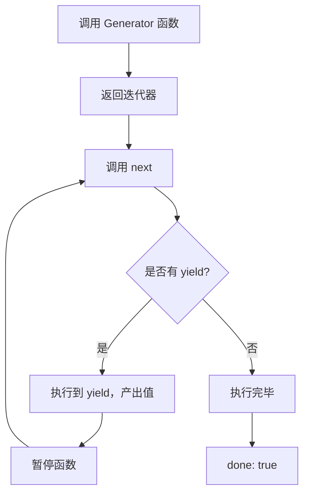

> Generator（生成器）是 JavaScript 中一种可暂停和恢复执行的函数，通过 `function*` 语法定义，使用 `yield` 关键字产出值。

**解决的核心痛点**：普通函数必须执行完毕才能返回结果，无法中间暂停；Generator 打破了这一限制，让函数可以分步执行、按需产生值，实现惰性计算。

---

## 核心命题

- [[Generator 函数可以暂停和恢复执行]]
	- **原理**：调用 Generator 函数返回一个迭代器，每次调用迭代器的 `next()` 方法执行到下一个 `yield` 表达式并产出值
- [[Generator 是异步编程的基础]]
	- **原理**：Generator 的暂停/恢复特性使其成为实现协程的基础，async/await 的底层使用了 Generator 的暂停/恢复机制

---

## 运行机制

1. `function*` 定义 Generator 函数
2. 调用函数返回迭代器（不执行函数体）
3. `next()` 执行到下一个 yield，产出值并暂停
4. 最后一个 yield 后执行完毕，`done: true`

---

## 关键区别

| 维度 | Generator | 普通函数 | [[async 函数]] |
|:--- |:--- |:--- |:--- |
| **执行方式** | 可暂停/恢复 | 执行到返回 | 自动执行 |
| **返回值** | 迭代器 | 直接返回值 | Promise |
| **控制流** | 手动（next） | 自动 | 自动 |
| **产出值** | 多次（yield） | 一次（return） | 一次 |

---

## 应用场景

- ✅ **适用场景**
	- **惰性迭代**：按需生成数据，避免一次性加载
	- **状态机**：实现复杂状态转换逻辑
	- **异步流程控制**：手动的异步流程控制（async/await 出现前）
	- **无限序列**：生成无限数列或数据流
- ⛔ **误用**
	- **简单遍历**：能用 for…of 时不必用 Generator
	- **忘记结束条件**：可能导致无限循环

---

## 知识图谱

- **父级概念**：[[JavaScript]] — Generator 是一种特殊的函数类型
- **子级概念**：
	- [[yield]] — Generator 的控制关键字
	- [[yield*]] — 委托给另一个 Generator
- **并列概念**：
	- [[async-await|async/await]] — 另一种异步流程控制
- **相关概念**：
	- [[迭代器]]
	- [[协程]]
	- [[生成器模式]]

---

## 参考延伸

- [function* - JavaScript | MDN](https://developer.mozilla.org/zh-CN/docs/Web/JavaScript/Reference/Statements/function*)
- 《你不知道的 JavaScript》下卷：Generator
