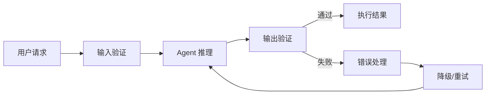

## 概念：Harness

> 用于围绕 AI Agent 构建工程化体系的框架和方法论，类似于传统软件开发中的框架、库、工具链在 Agent 开发中的作用。

**解决的核心痛点**：Agent 虽然具备强大的推理和执行能力，但缺乏工程化约束导致输出不稳定、难以复用、无法规模化。Harness 提供结构化方法来构建可靠的 Agent 应用。

---

### 核心命题

- Harness 是 Agent 的「骨架」——定义输入边界、输出结构、执行流程
- 好的 Harness 让 Agent 的能力可预测、可复用、可测试
- Harness 与 Prompt Engineering 是互补关系：Prompt 优化能力，Harness 优化工程可靠性

---

### 核心要素

| 要素 | 说明 |
|:---|:---|
| **输入契约 (Input Contract)** | 定义 Agent 接受的输入格式、约束条件 |
| **输出契约 (Output Contract)** | 定义 Agent 返回的输出格式、质量标准 |
| **执行管道 (Pipeline)** | Agent 执行的工作流、决策分支、回退策略 |
| **错误处理 (Error Handling)** | Agent 失败时的降级、重试、人工介入机制 |
| **评估标准 (Evaluation)** | 如何衡量 Agent 输出的质量、一致性 |

#### Harness 工程要做些什么？

- **实现工具。** 给 agent 一双手。文件读写、Shell 执行、API 调用、浏览器控制、数据库查询。每个工具都是 agent 在环境中可以采取的一个行动。设计它们时要原子化、可组合、描述清晰。
- **策划知识。** 给 agent 领域专长。产品文档、架构决策记录、风格指南、合规要求。按需加载（s05），不要前置塞入。Agent 应该知道有什么可用，然后自己拉取所需。
- **管理上下文。** 给 agent 干净的记忆。子 agent 隔离（s04）防止噪声泄露。上下文压缩（s06）防止历史淹没。任务系统（s07）让目标持久化到单次对话之外。
- **控制权限。** 给 agent 边界。沙箱化文件访问。对破坏性操作要求审批。在 agent 和外部系统之间实施信任边界。这是安全工程与 harness 工程的交汇点。
- **收集任务过程数据。** Agent 在你的 harness 中执行的每一条行动序列都是训练信号。真实部署中的感知 - 推理 - 行动轨迹是微调下一代 agent 模型的原材料。你的 harness 不仅服务于 agent -- 它还可以帮助进化 agent。
---

### 运行机制

#### 与传统软件对比

| 维度 | 传统软件 | Agent Harness |
|:---|:---|:---|
| **输入** | 函数参数 + 类型系统 | Prompt 模板 + 输入验证 |
| **输出** | 函数返回值 | 结构化输出 + 置信度 |
| **执行** | 确定性函数调用 | 概率性推理 |
| **错误处理** | 异常捕获 | 回退策略 + 人工介入 |
| **测试** | 单元测试 + 集成测试 | 评估套件 + 回归测试 |

---

### 关键区别

| 维度       | Prompt Engineering | Harness         |
| :------- | :----------------- | :-------------- |
| **关注点**  | 优化 Agent 的能力表达     | 优化 Agent 的工程可靠性 |
| **抽象层次** | 指令层                | 架构层             |
| **类比**   | 优化函数的实现逻辑          | 优化函数的调用方式、错误处理  |

---

### 应用场景

- ✅ **复杂任务分解**：将大任务拆分为 Agent 流水线
- ✅ **多 Agent 协作**：定义 Agent 间通信协议和职责边界
- ✅ **生产级 Agent**：需要稳定输出的商业应用
- ✅ **Agent 评估**：建立可量化的 Agent 质量标准
- ⛔ **简单单次任务**：直接 Prompt 即可，无需 Harness

#### SOP

- [[SOP-使用Claude-Code开发React组件]]

#### FAQ

- ⛔ **过度工程化**：简单任务不需要复杂 Harness
- ⛔ **限制 Agent 灵活性**：Harness 约束过多导致 Agent 无法发挥能力
- ⛔ **忽视评估**：没有量化标准就无法迭代优化
---

### 知识图谱

- **父级概念**：[[Agent]] — Harness 是 Agent 的工程化框架
- **子级概念**
	- [[智能体编排]] — 智能体编排是 Harness 的核心实现
- **并列概念**：
	- [[提示词工程|Prompt Engineering]] — 优化 Agent 能力
	- [[Claude Code]] — Agent 实现案例
- **相关领域**：
	- [[前端交互]] — Agent 可赋能前端交互
	- [[工作流引擎]] — Agent 流水线的编排方式

---

### 参考延伸

- [[Agent与Harness]]
- [[Vibe Coding Is Dead. Here’s What Replaced It]]
- [shareAI-lab/learn-claude-code](https://github.com/shareAI-lab/learn-claude-code)
- [Harness 设计模式](https://docs.anthropic.com/)
- [Agent 设计最佳实践](https://platform.openai.com/docs/guides/agents)
