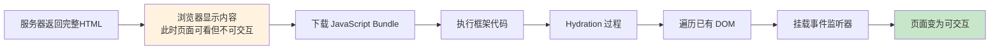

## 概念：Hydration

> Hydration（直译为「注水」）是客户端 JavaScript 在 SSR 输出的静态 HTML 上**重新绑定事件监听器**，使页面从「可看」变成「可用」的过程。

**解决的核心痛点**：SSR 返回的 HTML 只有结构没有交互（按钮点击无效、表单无法提交），Hydration 让 React/Vue 等框架在 DOM 上挂载事件处理器，使页面真正可用。

---

### 核心命题

- Hydration 的本质是「事件绑定」——在已有的 DOM 节点上挂载 JavaScript 事件，而不是重新渲染
- Hydration 存在性能成本——需要下载、执行 JS 并遍历整个 DOM，可能导致交互延迟
- Hydration 不匹配是常见 bug——服务端渲染的内容和客户端渲染的内容不一致会导致闪烁或错误

---

### 运行机制

#### Hydration 流程

#### SSR vs CSR vs Hydration

| 阶段          | SSR          | CSR          |
|:---------- |:----------- |:----------- |
| **HTML 生成** | 服务器          | 浏览器（JS 执行后）  |
| **首屏显示**    | 立即           | 需等 JS 下载执行   |
| **交互就绪**    | 需等 Hydration | 不需要 Hydration |

---

### 关键区别

| 维度 | Hydration | 直接渲染 |
|:---|:---|:---|
| **DOM 来源** | 使用 SSR 生成的 DOM | 框架自己创建 DOM |
| **速度** | 较快（复用 DOM） | 较慢（需创建新 DOM） |
| **一致性要求** | 必须保证 SSR/CSR 一致 | 天然一致 |

---

### 应用场景

- ✅ **适用场景**
	- **SSR 应用**：所有使用服务端渲染的 React/Vue 应用都需要 Hydration
	- **动态内容**：首屏需要 SEO 且后续有交互的页面
- ⛔ **误用**
	- **静态页面**：无交互需求的页面不需要 Hydration（用纯 HTML 即可）
	- **过度使用**：把不需要交互的组件也做 Hydration，增加无谓的性能开销

#### SOP

> 与 Hydration 相关的标准操作流程，通过实践辅助理解

- [[SOP-在Next.js中使用Hydration]] — Next.js 中使用 Hydration 的标准流程

#### FAQ

> 与 Hydration 相关的开放性问题，待进一步探索

- [[Q-Hydration 为什么会增加交互延迟]]
- [[Q-如何避免 Hydration Mismatch]]
---

### 知识图谱

- **父级概念**：[[SSR]] — Hydration 是 SSR 的一部分
- **子级概念**：
	- SSR/CSR 一致性 — 避免 Hydration 不匹配
	- 流式 Hydration — 分段进行 Hydration
- **并列概念**：
	- [[CSR]] — 纯客户端渲染，不需要 Hydration
	- SSG — 静态生成，也需要 Hydration（如果框架支持交互）
- **相关概念**：
	- [[NextJS]] — Next.js 对 Hydration 的封装
- **参考文章**
	- [React Hydration Docs](https://react.dev/reference/react-dom/client/hydrateRoot)
	- [Next.js Server and Client Components](https://nextjs.org/docs/app/building-your-application/rendering/server-components)
