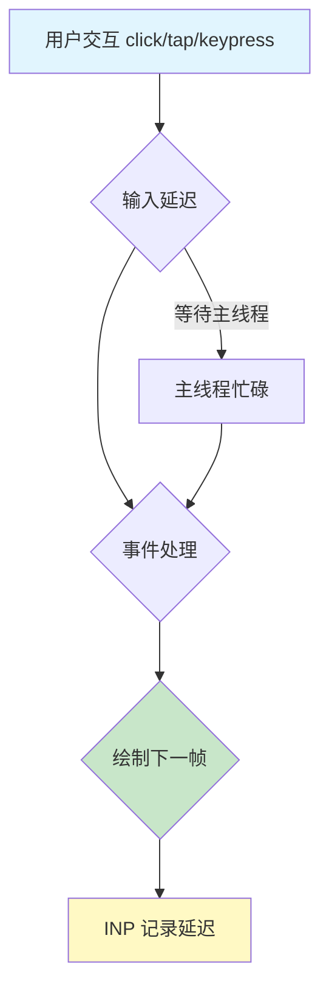

## 概念：INP (Interaction to Next Paint)

> INP（Interaction to Next Paint，交互至下一次绘制）衡量用户点击、触摸或按键后，浏览器绘制下一帧的响应速度。INP 值是页面生命周期内所有交互延迟的第 98 百分位（排除异常值）。

**解决的核心痛点**：FID 仅测量首次交互的输入延迟，无法反映用户与页面全生命周期内的真实响应体验

---

### 核心命题

- [[INP测量完整交互周期]]
	- **原理**：INP = 输入延迟 + 事件处理时间 + 绘制时间，而 FID 仅测量输入延迟
- [[长任务会阻塞主线程导致INP变差]]
	- **原理**：[^1] 主线程被占用时，浏览器无法处理用户交互和绘制下一帧

---

### 运行机制

**INP 计算方式**：
- 监控页面生命周期内所有合格的交互（click、tap、keypress）
- 取第 [^2]98 百分位数值作为 INP 值（排除极端异常值）
- 滚动和缩放不计入 INP

---

### 关键区别

| 维度 | [[INP]] | [[FID]] |
|:--- |:--- |:--- |
| **测量范围** | 所有用户交互 | 仅首次交互 |
| **测量内容** | 输入延迟 + 处理 + 绘制 | 仅输入延迟 |
| **百分位** | 第 98 百分位 | 第 99 百分位 |
| **异常值处理** | 排除最差 2% | 排除最差 1% |

---

### 阈值标准

| 评级 | INP 值 |
|:---:|:---:|
| 🟢 良好 | < 200ms |
| 🟡 需改进 | 200ms - 500ms |
| 🔴 差 | > 500ms |

> 基于 Chrome 团队对低端移动设备的实测数据制定

---

### 应用场景

- ✅ **适用场景**
	- **衡量网页整体交互响应性**：INP 能反映用户每次点击的实际体验
	- **SEO 排名因素**：Google 使用 INP 作为排名信号
	- **移动端性能评估**：对移动设备用户体验更敏感
- ⛔ **误用**
	- **过度优化微小交互**：非核心交互的几十毫秒差异用户感知不强
	- **忽略异步操作**：异步操作（fetch/文件读取）通常不延迟 INP

---

### 优化方法

> 如何降低 INP 值

1. **减少主线程阻塞**
	 - 分解长任务（> 50ms）
	 - 使用 `requestIdleCallback` 延迟非关键任务
2. **优化事件处理**
	 - 避免在事件处理中执行昂贵计算
	 - 使用 `defer`/`async` 延迟加载脚本
3. **减少绘制成本**
	 - 避免在交互后触发大规模布局变更
	 - 使用 `will-change` 提示浏览器提前准备

---

### FAQ

- [[Q-如何优化INP指标]]
- [[Q-FID和INP有什么区别]]

---

### 知识图谱

- **父级概念**：[[核心Web指标]] — INP 是 Core Web Vitals 三大指标之一
- **并列概念**：
	- [[LCP]] — 最大内容渲染，衡量加载速度
	- [[CLS]] — 累计布局偏移，衡量视觉稳定性
- **历史概念**：
	- [[FID]] — INP 于 2024 年 3 月取代 FID
- **相关概念**：
	- [[长任务]] — 主线程阻塞的常见原因
	- [[事件循环]] — 浏览器处理交互的底层机制

---

### 参考延伸

- [MDN - INP](https://developer.mozilla.org/zh-CN/docs/Glossary/Interaction_to_next_paint) — MDN 官方术语解释
- [Google - INP](https://web.dev/articles/inp) — Google 官方性能优化指南
- [Chrome 团队 INP 解释](https://developer.chrome.com/blog/inp/) — 阈值制定背景

[^1]: 指浏览器主线程，包括 JS 引擎、渲染引擎、事件处理等主要功能
[^2]: 即 100 份数据中采用第 98 份数据作为标准，例如页面上产生了一百次点击，INP 记录了每次延迟，将这 100 个值从小到大排序，第 98 百分位就是第 98 个值。假设排序后的数据如下：`[45,52,58, … 180,190,210,350,600]`，第 98 百分位就是 210。这个值意味着 `98%的交互响应时间<=220ms`
