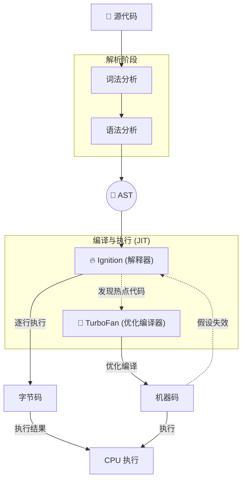

## 🧩 概念：JavaScript 执行机制

### 1. 核心定义 (The Essence)

> [!abstract]
> JavaScript 是一门**单线程**、**非阻塞**、**解释与编译混合 (JIT)** 的语言，其执行机制由引擎（如 V8）负责代码编译与执行，运行时环境（如浏览器/Node.js）负责调度异步任务和内存管理。

**解决的核心痛点**：如何在单线程的限制下，高效处理用户交互、网络请求、定时任务等异步操作，同时保证代码执行的可预测性和高性能。

### 2. 核心命题与原则 (Atomic Propositions)

- [[JavaScript是词法作用域，函数作用域在定义时确定]]
	- **原理**：函数的作用域链由**词法环境**中的 `outer` 指针在函数**定义时**决定，而非调用时，这构成了闭包和静态作用域分析的基础。
- [[事件循环通过宏任务与微任务的优先级调度实现单线程非阻塞]]
	- **原理**：[[事件循环]] 协调同步代码、微任务队列（高优先级）和宏任务队列（低优先级）的执行顺序，确保异步回调有序执行而不阻塞主线程。
- [[V8引擎通过JIT编译在启动速度与运行效率间取得平衡]]
	- **原理**：V8 使用 Ignition 解释器快速生成字节码保证启动速度，同时由 TurboFan 监控并优化热点代码为机器码以提升运行效率，并在类型假设失效时进行去优化。

### 3. 运行机制/模型 (Mechanism)

#### ⚙️ 运作流程

#### 🆚 关键区别 (Compare & Contrast)

| 维度         | **JavaScript (V8)**   | **Java (JVM)**             |
|:----------- |:-------------------- |:------------------------- |
| **编译方式** | JIT (即时编译)        | 提前编译为字节码，JIT 优化 |
| **内存管理** | 自动垃圾回收 (分代式) | 自动垃圾回收 (分代式)      |
| **线程模型** | 单线程 (事件循环)     | 多线程                     |

### 4. 应用场景与反模式 (Use Cases)

- ✅ **适用场景**
	- **高交互 Web 应用**：利用事件循环处理用户输入、动画与网络请求，保持界面响应。
	- **I/O 密集型服务**：在 [[Node.js]] 环境中，利用非阻塞 I/O 模型处理大量并发连接。
- ⛔ **误用与反模式 (Anti-Patterns)**
	- **阻塞事件循环**：在同步代码或微任务中执行耗时计算（如大循环），导致页面卡死或无响应。
	- **滥用闭包导致内存泄漏**：在不再需要的闭包中意外持有对大对象（如 DOM）的引用，阻止垃圾回收。

### 5. 知识图谱 (Knowledge Graph)

- **父级概念**：[[编程语言执行模型]]
- **子概念/组成部分**：[[执行上下文]]、[[作用域链]]、[[闭包]]、[[事件循环]]、[[V8引擎工作原理]]、[[垃圾回收机制]]
- **关联工具/库**：[[Node.js]]、[[Chrome DevTools]]

### 6. 参考与延伸

- **经典文献**：《JavaScript 高级程序设计》、《你不知道的 JavaScript》
- **推荐阅读**：[V8 官方博客](https://v8.dev/)、[MDN Concurrency model and Event Loop](https://developer.mozilla.org/en-US/docs/Web/JavaScript/EventLoop)
