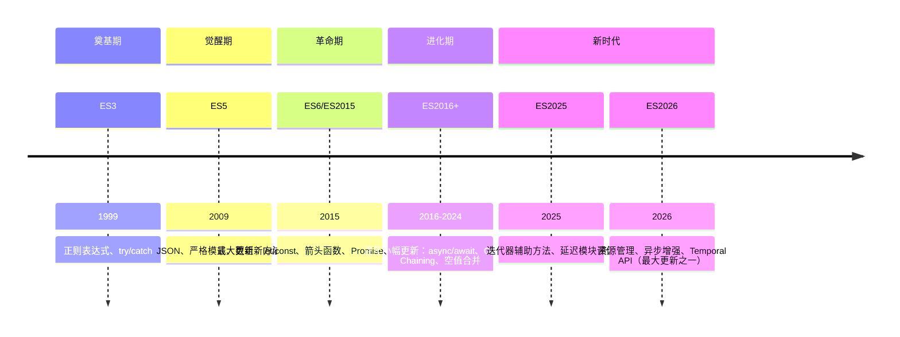

## JavaScript 版本演进

> 记录 JavaScript 语言从 ES3 到 ES2026 的版本演进历程，展现一门语言如何从 "10 天设计 " 走向现代工程化

**时间跨度**：ES3 (1999) → ES2026 (当前)
**演进动力**：弥补早期设计缺陷 + 适应现代开发需求 + 回应社区呼声

---

### 演进概览

---

### 阶段详情

#### ES3 (1999)

- **时间**：1999 年 12 月
- **核心变化**：首个国际化标准
- **解决的关键问题**：确立 JavaScript 作为浏览器脚本语言的基础语法
- **相关概念**：[[正则表达式]] — ES3 引入正则表达式支持

#### ES5 (2009)

- **时间**：2009 年 12 月
- **核心变化**：
	- `JSON.parse` / `JSON.stringify`
	- 严格模式 (`'use strict'`)
	- 数组新方法 (`forEach`, `map`, `filter`, `reduce`)
	- `Object.create`、`Object.defineProperty`
- **解决的关键问题**：提供标准数据格式处理 + 开启现代化写法
- **相关概念**：[[JSON]] — 原生 JSON 支持

#### ES6/ES2015 (2015)

- **时间**：2015 年 6 月
- **核心变化**（最大一次更新，50+ 新特性）：
	- 块级作用域：`let` / `const`
	- 箭头函数：`() => {}`
	- 类：`class` 语法
	- 模块：`import` / `export`
	- Promise 异步编程
	- 解构赋值：`const { a, b } = obj`
	- 模板字符串：`` `Hello ${name}` ``
	- 展开运算符：`…arr`
	- 生成器函数：`function*`
	- Proxy / Reflect
- **解决的关键问题**：从 " 草图语言 " 走向 " 工程化语言 "，填补了类、模块、异步等工程必需功能
- **相关概念**：
	- [[Promise]] — 原生异步编程
	- [[Class]] — 面向对象语法

#### ES2016 - ES2020

| 版本     | 时间   | 核心特性                                             |
|:----- |:--- |:----------------------------------------------- |
| ES2016 | 2016 | 指数运算符 `**`、`Array.prototype.includes`            |
| ES2017 | 2017 | `async`/`await`、共享内存 (`SharedArrayBuffer`)       |
| ES2018 | 2018 | 异步迭代 (`for await of`)、Rest/Spread 属性             |
| ES2019 | 2019 | `Array.prototype.flat`、可选捕获 (`catch (e) {}`)     |
| ES2020 | 2020 | 可选链 `?.`、空值合并 `??`、`BigInt`、`Promise.allSettled` |

#### ES2021 - ES2024

| 版本 | 时间 | 核心特性 |
|:---|:---|:---|
| ES2021 | 2021 | 逻辑赋值运算符 `\|\|=`、`&&=`、`??=`、数字分隔符 `_` |
| ES2022 | 2022 | 顶层 `await`、Class 私有字段 `#field`、正则 `d` 标志 |
| ES2023 | 2023 | `Array.prototype.toSorted`、`toReversed`、哈希 bang 语法 |
| ES2024 | 2024 | `Array.prototype.groupBy`、`Promise.withResolvers` |

#### ES2025 (2025)

- **时间**：2025 年 6 月
- **核心变化**：
	- 迭代器辅助方法：`Iterator.prototype.map`、`filter`、`take`、`drop` 等
	- 延迟模块评估：`defer import` 按需加载模块
	- `Promise.try()`：统一处理同步/异步函数错误
	- 原生 JSON 模块导入：`import json from './config.json' with { type: 'json' }`
- **解决的关键问题**：优化大型应用首屏性能 + 简化异步错误处理
- **相关概念**：
	- [[async/await]] — 异步编程

#### ES2026 (2026)

- **时间**：2026 年 6 月
- **核心变化**（第二次重大更新，20+ 新特性）：
	- 资源管理：`using` / `await using` 声明（类似 C# `using`）
	- 错误处理：`Error.isError()` 精确判断错误类型
	- 日期时间：`Temporal API` 现代化日期时间处理
	- 异步增强：`AsyncIterator` 辅助方法
	- 二进制编码：`Uint8Array` 的 Base64/十六进制编解码
	- 不可变数据结构：`Records & Tuples`（`#record` / `#tuple`）
- **解决的关键问题**：填补资源管理、日期时间处理、错误类型判断等长期痛点
- **相关概念**：
	- [[using 声明]] — 资源管理
	- [[Temporal API]] — 全新的日期 API，代替 Date
	- [[Error.isError]] — 精确判断错误类型

---

### 关键转折点

| 时间点             | 转折内容                           | 影响              |
|:-------------- |:----------------------------- |:-------------- |
| 1995            | Brendan Eich 10 天设计 JavaScript | 语言灵魂奠定，但早期设计粗糙  |
| 1999 ES3        | 首个国际化标准                        | JavaScript 走向规范 |
| 2009 ES5        | 严格模式 + JSON                    | 现代化开端           |
| 2015 ES6        | 50+ 新特性，模块化、类、Promise          | 工程化门槛大幅降低       |
| 2017 ES2017     | async/await                    | 异步编程主流方案        |
| 2026 [[ES2026]] | 20+ 新特性，资源管理、Temporal API      | 现代化日期时间和资源管理    |

---

### 未来展望

- **趋势**：
	- 渐进式增强（每年小更新，而非大版本跳跃）
	- 更多声明式语法糖
	- 更好的类型安全方案（TypeScript 协作）
- **ES2027+ 待定方向**：
	- Pattern Matching：模式匹配语法（Stage 3）
	- 装饰器标准化（Decorators 历经多年讨论）
	- 更好的并发模型（当前 SharedArrayBuffer 使用复杂）
- **值得关注**：
	- ECMAScript 提案流程（新特性通过 Stage 推进）
	- TypeScript 与 ECMAScript 的协作

---

### 关联概念

- **父级概念**：
 - [[JavaScript]] — JavaScript 是前端开发的核心语言
- **相关概念**：
	- [[ES2015|ES6]]
	- [[ES2026]]
