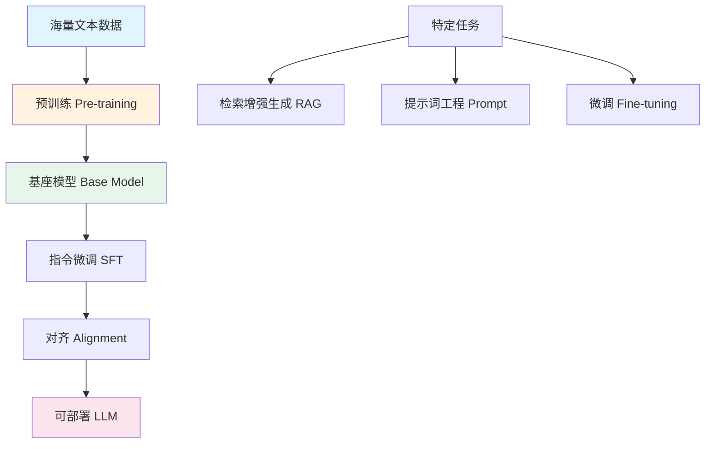

## 概念：LLM

> 大型语言模型（Large Language Model，LLM）是指具有数十亿参数的深度学习模型，通过在海量文本数据上进行预训练，学习语言的模式和结构，能够执行各种自然语言处理任务。

**解决的核心痛点**：传统 NLP 任务需要针对每个任务训练专属模型，LLM 通过预训练 + 泛化能力，实现一个模型处理多种任务，大幅降低 AI 应用门槛。

---

### 核心命题

- LLM 的本质是「规模涌现」—— 当模型参数达到一定量级时，会涌现出在小模型中不存在的推理能力
- LLM 是「世界知识的压缩器」—— 通过预训练将海量文本中的知识压缩到模型权重中
- LLM 的能力边界取决于「预训练数据的多样性和质量」，而非单纯的参数规模

---

### 运行机制

#### 技术栈

| 层级 | 技术 | 说明 |
|:---|:---|:---|
| **架构** | Transformer | 基于自注意力机制的神经网络 |
| **训练** | 预训练 + 微调 | 语言建模 → 任务适应 |
| **能力来源** | 涌现现象 | 规模突破后的能力跃升 |

---

### 关键技术

| 技术 | 作用 | 关键点 |
|:---|:---|:---|
| **Transformer** | 基础架构 | 自注意力机制捕捉长距离依赖 |
| **自注意力机制** | 理解上下文 | Query/Key/Value 矩阵计算 |
| **预训练** | 学习语言模式 | 下一个词预测（Next Token Prediction） |
| **微调** | 任务适应 | SFT、RLHF、DPO 等方法 |
| **涌现能力** | 质变来源 | 规模突破产生的复杂推理能力 |

---

### 关键区别

| 维度 | LLM | 传统 NLP 模型 | 小型语言模型 |
|:---|:---|:---|:---|
| **参数量** | 数十亿 ~ 万亿 | 百万 ~ 亿 | 百万 ~ 千万 |
| **训练方式** | 预训练 + 微调 | 任务专属训练 | 任务专属训练 |
| **泛化能力** | 强（通用） | 弱（专用） | 弱 |
| **涌现能力** | 有 | 无 | 无 |
| **部署成本** | 高 | 中 | 低 |

---

### 应用场景

- ✅ **适用场景**
	- **文本生成**：文章、代码、对话、摘要
	- **知识问答**：基于海量知识的问答系统
	- **Agent 核心**：作为 [[Agent]] 的推理引擎
	- **多模态基座**：结合视觉、音频的多模态模型
- ⛔ **误用**
	- **作为知识库**：幻觉问题导致事实性错误
	- **直接上岗**：缺乏 [[提示词工程]] 优化，效果打折

---

### 知识图谱

- **父级概念**：[[人工智能]] — LLM 是深度学习在 NLP 领域的重大突破
- **子级概念**：
	- [[Agent]] — LLM 作为 Agent 的推理引擎
\t- [[RAG]] — 检索增强生成，扩展 LLM 知识边界
	- [[提示词工程]] — 激发 LLM 能力的工程技术
	- [[上下文窗口]] — LLM 的令牌处理能力上限
	- [[温度]] — 控制 LLM 输出随机性的采样参数
	- [[Top-P]] — 动态截断采样的解码策略
- **并列概念**：
	- CV 模型 — 计算机视觉模型（如 ResNet、VIT）
	- 多模态模型 — 融合文本、图像、音频的模型
- **相关概念**：
	- [[Harness]] — 基于 LLM 的工程化框架

---

### 挑战与局限性

- **幻觉问题**：生成看似合理但实际错误的内容
- **时效性限制**：知识截止于训练数据的时间点
- **计算成本**：训练和推理需要大量 GPU 资源
- **安全风险**：可能被用于生成恶意内容
- **偏见传递**：从训练数据中继承偏见

---

### FAQ

- [[Q-LLM 的幻觉问题如何缓解]]
- [[Q-为什么规模增大会让 LLM 产生涌现能力]]

---

### 参考延伸

- [Attention Is All You Need - Transformer 原始论文](https://arxiv.org/abs/1706.03762)
- [GPT-4 Technical Report](https://arxiv.org/abs/2303.08774)
- [Anthropic - Understanding LLMs](https://docs.anthropic.com/)
