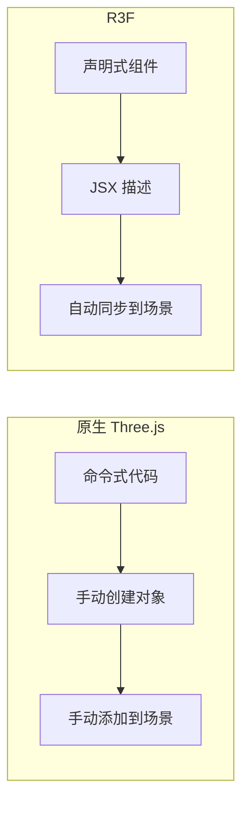
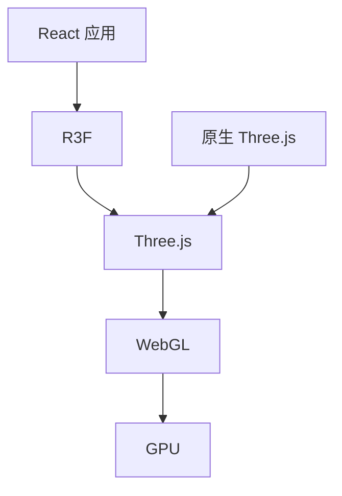

## 概念：R3F

> React Three Fiber (R3F) 是将 Three.js 与 React 组件模型结合的库，允许用声明式组件构建 3D 场景。

**解决的核心痛点**：原生 Three.js 需要命令式代码管理场景，R3F 通过 React 的声明式组件模型简化了 3D 场景的构建和状态管理。

---

### 核心命题

- R3F 将 Three.js 对象映射为 React 组件，`<mesh>` 即 `new THREE.Mesh()`
- R3F 通过 React 的 reconciler 同步组件树与 Three.js 场景图
- R3F 让 3D 组件可以复用、组合、使用 React 生态（state、hooks、context）

---

### 运行机制

#### 架构对比



#### 核心概念

| 概念 | 说明 |
|:---|:---|
| **Canvas** | R3F 的入口组件，创建 WebGL 渲染上下文 |
| **Mesh** | 对应 `THREE.Mesh`，包含几何体和材质 |
| **useFrame** | 每帧执行的 hook，替代 `requestAnimationFrame` |
| **useThree** | 获取 Three.js 上下文（相机、渲染器等） |
| **drei** | R3F 官方辅助库（OrbitControls、Html、Environment 等） |

#### 代码对比

```jsx
// 原生 Three.js（命令式）
const mesh = new THREE.Mesh(geometry, material);
scene.add(mesh);

// R3F（声明式）
<Mesh>
  <boxGeometry args={[1, 1, 1]} />
  <meshStandardMaterial color="orange" />
</Mesh>
```

---

### 关键区别

| 维度 | Three.js | R3F |
|:---|:---|:---|
| **编程模型** | 命令式 | 声明式（React 组件） |
| **状态管理** | 手动同步 | React state/context |
| **组件复用** | 构造函数复用 | JSX 组合 |
| **学习曲线** | 需学 Three.js API | 需同时学 React + Three.js |
| **适用人群** | 原生开发/非 React 项目 | React 项目 |

---

### 应用场景

- ✅ **React 项目中的 3D 需求**：与 React 生态无缝集成
- ✅ **数据可视化**：配合 React 数据流（Redux/Zustand）
- ✅ **3D 组件库**：封装可复用的 3D 组件
- ✅ **交互式 Landing Page**：声明式管理复杂 3D 交互
- ⛔ **非 React 项目**：使用原生 Three.js
- ⛔ **极致性能需求**：R3F 有一定抽象开销

---

### 与 ThreeJS 的关系



- **R3F 依赖 Three.js**：R3F 是 Three.js 的 React 封装
- **共享核心概念**：Mesh、Geometry、Material、Camera 等
- **性能差异**：R3F 有轻微抽象开销，极致性能仍选原生

---

### 知识图谱

- **父级概念**：[[ThreeJS]] — R3F 是 Three.js 的 React 封装
- **并列概念**：
  - [[WebGL]] — 底层技术
  - 原生 Three.js — 非 React 方案
- **相关领域**：
  - [[前端交互]] — R3F 是实现 3D 交互的技术
  - [[着色器]] — 3D 视觉效果的核心
- **生态库**：
  - **drei** — R3F 官方辅助库
  - **react-three/postprocessing** — 后处理效果
  - **@react-three/rapier** — 物理引擎

---

### 常见问题

- ⛔ **Canvas 全屏覆盖**：设置 `<Canvas style={{ position: 'fixed' }} />` 并配合 `pointer-events: none`
- ⛔ **性能问题**：避免每帧创建新对象，在组件外创建常量
- ⛔ **TypeScript 类型**：R3F 类型定义复杂，需配置 `tsconfig.json`

---

### 参考延伸

- [R3F 官方文档](https://docs.pmnd.rs/react-three-fiber)
- [R3F GitHub](https://github.com/pmnd/react-three-fiber)
- [drei - R3F 辅助库](https://github.com/pmnd/react-three-drei)
- [Three.js Journey](https://threejs-journey.com/)（付费课程）
