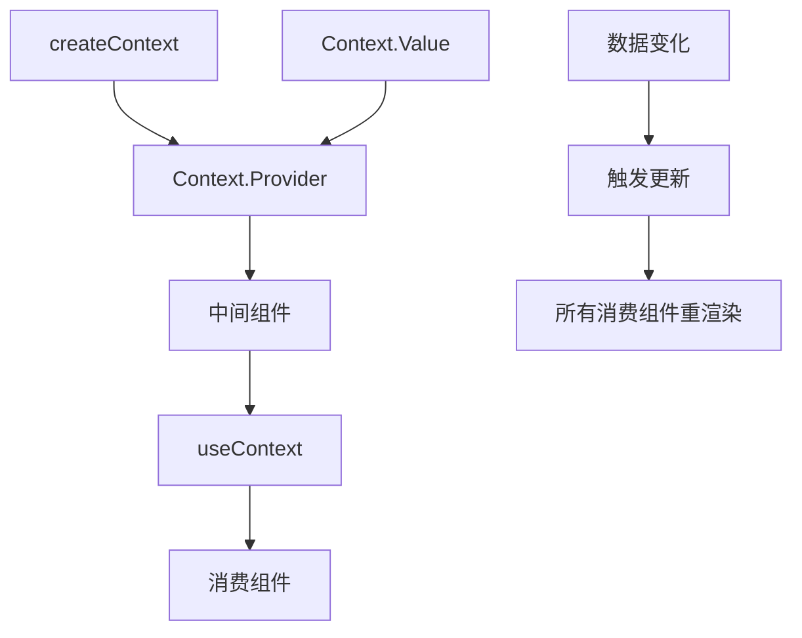

## 概念：React Context

> React Context 提供了在组件树间共享数据的方式，无需为每一层手动传递 props

**解决的核心痛点**：当应用中有多层嵌套组件需要访问相同数据时，传统方式需要层层传递 props（prop drilling），导致组件难以维护和耦合度高。Context 让数据可以从顶层直接传到底层任意组件。

---

### 核心命题

> 核心命题引用 atomic 笔记（陈述句观点），每个命题是一句话洞见

- [[React Context 应作为浅层、可枚举的全局数据共享方案]]
	- **原理**：Context 每次更新会导致所有消费组件重渲染，过多或频繁更新的 Context 会导致性能问题
- [[React Context 可搭配 React.memo 使用]]
	- **原理**：Context 可能导致性能问题，搭配 React.memo 不再重渲染 props 稳定的组件
- [[React Context 不等于状态管理库]]
	- **原理**：Context 是 React 内置的 " 注射 " 机制，而非状态管理方案。状态管理需要配合 useState/useReducer 或外部库实现
- [[React Context 是观察者模式的变体]]
	- **原理**：Provider 持有 Consumer 的引用，Provider.props.value 更新时，会通知所有 Consumer 重渲染
---

### 运行机制

**核心流程**：

1. **创建 Context**：`const ThemeContext = React.createContext(defaultValue)`
	- 产生 `Provider` 和 `Consumer`，`Provider` 是一个 React 组件用来提供数据
2. **提供数据**：在父组件用 `<ThemeContext.Provider value={theme}>`
	- React 内部通过 `Provider.props.value` 获取共享数据，然后分享给所有 Consumer
3. **消费数据**：在子组件用 `const theme = useContext(ThemeContext)` 或 `<ThemeContext.Consumer>`

---

### 关键区别

| 维度 | React Context | Props Drilling | Zustand/Redux |
|:--- |:--- |:--- |:--- |
| **数据流** | 树级广播 | 层层传递 | 独立 Store |
| **更新粒度** | 整树重渲染 | 精确到子组件 | 可精确订阅 |
| **适用场景** | 主题/语言/用户 | 页面内数据 | 复杂状态 |
| **性能** | 需谨慎使用 | 最优 | 优化良好 |

---

### 应用场景

- ✅ **适用场景**
	- **主题切换（Theme）**：暗色/亮色模式，数据简单且更新频率低
	- **语言/国际化（i18n）**：多语言切换，全局配置
	- **用户信息**：登录状态、用户偏好设置
	- **认证状态**：登录/登出状态共享
- ⛔ **误用**
	- **全局状态管理**：频繁更新的数据（如购物车、复杂表单状态）不适合用 Context，会导致性能问题
	- **动态配置**：需要根据路由/条件变化的配置，更适合用组合模式

---

### SOP

> 暂无 SOP

---

### FAQ

> 与本概念相关的开放性问题，待进一步探索

- [[Q-Context 与 useReducer 如何配合实现复杂状态管理]]
- [[Q-何时该用 Context 而非状态管理库]]

---

### 知识图谱

> 知识图谱链接 term（术语定义）和相关 concept，建立概念关系网络

- **父级概念**：[[Hooks (React)|React Hooks]] — Context 依赖 useContext Hook
- **子级概念**：
	- [[useContext]] — 消费 Context 的 Hook
- **并列概念**：
	- [[Zustand]] — 更轻量的状态管理方案
	- [[Redux]] — 成熟的全局状态管理方案
- **相关概念**：
	- [[React 状态管理]] — 包含 Context 在内的状态管理全景
	- [[Prop Drilling]] — Context 试图解决的问题

---

### 参考延伸

- [React 官方文档 - Context](https://react.dev/reference/react/createContext) — React 官方对 Context 的完整说明
- [React 官方文档 - useContext](https://react.dev/reference/react/useContext) — useContext Hook 的详细 API
- [React Context 性能优化指南](https://react.dev/learn/you-might-not-need-an-effect-library#context) — React 官方关于 Context 性能 Considerations 的说明
- [Kent C. Dodds - How to optimize your context value](https://kentcdodds.com/blog/how-to-optimize-your-context-value) — Context 性能优化的最佳实践
- [useContext + useReducer 模式](https://react.dev/reference/react/useReducer#extracting-state-logic-into-a-reducer) — 官方推荐的状态逻辑提取模式
