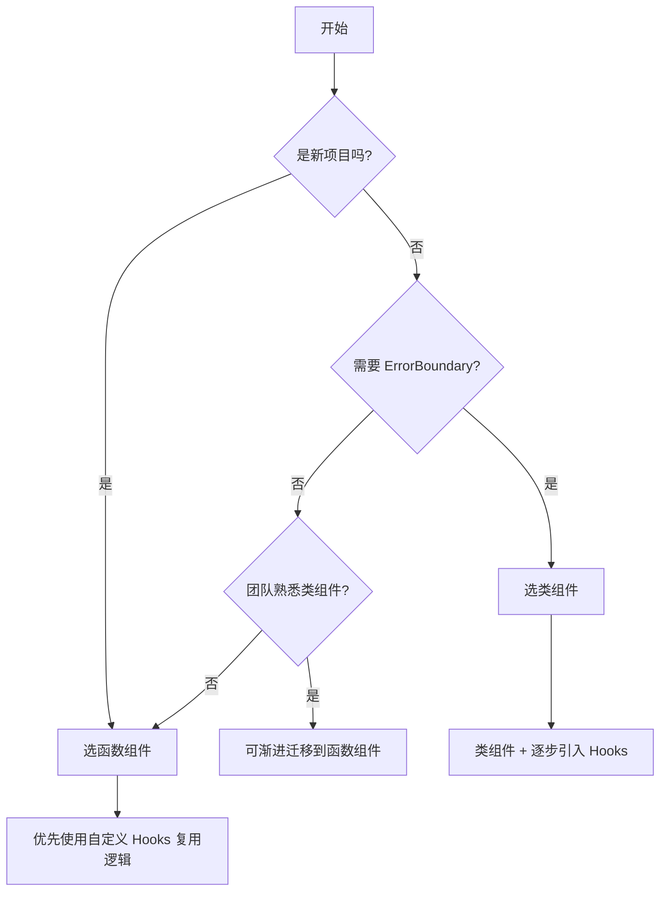

## 函数组件 vs 类组件

### 一句话对比

函数组件通过 Hooks 获得与类组件等价的能力，但更轻量、更灵活；类组件是 React 早期主流写法，现已被函数组件取代。

---

### 核心对比

| 维度       | **[[函数组件]]**                     | **[[类组件]]**                             |
| :------- | :------------------------------- | :-------------------------------------- |
| **定义**   | 普通 JavaScript 函数，接收 props 返回 JSX | 继承 `React.Component`，必须定义 `render()` 方法 |
| **核心本质** | 纯函数，无状态（Hooks 之前），通过 Hooks 获得能力  | 有状态组件，有完整生命周期方法                         |
| **适用场景** | 新项目默认选择，逻辑复用、自定义 Hooks           | 遗留代码、需要 ErrorBoundary 的场景               |

### 差异点

- **声明式本质相同**：
	- 函数组件：描述 UI 应该是什么样子
	- 类组件：同样声明式，但写法是继承式的
- **状态管理**：
	- 函数组件：`useState` Hook，状态更新通过返回的 setter 函数
	- 类组件：`this.state` 对象，`this.setState()` 方法更新
- **生命周期实现**：
	- 函数组件：`useEffect` Hook，通过依赖数组模拟 mount/update/unmount
	- 类组件：`componentDidMount`/`componentDidUpdate`/`componentWillUnmount` 等方法
- **this 上下文**：
	- 函数组件：无 this 问题，props 直接作为参数传递
	- 类组件：有 this，需手动 bind 或使用箭头函数
- **逻辑复用**：
	- 函数组件：自定义 Hooks，组合式复用，无嵌套问题
	- 类组件：高阶组件（HOC）、Render Props，容易产生嵌套地狱
- **打包体积**：
	- 函数组件：较小，仅包含所需逻辑
	- 类组件：需要继承完整 `React.Component`，体积较大

---

### 场景选择

- **选 [[函数组件]] 当**：
	- 新项目起步
	- 需要复用逻辑且希望保持组件树扁平
	- 追求更小的打包体积
	- 团队熟悉 Hooks 模式
- **选 [[类组件]] 当**：
	- 维护遗留的类组件代码库
	- 需要实现 `ErrorBoundary`（目前 Hooks 无法实现）
	- 团队对类组件更熟悉需要过渡期

---

### 决策树



---

### 示例

**函数组件示例**

```jsx
function Counter({ initialCount = 0 }) {
  const [count, setCount] = useState(initialCount);

  useEffect(() => {
    document.title = `计数: ${count}`;
    return () => document.title = 'React App';
  }, [count]);

  return (
    <button onClick={() => setCount(c => c + 1)}>
      点击次数: {count}
    </button>
  );
}
```

**类组件等效实现**

```jsx
class Counter extends React.Component {
  constructor(props) {
    super(props);
    this.state = { count: props.initialCount || 0 };
    this.handleClick = this.handleClick.bind(this);
  }

  componentDidMount() {
    document.title = `计数: ${this.state.count}`;
  }

  componentDidUpdate() {
    document.title = `计数: ${this.state.count}`;
  }

  componentWillUnmount() {
    document.title = 'React App';
  }

  handleClick() {
    this.setState(state => ({ count: state.count + 1 }));
  }

  render() {
    return (
      <button onClick={this.handleClick}>
        点击次数: {this.state.count}
      </button>
    );
  }
}
```

---

### 知识图谱

- **父级概念**：[[React]]
- **相关概念**：
	- [[函数组件和类组件有什么区别？生命周期如何映射？]]
	- [[为什么更倾向函数组件]]
- **核心关联**：[[Hooks(React)]] / [[React.Component]]
