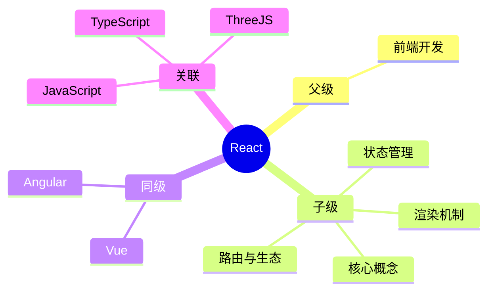

## 概念： React

> 用于构建用户界面的 JavaScript 库，由 Facebook 开发和维护，采用组件化和 Virtual DOM。

---

### 知识图谱

---

### 核心 API

> 以下为 React 原理层面的核心 API，常见于面试问题。

- **创建元素**
	- `React.createElement()` — 手动创建 React 元素的底层方法
	- `React.cloneElement()` — 克隆并修改已有 React 元素
	- `React.isValidElement()` — 判断是否为有效的 React 元素
- **组件基础**
	- `React.Component` — 类组件基类
	- `React.PureComponent` — 浅比较优化的类组件
	- `React.Fragment` — 片段组件，避免额外 DOM 节点
	- `React.StrictMode` — 严格模式，检测不安全的生命周期等
- **渲染**
	- `ReactDOM.render()` — 经典渲染入口（React 17 已不推荐）
	- `ReactDOM.createRoot()` — React 18+ 并发模式根节点
	- `ReactDOM.hydrateRoot()` — 服务端渲染水合
- **悬念与异步**
	- `React.Suspense` — 组件挂起与加载状态边界
	- `React.lazy()` — 代码分割与动态导入
	- `React.startTransition()` — 标记非紧急更新
- **上下文**
	- `React.createContext()` — 创建 Context 对象
	- `React.useContext()` — 消费 Context 值

---

### 定义

- **核心范畴**：React 核心概念、组件开发、Hooks、状态管理、生态工具
- **不包括**：后端开发、移动端原生开发（React Native 除外）
- **与相关领域的区别**：
	- vs Vue：React 使用 JSX 和单向数据流，Vue 使用模板和双向绑定
	- vs Angular：React 更轻量，只关注视图层，不含完整框架功能

---

### 长期目标

- **愿景**：深入掌握 React 生态，能够独立构建中大型 React 应用
- **里程碑**：
	- [x] 掌握 React 核心概念和 Hooks
	- [ ] 掌握状态管理（Redux / Zustand / Jotai）
	- [x] 掌握性能优化（useMemo / useCallback / React.memo） ✅ 2026-04-28
	- [ ] 深入 React 源码和原理（Fiber / Reconciliation）
	- [ ] 掌握 Next.js 全栈开发

---

### 关键领域

> 该领域的核心知识主题。链接指向尚未创建的 concept，表明尚未掌握。

- **核心概念**
	- [[React版本演进]] — 各版本核心差异与演进路线
	- [[虚拟DOM(React)]] — Virtual DOM 的原理与 Diff 算法
	- [[Fiber]] — React 16+ 的协调引擎
	- [[Hooks(React)]] — useState / useEffect / useRef 等
	- [[Refs(React)]] — DOM 节点和组件实例
	- [[useCallback]] — 回调函数缓存
	- [[useMemo]] — 计算结果缓存
	- [[React.memo]] — 组件级别的记忆化
- **渲染机制**
	- [[React重新渲染]] — 重新渲染的触发条件与优化
	- [[React组件通信]] — Props / Context / 状态提升 / 事件总线
	- [[Suspense]] — 异步加载与错误边界
	- [[Server Components]] — React 18+ 服务端组件
- **并发模式**
	- [[useTransition]] — 并发模式下的状态过渡
	- [[useDeferredValue]] — 延迟值更新
- **状态管理**
	- [[状态管理(React)]] — Redux / Zustand / Jotai / Recoil
	- [[React Context]] — 跨层级数据传递
- **路由与生态**
	- [[React Router]] — 路由管理
	- [[Next.js]] — React 全栈框架
	- [[R3F]] — React + Three.js
	- [[Zustand]]、[[Redux]] — React 状态管理库
		- 👉[[Zustand vs Redux]]
---

### SOP

> 该领域的标准化操作流程

- [[React最佳实践|SOP-React最佳实践]] — 开发 React 应用需要遵循的规范
- [[React性能优化]] — 开发 React 应用需要注意的性能优化方法
- [[SOP-使用Claude-Code开发React组件]] — Claude Code 开发 React 组件的工作流
- [[SOP-在React中实现文字故障效果]] — React 中的 Glitch 文字动画
- [[SOP-在React中实现ASCII动画]] — React 中的 ASCII 动画效果

---

### FAQ

> 该领域的常见问题

- [[React面试题]] — React 常见面试问题汇总

---
